## Amazon AWS S3 (simple storage service)
- if you want to store data in petabytes,gigabytes
- store blob(binary large object)
- a bucket contains collection of objects
-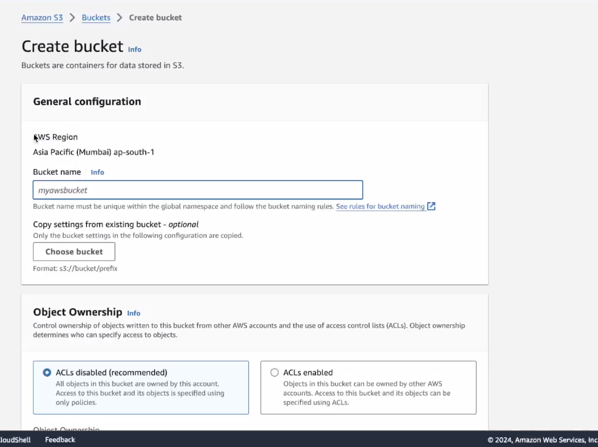

## why bucknet name should be diff for whole global space
- 
- no conflict in dns resolution

## public access
-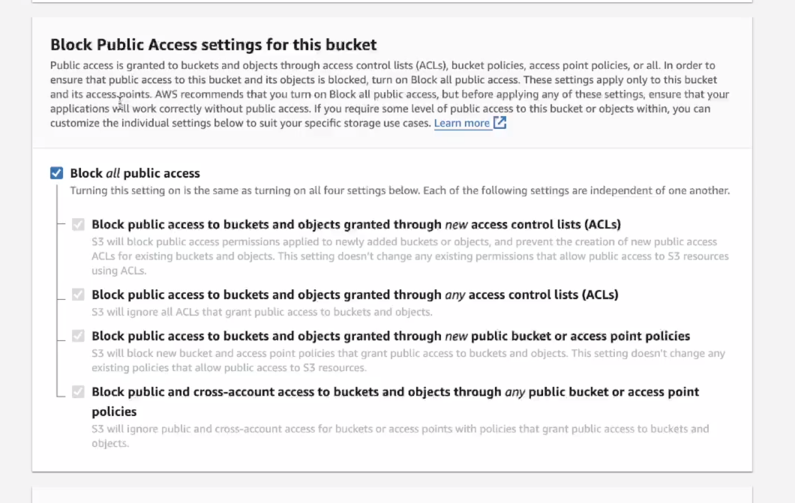

## when you upload that file
- you got public url to access that file

## how to access object from public url
-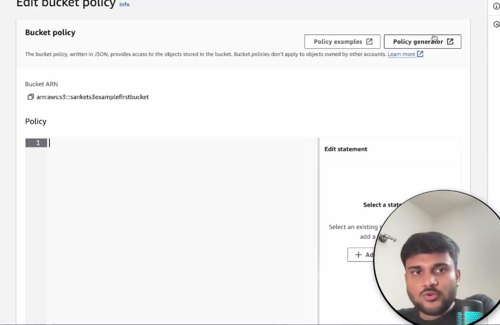 
- you have to add policy 
- means add policy generator
- in principal - type * means anu user
-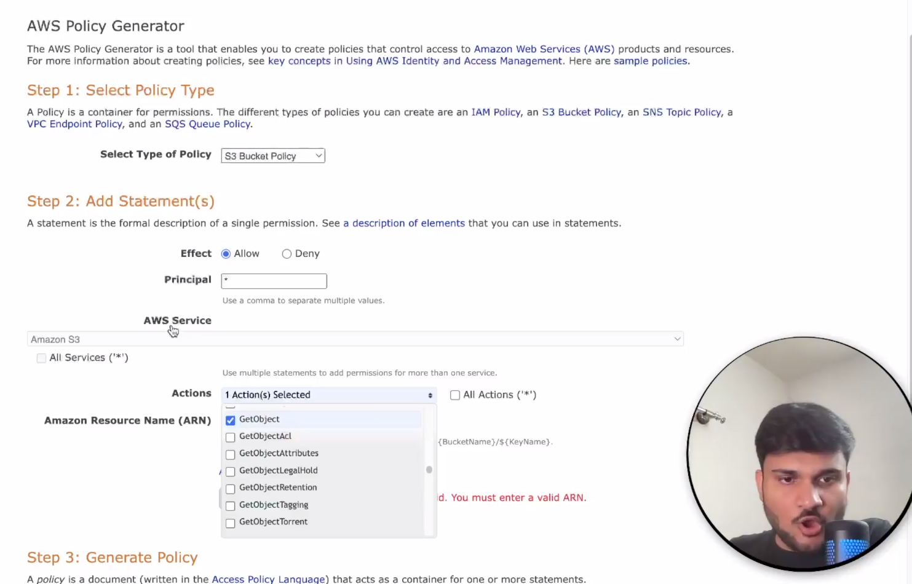

## S3 versioning
- we can version our files on the bucket level and we have to manually enable it
- easly rollback
-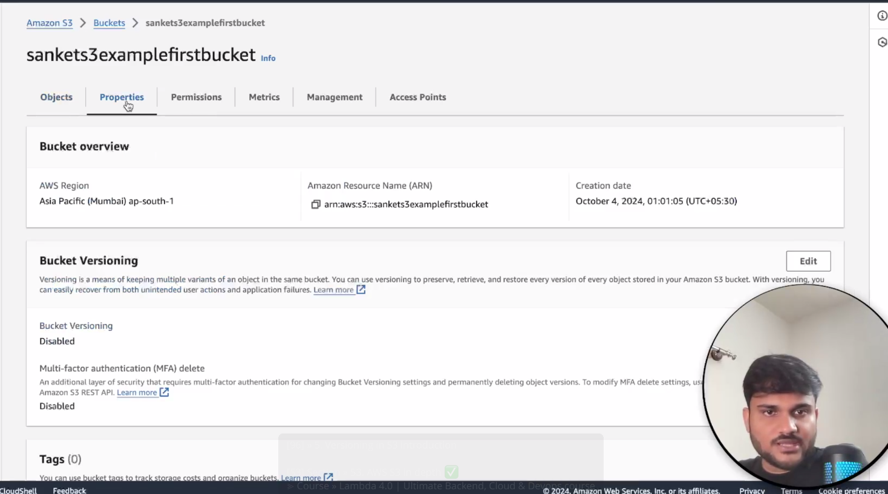

## Replication strategies
-suppopse we have a bucket in region-1 
- we can replicate in diff bucket in same region or different region as abackup
- SRR- ( same region replication)
- CRR ( cross region replication)
- replication can be done in cross account also
- it is asynchronous process
- CRR- it can take more network bandwidth
- CRR- might be compliance issue
- lower latency issue
- SRR- prod data- test data backup
- log aggregation
- live replication
- by default only new objects added after replication is enabled after replication
-old objects can be replicated- (S3 batch replication)
-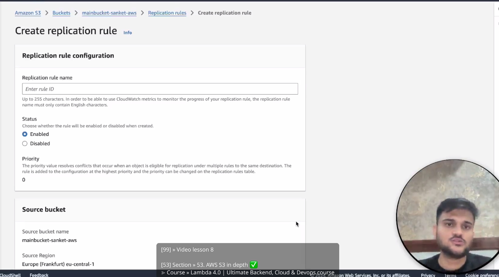
-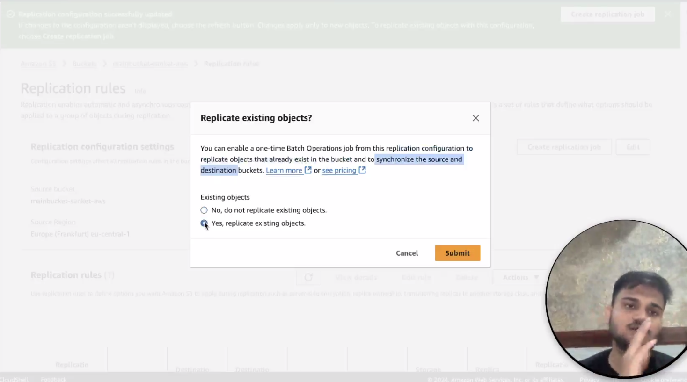

### S3 storage classes
- we can created different type of s3 class based on access/storage pattern
- when u are uploading something , there are some properties option
- 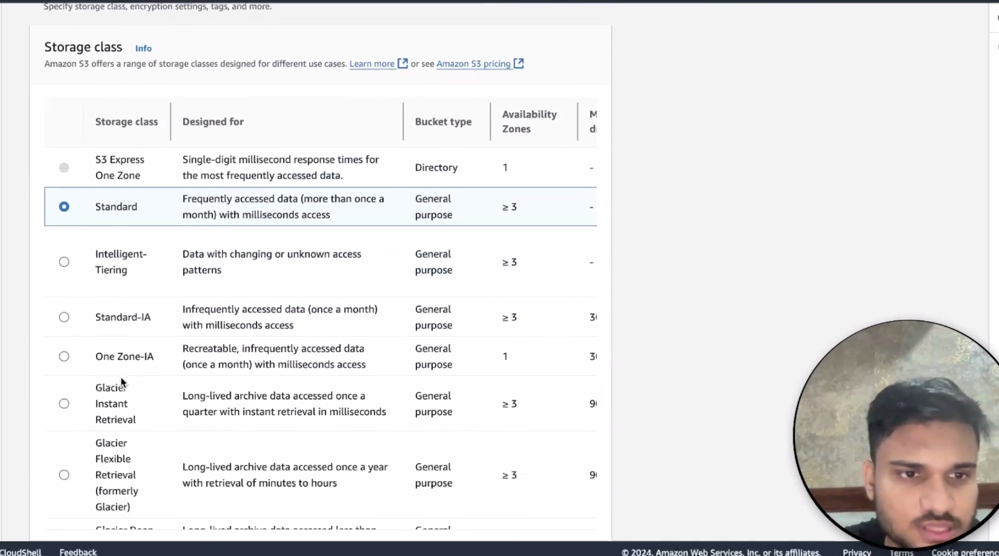
- S3 standard(general)-99..99% availabilty - is used for frequent access, low latency,high throughput
- S3 standard(infrequent access)-good for data which is not frequently access but requires rapid access when needed, availiabilty-99.99%,low cost 
- S3 one zone infrequent access
- S3 glacier instant retreival-low cost , ms retrieval,very less access
- S3 glacier flexible retreival-(1-5)best, 12hr bad,very less access
- S3 glacier deep archive- 48 hr retreival ,very less access
- S3 intelligent tiering- automatically aws will determine which will be fast, but will cost due to aws management

- they are identfied by (durability and availability)
- for durability for all storage classes it is 99.99%
-for availability it is different for storage classes - means how much it is readily available 

### life cycle route
- in management
-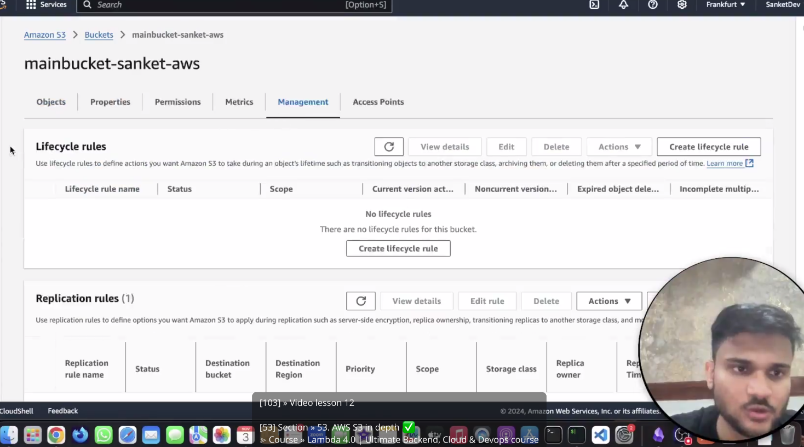
-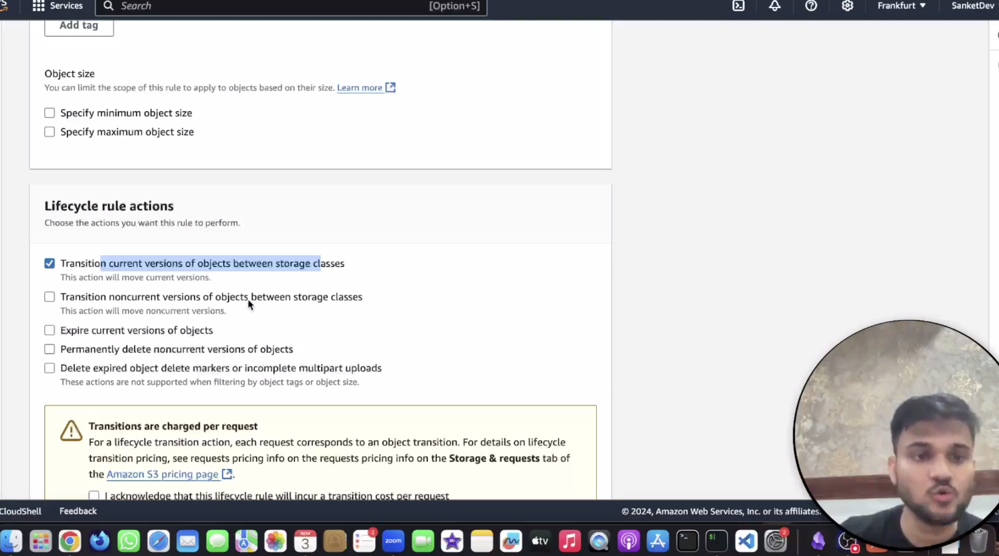
-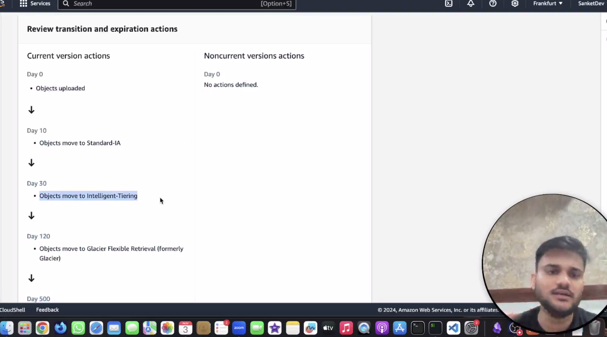
- so what it does let say you can urself determine after how many days you want to transitition in which storage class
-1) transpiration access- storage classes gets changed
-2) expiration access - older versions gets deleted

### S3 update notifications
-this can work as a trigger( producer)
- assume we do some actions on objects store in a bucket. and we want to fire notifications, this can be achiedved thrugh event listeners
- on diff services - (SNS,SQS,lambda)consumption
```
This note describes a fundamental cloud architecture pattern called Event-Driven Architecture using Amazon S3 Event Notifications.

. The Producer: S3 Object Actions
In this setup, Amazon S3 is the Producer. It produces events whenever an action occurs on an object (a file) inside your bucket.

You can set up "event listeners" to watch for specific actions, such as:

ObjectCreated: Triggered when a file is newly uploaded (PUT, POST, or COPY) or when a large file finishes a Multipart Upload.

ObjectRemoved: Triggered when a file is permanently deleted or moved to trash.

ObjectRestore: Triggered when an archived file is pulled back from cold storage (Glacier).

The Consumers: Where do notifications go?
When S3 detects an action, it creates a small JSON message containing details about the file (its name, size, bucket, and time of action). S3 can natively send this notification to three main Consumers:

A. AWS Lambda (Compute/Action)
How it works: S3 directly invokes a Lambda function and hands it the file details.

Example Use Case: A user uploads a high-resolution profile picture (ObjectCreated). S3 triggers a Go/Node.js Lambda function. The function wakes up, resizes the picture into a tiny thumbnail, and saves it back to a different bucket.

B. Amazon SQS (Queuing/Buffering)
How it works: S3 sends the notification into a Simple Queue Service (SQS) line.

Example Use Case: If you are uploading 10,000 files a second, you don't want to crash your backend servers. S3 dumps all 10,000 notifications safely into an SQS queue. Your backend servers can then smoothly pull messages out of the queue at their own comfortable pace without getting overwhelmed.

C. Amazon SNS (Fan-out/Broadcasting)
How it works: S3 sends the notification to a Simple Notification Service (SNS) topic. Multiple other services can "subscribe" to this topic.

Example Use Case: When a major report is uploaded, you want to do three things simultaneously: log it in a database, send an email alert to an admin, and trigger a data processing job. S3 sends one message to SNS, and SNS duplicates and broadcasts it to all three destinations at once.

```
## diff between sqs and sns 
```
1. The Core Concepts (Push vs. Pull)
Amazon SNS (Simple Notification Service) - The Broadcaster

Model: Publish / Subscribe (Pub/Sub).

How it works: You send a message to an SNS "Topic." SNS instantly pushes copies of that message to anyone who is subscribed to that topic (like an email address, a text message, or another AWS service).

The Catch: It happens in real-time. If the receiver's server is down or busy when SNS shouts the message, they might miss it entirely.

Analogy: It is like a Radio Tower. It broadcasts the song to the whole city. You only hear it if your radio is turned on and tuned in at that exact moment.

Amazon SQS (Simple Queue Service) - The Buffer

Model: Message Queuing.

How it works: You send a message into an SQS "Queue." The message just sits there safely in a line. Your backend server (the Consumer) connects to SQS whenever it is ready and pulls the message out to process it.

The Catch: It doesn't tell anyone the message arrived; the workers have to actively check the line. However, it guarantees the message is saved until a worker is ready to handle it.

Analogy: It is like an Email Inbox or Voicemail. The message drops in and waits patiently. You handle it whenever you have the time and capacity.


```

### AWS S3 performance
-S3 auto scales for reducing latency
- for any read/get request-5500 req per second per prefix
-write-3500 req per second
- system->s3 ( u can upload in multiparts)
- normal flow kya hai( client->backend->s3)
-client->backend se presigned url aur backend->s3->backend->client ...phir client diretcly frontend se upload kr skta hai
- S3 byte range fetch

```
1. S3 Auto-Scales for Reducing Latency & Request Limits
"for any read/get request-5500 req per second per prefix -write-3500 req per second"

Amazon S3 is incredibly fast and scales automatically to handle massive amounts of traffic. However, there are hard limits on how many requests you can make per prefix (think of a prefix like a folder path in your bucket).

Reads (GET): You can download or read files up to 5,500 times per second, per prefix.

Writes (PUT/POST/DELETE): You can upload or delete files up to 3,500 times per second, per prefix.

Why the "Prefix" part matters: If all your user profile pictures are stored in s3://my-bucket/images/profiles/, they all share that one 5,500 limit. If your app gets wildly popular, you might hit this limit. To fix this, developers distribute files across multiple prefixes (e.g., .../profiles/user_A/, .../profiles/user_B/) to multiply their scaling limits.

The "Normal Flow" vs. Presigned URLs
"normal flow kya hai( client->backend->s3) -client->backend se presigned url aur backend->s3->backend->client ...phir client diretcly frontend se upload kr skta hai"

This note is comparing two different architectures for uploading files, explaining why Presigned URLs are better for performance.

The Normal Flow (Bad for performance): Your user (Client) wants to upload a photo. They send the photo to your Node.js/Python server (Backend). Your server processes it, and then your server uploads it to S3.
Problem: This clogs up your server's network bandwidth and wastes your server's CPU on simply passing a file along.

The Presigned URL Flow (Best Practice): Instead of sending the heavy file to the server, the Client asks the Backend for permission to upload. The Backend talks to AWS and generates a temporary, secure link called a Presigned URL. The Backend gives this link back to the Client. "Phir client directly frontend se upload kr skta hai" (Then the client can upload directly from the frontend).
Benefit: Your backend is completely freed up. The heavy file goes directly from the user's browser to Amazon's ultra-fast servers.

S3 byte range fetch"

Normally, when you request a file from S3, it sends you the entire file. A Byte Range Fetch allows you to tell S3, "Hey, I only want bytes 0 to 500 of this file."

When is this useful?

Resuming Downloads: If a user is downloading a file and their internet dies halfway through, they don't need to restart. Your app can just request the remaining bytes.

Video Streaming: If a user skips to the middle of a 2-hour movie, your app uses a byte range fetch to only download the exact chunk of the video file they skipped to, saving massive amounts of bandwidth and making the video load instantly.

```