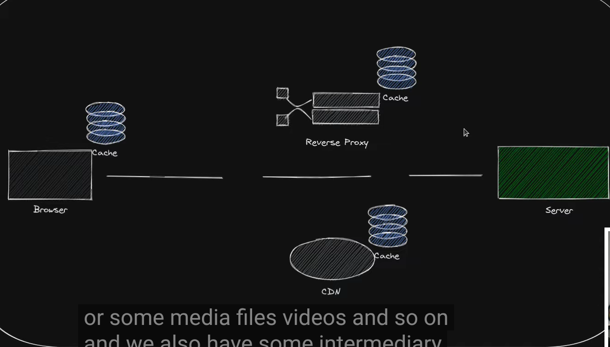
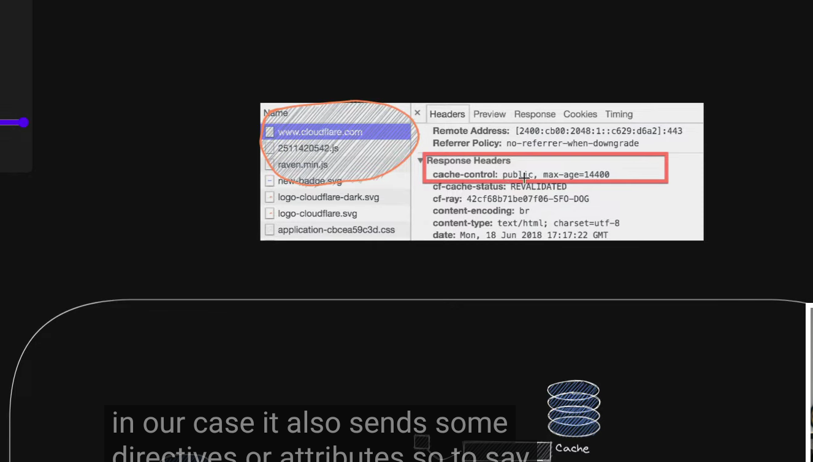
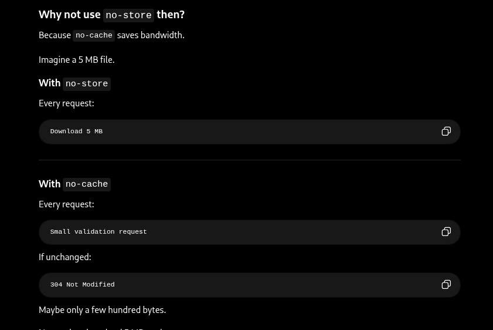
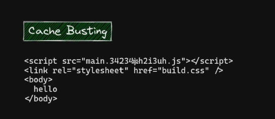
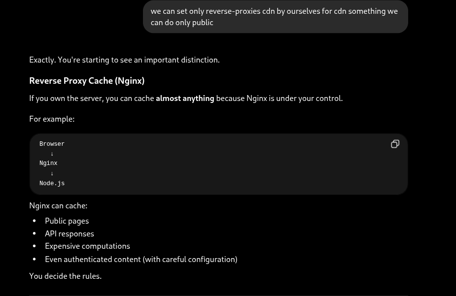
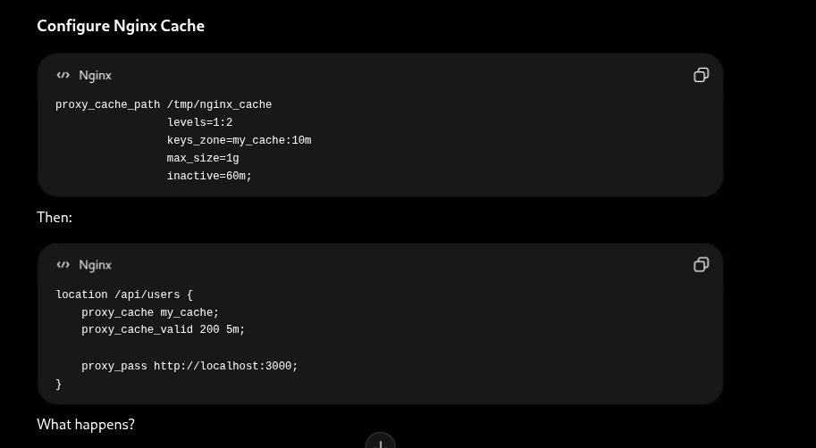
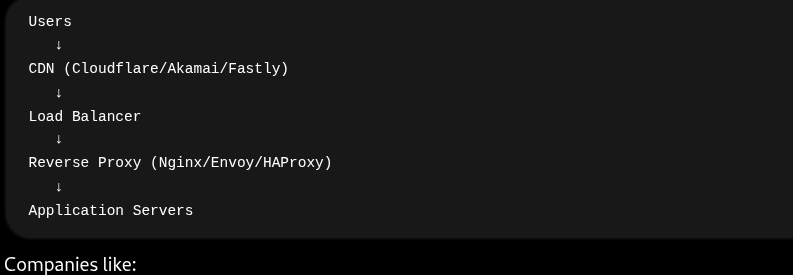
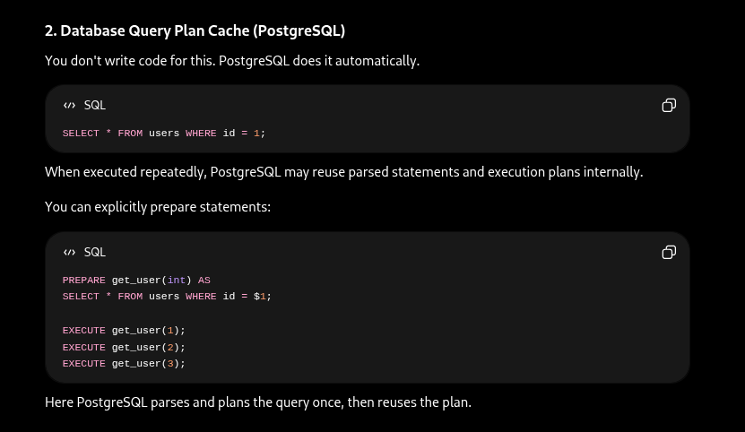
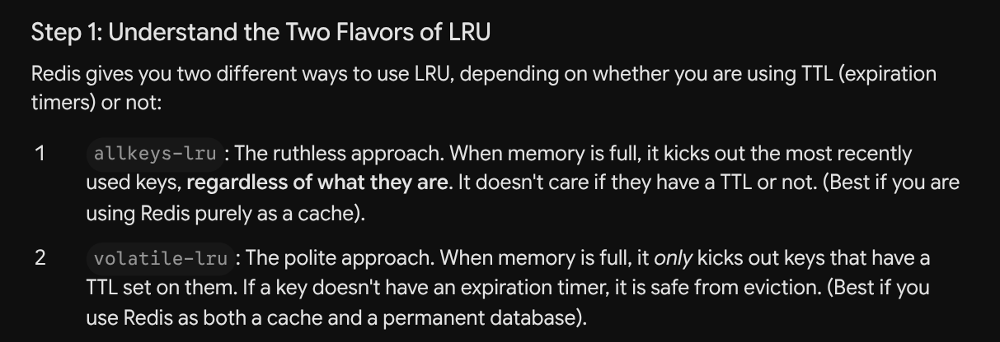
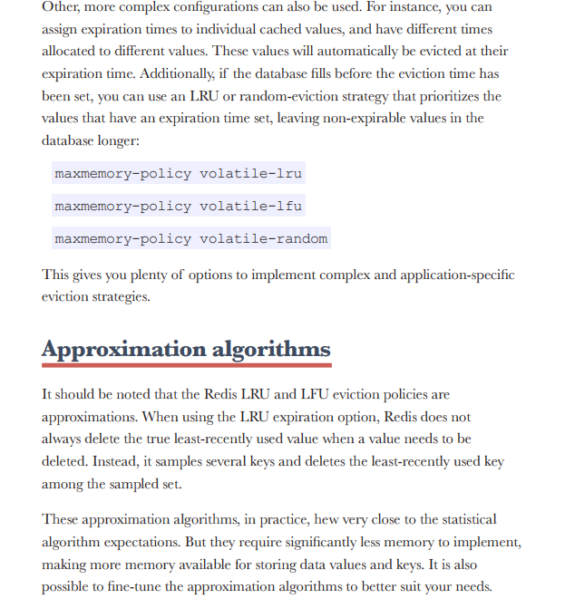

## Application level caching
```
const cache= new Map();
app.get('/users/:id',async(req,res)=>{
    const user_Id= req.params.id;


    if(cache.has(userId))
    {
        console.log("Cache hit")
        return res.json(cache.get(userId));
    }
    console.log('Cache Miss');

  const user = await db.query(
    'SELECT * FROM users WHERE id = ?',
    [userId]
  );

  cache.set(userId, user);

  res.json(user);
})


or pseudo code for redis
const cachedUser = await redis.get(`user:${userId}`);

if (cachedUser) {
  return res.json(JSON.parse(cachedUser));
}

const user = await db.query(
  'SELECT * FROM users WHERE id = $1',
  [userId]
);

await redis.set(
  `user:${userId}`,
  JSON.stringify(user),
  { EX: 60 } // 60 seconds TTL
);

```
## CACHING ORDER
```
Browser Cache
      ↓
CDN Cache
      ↓
Reverse Proxy Cache (Nginx)
      ↓
Application Cache (Redis)
      ↓
Database
```

```
Browser-cache
-immutable+ long max-age
1) here content of the url does not change
2)the browser can cache for almost 1 year

here lets say you want scrpit-v1.js so cache will see it has or not if it has it will not ask server 

- mutable cache no-cache
1) it is always server-validated
2)the contents of the url may change
3)so here cache asks server hey bro does the content of this page gets changed if so give me the new one and give the one to the user also .. if not so i will send mine 

-no store 
1) means not to cache at all
- egs banking system,html file

-must revalidate
1) means must validate after age expiry
2) otherwise its must re-valdate

-


```

## why the option (revalidate+max-age)
```
here this is wrong because when user asks for 3 pagees one is html,css,and another js file 
and u have changed 
max-age is relative to the response time, so if all the above resources are requested as part of the same navigation they'll be set to expire at roughly the same time, but there's still the small possibility of a race there. If you have some pages that don't include the JS, or include different CSS, your expiry dates can get out of sync. And worse, the browser drops things from the cache all the time

How Modern Web Development Fixes This
Because max-age causes these desynchronization nightmares, modern developers use a technique called Cache Busting (or File Fingerprinting).

Instead of naming files style.css and app.js, build tools (like Webpack, Vite, or React) inject a unique hash of the file's contents into the filename:

style.a8f9c.css

app.b2x19.js

If you do this, you can set the max-age to 1 year for both files.
When you update your JavaScript code, the file's contents change, so the tool generates a brand-new filename (e.g., app.z99po.js). The HTML simply asks for the new filename, bypassing the cache entirely, while safely continuing to use the cached CSS if it hasn't changed. This completely eliminates the "out of sync" problem!
```




## diff between no-cache and no-store


## in the req header
-if cache set is public then it means it can be cached in between like proxies or cdn
-private - only in browser
-public- means reverse proxies or cdn can do it

## E-tags
-Revalidation mechanism
- they are generated to see if the same type hash value is coming from server. if so means same request with no change so we can give cache page
## Cache busting
- ususally next js files do like this so that cdn cant give stale data they hash the js files with random hashes


## CDN and reverse-proxies
-
-
=
- ususally what happens we can do load balancing in network proxies itself then why do we load balancers before
-beacuse reveerse proxies works at application level
-and load balancer at aws works at network layer

## Database caching
-


### why does caching is easier for bell-curve data rather than flat-line
```
The peak- (imaging the peak of bell curve. this data is regulary searched. since this is small. we can store small amount of data whereas for flat-line where each data has equal importance we have to advance strategies like lru )
for flat line 
If your traffic is flat or highly erratic, LRU won't help much. Advanced strategies might include:

Pre-fetching: Predicting what the user will do next and loading it into the cache before they ask for it (e.g., if they read page 1, proactively cache page 2).

Time-based or Event-based eviction: Heavily customizing exactly when and why data leaves the cache based on specific business logic rather than just basic popularity.

```
### Caching patterns-
```
Dynamic caching-
1)In a dynamic cache, the application treats the cache as the primary data store for both reading and writing.
2)ter the cache is updated, the cache itself (or a related process) is responsible for pushing that update down to the persistent data store (the main database).
Write-Heavy + Read-Immediately Workloads: For example, a multiplayer game leaderboard or a live sports score app. If a user updates their score and instantly refreshes the page, you want that new score waiting for them in the fast cache.

-a) here two things can happen
-1.a) if data stored in database synchronously update- therw will be consistency but trade-off for expensive write operation
-1.b) if data stored in database asynchrously updated- there will be incosistency for some-time


Static caching( catch-aside pattern)
1)As shown on the right side of the diagram, when an update occurs, the application bypasses the cache entirely and writes the new value directly to the persistent data store.
2)Because the data store now has the new value, the old value sitting in the cache is stale. Instead of updating the cache, the system simply deletes or invalidates the stale entry (represented by the large orange X over the cached item in the diagram).
Read-Heavy Applications: (e.g., User profiles, blog posts, product catalogs). Data is read 100 times for every 1 time it is updated.
```

### Caching stratgies- these are architectures
```
1) Inline cache->
Look at the blue text at the very bottom of your caching-images/image: "cache consistency is the responsibility of the cache". This is the defining feature of an inline cache.

The Advantages:

Simpler Application Code: Developers love this pattern. You don't have to write if cache_miss: go_to_database() logic all over your codebase. You just ask for data, and you get it. The caching layer handles the messy details.

Consistency: Because all reads and writes flow through the cache to get to the database, it is much harder for the cache and the database to get out of sync.

The Disadvantages:

Complex Infrastructure: Standard Redis out-of-the-box doesn't know how to query a PostgreSQL or MongoDB database on its own. To set up an inline cache, you usually need specialized plugins, middleware, or a framework (like Spring Cache in Java) that acts as the "smart" cache layer capable of talking to your specific database.
const redis = require('./redisClient'); // Your Redis connection
const db = require('./dbClient');       // Your Postgres/Mongo connection

class UserInlineCache {
    
    // READ-THROUGH LOGIC
    static async getUser(userId) {
        // 1. Try to get it from Redis
        const cachedData = await redis.get(`user:${userId}`);
        
        if (cachedData) {
            return JSON.parse(cachedData); // Cache hit
        }

        // 2. Cache Miss: The CACHE layer fetches from the DB
        const user = await db.query('SELECT * FROM users WHERE id = ?', [userId]);

        // 3. The CACHE layer updates itself
        if (user) {
            // Setting an expiry (TTL) is always a good practice
            await redis.setEx(`user:${userId}`, 3600, JSON.stringify(user));
        }

        return user;
    }

    // WRITE-THROUGH LOGIC (Dynamic Caching inside an Inline Cache)
    static async updateUser(userId, updateData) {
        // 1. The CACHE layer updates Redis directly
        await redis.set(`user:${userId}`, JSON.stringify(updateData));
        
        // 2. The CACHE layer synchronously updates the database
        await db.query('UPDATE users SET ? WHERE id = ?', [updateData, userId]);
        
        return true;
    }
}

module.exports = UserInlineCache;

now in application code


const express = require('express');
const UserInlineCache = require('./userService');
const app = express();

// GET a user
app.get('/users/:id', async (req, res) => {
    try {
        // The app only talks to the "Inline Cache"
        const user = await UserInlineCache.getUser(req.params.id);
        
        if (!user) return res.status(404).send('User not found');
        res.json(user);
        
    } catch (error) {
        res.status(500).send('Server Error');
    }
});

// UPDATE a user
app.put('/users/:id', async (req, res) => {
    try {
        const updateData = req.body;
        
        // The app just pushes the update to the cache layer
        await UserInlineCache.updateUser(req.params.id, updateData);
        
        res.send('User updated successfully');
        
    } catch (error) {
        res.status(500).send('Server Error');
    }
});


```
### Cache eviction
-
```
// Set max memory to 100 Megabytes (Value is in bytes: 100 * 1024 * 1024)
        await redisClient.configSet('maxmemory', '104857600');
        
        // Set the policy
        await redisClient.configSet('maxmemory-policy', 'allkeys-lru');
```
- TTL-
```
Once that timer hits zero, the data basically self-destructs and is deleted from the cache. The most critical takeaway here is: This happens whether the cache is full or not. It isn't trying to make room for new data; it is just enforcing a strict rule that data shouldn't live past a certain age.
1) it happens at the key level

two timeouts are there
const { createClient } = require('redis');

// 1. CONFIGURE CLIENT TIMEOUTS
const redisClient = createClient({
    url: 'redis://localhost:6379',
    socket: {
        // Connection Timeout: 
        // "If I can't connect to Redis in 5 seconds, throw an error."
        connectTimeout: 5000, 

        // Command/Read Timeout: 
        // "If a command takes longer than 2 seconds to finish, cancel it."
        timeout: 2000,

        // Idle Connection (Keep-Alive):
        // Automatically ping the server every 10 seconds so the firewall 
        // doesn't close our connection for being "idle".
        keepAlive: 10000, 

        // Retry Strategy:
        // If the connection drops, how many times should we try to reconnect?
        // (Setting this to false means it will just fail immediately)
        reconnectStrategy: (retries) => {
            if (retries > 5) return new Error('Too many retries, giving up.');
            return Math.min(retries * 100, 3000); // Wait longer between each retry
        }
    }
});

// Handle connection errors (e.g., if the connectTimeout is reached)
redisClient.on('error', (err) => console.log('Redis Client Error', err));

async function runCacheExamples() {
    // Make sure we are connected first
    await redisClient.connect();

    console.log("--- Starting Data TTL Examples ---");

    // --- EXAMPLE A: Set data with a TTL right from the start ---
    // setEx takes: (key, time_in_seconds, value)
    await redisClient.setEx('user:101:session', 900, 'active_user_data');
    console.log("Session created. It will delete itself in 15 minutes.");

    // --- EXAMPLE B: Add a TTL to data that is ALREADY in the cache ---
    // Let's say we save a normal, permanent key first
    await redisClient.set('product:55', 'Smartphone');
    
    // Now we change our minds and tell it to expire in 60 seconds
    await redisClient.expire('product:55', 60);
    console.log("Product added. It will now expire in 60 seconds.");

    // --- EXAMPLE C: Check how much time is left ---
    // 'ttl' returns the exact number of seconds remaining before eviction
    const timeLeft = await redisClient.ttl('user:101:session');
    console.log(`Time left on session: ${timeLeft} seconds`);

    // --- EXAMPLE D: Remove the TTL (Make the data permanent again) ---
    // 'persist' removes the ticking timer entirely
    await redisClient.persist('user:101:session');
    console.log("Timer removed. The session will now live forever (until manually deleted).");

    await redisClient.disconnect();
}

runCacheExamples();

```

## Cache persistence
```
Under a Persistent (No Eviction) policy, when person #101 shows up, the bouncer simply says, "Sorry, we're full." As the text states, if the cache is full, new data is just rejected. The application trying to save that new data will usually just get an error. The only way to get new data in is if a developer or a separate background script manually deletes something to free up space.
You might be surprised to learn that in Redis, this "persistent" behavior is actually the factory default!

The default memory policy in Redis is called noeviction. If you don't explicitly configure Redis to use LRU or something else, it will happily store your data until it runs out of RAM, and then it will start crashing your application by throwing OOM (Out of Memory) errors every time you try to write something new.
When is this actually used?
You only use this policy when you can mathematically guarantee the cache will never fill up. The text gives two scenarios where this is possible:

Scenario A (Very Rare): Your cache is literally as big as your main database. If your database is 10GB and your Redis cache has 16GB of RAM, you can just cache everything permanently without worrying.

Scenario B (Very Common): You only cache a strictly limited dataset, like Active User Sessions. If you know you have a maximum of 10,000 active users at any given time, and each session takes 1KB of memory, you know your cache will never grow beyond 10MB. You can safely turn off eviction because it is impossible for the cache to hit its memory limit.
```

### cache thrasing
-Sometimes a value is removed from the cache, but is then requested again
soon afterwards and thus need to be re-fetched. This can cause other values
to be removed from the cache, which in turn requires them to be re-fetched
later when requested. This back-and-forth motion can lead to a condition
known as “cache thrashing,” which reduces cache efficiency. Cache
thrashing typically happens when a cache is full and not using the most
appropriate eviction type for the particular use case. Often, simply adjusting
the eviction algorithm or changing the cache size can reduce thrashing.

### Cache cold means jab initially data ni hota hai toh saara cache miss hota hai so uske liye prefeeding krte hain that is called cache warmup

### Cache penetration
-
## Cache avalanche

```
preventing avalanceh and penetration
// A safe implementation to prevent Penetration and Avalanche
async function getProductSecure(productId) {
    const cacheKey = `product:${productId}`;

    // 1. Try Cache
    const cachedData = await redis.get(cacheKey);
    if (cachedData === "NON_EXISTENT") {
        return null; // Prevents Cache Penetration (We cached the non-existence!)
    }
    if (cachedData) {
        return JSON.parse(cachedData);
    }

    // 2. Fetch from Database
    const product = await db.findProduct(productId);

    // 3. Handle Cache Penetration (Database returned null)
    if (!product) {
        // Cache the fact that it doesn't exist for 2 minutes max
        await redis.setEx(cacheKey, 120, "NON_EXISTENT");
        return null;
    }

    // 4. Handle Cache Avalanche (Add random Jitter to TTL)
    const baseTTL = 3600; // 1 hour base
    const randomJitter = Math.floor(Math.random() * 300); // 0 to 5 minutes random
    const finalTTL = baseTTL + randomJitter;

    await redis.setEx(cacheKey, finalTTL, JSON.stringify(product));
    return product;
}
```
### Cache rehydration and persistence
```
From the Source of Truth: Your cache wakes up empty. The next 10,000 users experience a "cache miss" and your application has to query your main database (PostgreSQL, MongoDB, etc.) 10,000 times to refill the cache. This can cause the "Cache Avalanche" we discussed earlier.

From a Persistent Backup (Redis Persistence): Even though Redis is a RAM-based cache, it can act like a traditional database by quietly saving copies of its data to your hard drive in the background. If it crashes, it just reads its own hard drive backup and instantly "rehydrates" itself before any users even notice it went down.
Redis offers two main ways to save to the hard drive:

RDB (Point-in-time backups): Redis takes a snapshot of the entire cache (like a photograph) every few minutes or hours.

AOF (Append-only files): Redis keeps a running, continuous text log of every single write command you send it. If it crashes, it just "replays" the log to rebuild its state.

```


## AOF DILEMMA
```
If the server crashes and the RAM is wiped out, Redis wakes up, looks at the AOF file, and literally "re-types" all those commands back into its own memory to rebuild the exact state it was in before the crash.

2. The APPENDFSYNC Dilemma
Writing to a physical hard drive (even a fast SSD) is hundreds of times slower than writing to RAM.
If Redis is processing 50,000 commands per second, forcing it to physically write to the SSD 50,000 times per second will cause a massive bottleneck.

To solve this, Redis gives you three options using the APPENDFSYNC setting. This setting controls how often Redis says to the hard drive, "Hey, take this log of commands and actually save it permanently right now."

Here are your three choices:

Option A: APPENDFSYNC always (Maximum Safety, Terrible Performance)
What it does: Every single time a command hits RAM, Redis stops and waits for that command to be successfully written to the SSD before moving on to the next command.

The Pros: Zero data loss. Even if someone unplugs the server right now, your data is perfectly safe.

The Cons: It ruins the primary benefit of Redis (speed). Your fast RAM cache is now only as fast as your hard drive.

Option B: APPENDFSYNC no (Maximum Performance, Terrible Safety)
What it does: Redis just hands the log of commands to the server's Operating System (Linux) and says, "Here, save this to the SSD whenever you feel like it. I'm too busy to wait." * The Pros: Redis runs at maximum possible speed because it never waits for the disk.

The Cons: Linux might wait 30 seconds before it actually saves to the SSD. If the server crashes during that 30 seconds, you lose a massive amount of data.

Option C: APPENDFSYNC everysec (The Industry Standard Compromise)
What it does: This is the Goldilocks zone. Redis writes commands to RAM at full speed. Then, exactly once per second, a background process takes all the commands from that second and saves them to the SSD in one big batch.

The Pros: Excellent performance. Redis almost never slows down.

The Cons: If the server crashes, you will lose exactly 1 second of data.

```