# Chapter 1

## Difference Between OLTP and OLAP

### OLTP (Online Transaction Processing)

- Handles day-to-day operations of an application
- Works on small numbers of rows at a time
- High concurrency
- Short-lived transactions
- Transactional workloads,mongo
-myql,posygre

Examples:
- think of small transaction
```
 BEGIN
 SELECT account_balance
 FROM USERS 
 where user_id=101
 FOR UPDATE;

 # deduct 20 dollar rupees

 UPDATE Users 
 SET account_balance=account_balance+10
 where user_id=101

 #creating official record
 INSERT INTO ORDERS(user_id, order_date,amount)
 VALUES(9876, 1045, CURRENT_TIMESTAMP, 20.00);

 COMMIT; 

```
actual business logic
```
# This is Python backend code running on your server

def process_purchase(user_id, book_price):
    
    # 1. Start the transaction
    db.execute("BEGIN TRANSACTION")

    # 2. SELECT the current balance and lock the row
    # We MUST lock it now, otherwise someone else could change the balance 
    # while our Python code is doing the math in step 3.
    result = db.execute("SELECT account_balance FROM Users WHERE user_id = ? FOR UPDATE", user_id)
    current_balance = result['account_balance']

    # 3. THIS IS THE BUSINESS LOGIC I LEFT OUT
    if current_balance < book_price:
        # She doesn't have enough money! 
        db.execute("ROLLBACK") # Unlock the row
        return "Error: Insufficient Funds"
        
    # 4. If she has enough money, NOW we issue the UPDATE
    db.execute("UPDATE Users SET account_balance = account_balance - ? WHERE user_id = ?", book_price, user_id)
    
    # 5. Save changes and unlock the row
    db.execute("COMMIT")
    return "Success: Book purchased!"


```

```
# more production way
UPDATE Users 
SET account_balance = account_balance - 20 
WHERE user_id = 9876 
  AND account_balance >= 20;


```
- In this code you can see why are we first selecting the index and then updating it 
- 1st reason-business logic first check whether she have that 20 dollar in her account or not
- if the balance is less than 20 then say insufficient amount
- 2nd reason preventing concurrency control by using locks
-

---

### OLAP (Online Analytical Processing)

- Handles analytical/business intelligence queries
- Read-heavy workloads
- Scans millions of rows
- Performs aggregations and reporting
- duckdb,clickhouse

Examples:
```
SELECT 
    AVG(u.age) AS average_customer_age,
    COUNT(o.order_id) AS total_books_sold
FROM 
    Orders o
JOIN 
    Users u ON o.user_id = u.user_id
JOIN 
    Products p ON o.product_id = p.product_id
WHERE 
    p.category = 'Science Fiction'
    AND o.order_date BETWEEN '2023-11-24' AND '2023-11-27';

```

## The client-server model

-The Server (Node): This is the Database Management System itself running on a machine. It listens for requests.

-The Client: This is usually your application code (your Python, Java, or Node.js backend server).

-It's important to remember that when we talk about a database "client," we don't mean the user's web browser or mobile app. The web browser talks to your backend API, and your backend API acts as the client that talks to the database server.

- 1st) It first sends the raw text from node js or any backend
- 2nd) It takes the string and convert to AST(abstract syntax tree)-Query parser
- 3rd) It takes the cheapest(fastest)way to execute command - Query optimiser
     It uses dependency tree and cardinality estimation
-3.5)  for cardinality estimation- let say it wants 3 or 4 rows then it will use index otherwise if has to query millions then it will use just scans the disl
-3.75)FROM AND JOIN-> WHERE->GROUP BY->HAVING->SELECT->DISTINCT->ORDER BY->LIMIT
- 4) then execution engine then storage engine 
- 5) in storage engine comes buffer manager- reading from hard drive is incredibly slow. the buffer manager tries to keep most used data in RAM


# PROBLEM IN RAM(IN MEMORY)
-The biggest limitation of an In-Memory database is volatility (lack of durability).

 requires continuous electricity to hold data. If the server crashes, a software bug happens, or the data center loses power, everything in RAM is instantly wiped out.

-To solve this, memory databases still have to talk to the disk. They constantly write a "log" of their actions to a cheap hard drive (using the Recovery Manager we learned about on the last page!). That way, when the power comes back on, they can read the log and rebuild the data back into RAM.

# HOW ram keeps updated data
1) sequential write-ahead log- everytime we change it upadate ram as well as keep a log file and it snapshot the data at particula time to write to disk..
and the old logs gets cleared off called checkpointing


## Question- if we have to write wal (write ahead log)in disk only cant we directly write on disk 
- Answer- simply wal is written in sequential I/O and not a random I/O .. in seuquential I/o we dont have to search index .. we just write directy this was updated at this time.. whearas in random i/o we have to find that particular index and give I/O

## Row vs column based storage
- Row
-THIs how POSTGRE OR SQL WORKS (OLTP DATABASES) we store data in contiguous block
-column -monet or snowflake
- in row we have to read whole chunk of data which might be unnecesary 
- in column we have to read only sequential data
-The author gives a perfect, practical example of when a Row-Oriented layout is superior: User Registration.
Imagine John fills out a sign-up form on your website. He hits "Submit," and your backend needs to save his Name, Birth Date, and Phone Number.
Because a row-oriented database stores all these fields together, it can write John's entire profile to the hard drive in one single, fast block write. If the database were column-oriented, it would have to open three different physical files to save John's data, which is much slower for this specific task.

## in column partitioning it keeps each column in diff files how does it know that this belongs to the 3rd person
- answer - two ways
- u can store id as well with the column but will cause duplication
- virtual ids
-How does the hard drive physically jump to Virtual ID #5,000,000 without reading the first 4,999,999 records? It uses fixed-width data and pointer arithmetic.

When you define a table, the database assigns a strict byte size to the columns. Let's say a Price column is defined as a 32-bit integer. That means every single price takes up exactly 4 bytes of space on the hard drive, no exceptions.

If the database wants to reconstruct Row #5,000,000, it performs this exact calculation:

Item Size: 4 bytes

Target Virtual ID: 5,000,000

The Formula: Target ID * Item Size = 5,000,000 * 4 = 20,000,000

The database tells the hard drive: "Skip the first 20 million bytes of this file, and read the next 4 bytes." It instantly retrieves the exact price for that row. No searching, no scanning, and no actual ID numbers stored on disk!

## but it causes tombstone problem
Because the Virtual ID is purely based on physical position, order is completely sacred.

If you have 10 rows, and you want to delete Row #3, you cannot just erase the 3rd price from the file. If you did, the 4th price would shift left and become the new 3rd price. Suddenly, Row 4's price belongs to Row 3's symbol, and your entire multi-billion-row database is permanently corrupted.

To fix this, column stores use Tombstones. When you delete Row #3, the database doesn't actually remove the data. It just leaves the physical data right where it is to preserve the spacing, and flips a tiny hidden bit somewhere else that says, "Hey, ignore Virtual ID #3, it's dead."

Here is an interactive visualization of the actual memory math the hard drive does when you ask for a Virtual ID.

# ANOTHER TABLE IS WIDE COLUMN TABLE
this is nosql database 
-the data is actually stored row-wise! * It is called "wide" because unlike a strict SQL database, Row 1 might have 5 columns in its profile family, while Row 2 might have 5,000 entirely different columns in its profile family.
-The JSON-like structure you see in Figure 1-3 is the logical representation of a Webtable—a database used to store crawled web pages for a search engine. Let’s break down exactly how this multidimensional layout works and why it’s designed this way.
-The 4D Coordinate SystemIn a standard relational database, you find a value using two coordinates: (Row, Column).In a Wide-Column store like Bigtable or Cassandra, it is a multidimensional sorted map. To locate any piece of data, you need up to four coordinates:$$\text{(Row Key, Column Family, Column Qualifier, Timestamp)} \rightarrow \text{Value}$$Looking at the diagram, let's locate the HTML content of CNN at version 6:
-Notice that the row keys aren't written as www.cnn.com or www.example.com. They are completely reversed: "com.cnn.www".

Why do this? Distributed databases sort row keys alphabetically across multiple servers. If you use standard URLs, sports.cnn.com and money.cnn.com would end up on entirely different servers. By reversing them to "com.cnn.sports" and "com.cnn.money", all pages belonging to the same root domain are grouped alphabetically right next to each other. This guarantees high spatial locality when you want to run analytics on a single website.

-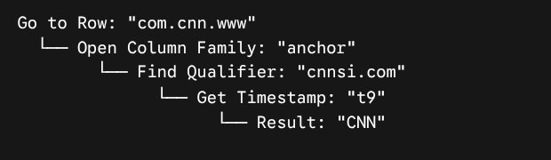

## how data is deleted
- This section addresses a massive industry secret: Modern databases almost never actually delete data when you tell them to. If you execute DELETE FROM Users WHERE id = 10;, the database does not go into the file, erase the bytes, and shift all the other millions of records up to fill the gap. Shifting data would cause massive random disk I/O and freeze performance.

Instead, they use three steps:

Deletion Markers (Tombstones): The database simply writes a tiny "marker" or flag next to the record (or appends a new record called a tombstone) that states: "As of timestamp X, this ID is dead." When you try to query that user, the database sees the tombstone and returns "Not Found," even though the old bytes are still sitting on the disk.

Shadowed Records: When you update a record, the database might just write a brand-new version of it somewhere else. The old version becomes "shadowed" (outdated/obscured by the new version).

Garbage Collection (Compaction): Periodically, a background thread wakes up to clean the house. It reads an entire page into RAM, sifts out the live records, writes only the live records sequentially into a brand-new clean page on disk, and completely drops the old page containing the deleted or shadowed data.

## Clustered vs Non-clustered
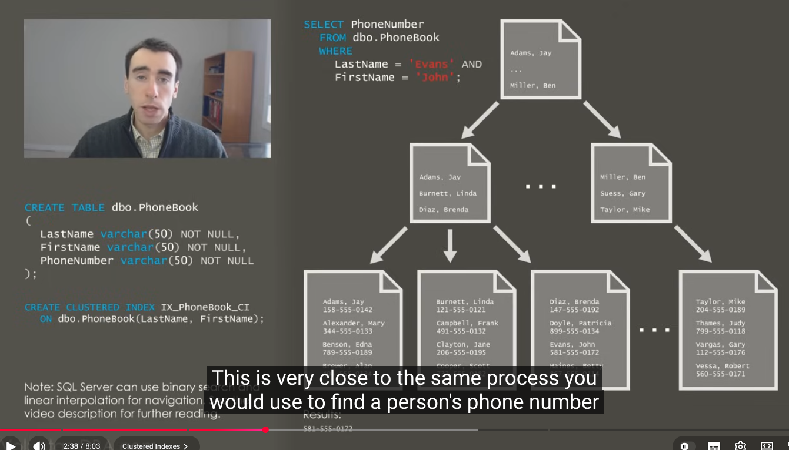
- since it has base data itself thats why we can create only one clustered index
-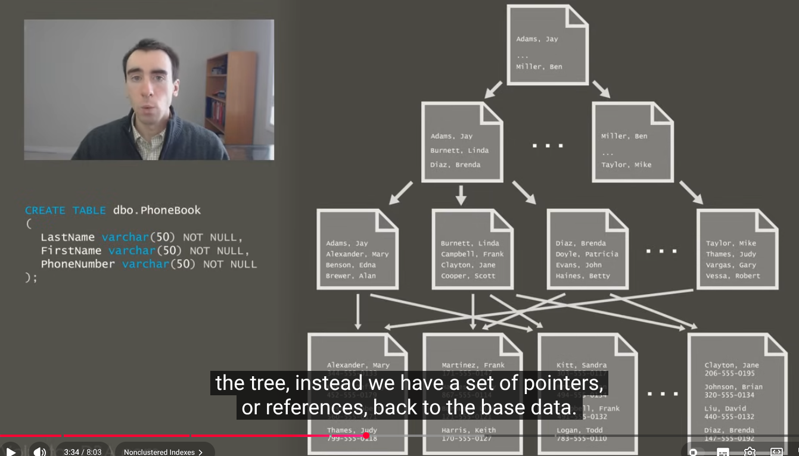
- here it has references to the base data 
for non-clustered index
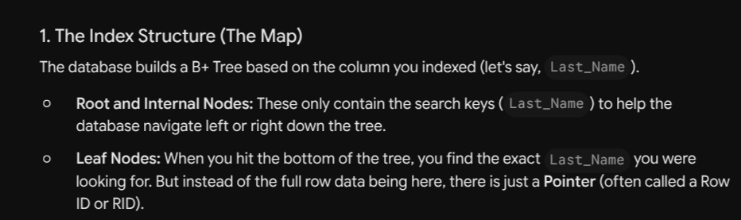
-You can create 10 different non-clustered indexes on 10 different columns (e.g., Email, Phone Number, Last Name, Department). None of them duplicate the heavy base table. They all just store tiny pointers that reference back to that exact same single base table. This is why you can have many of them without destroying your storage capacity.

The Quick Analogy to Remember It:

The Clustered Index is the actual printed pages of a dictionary (sorted alphabetically). You can't sort the printed pages a second way without printing a whole new physical dictionary.

The Non-Clustered Indexes are the extra indexes at the back of the book (e.g., an index of words by origin, or an index of words by syllable count). You can have as many of these as you want, because they just point back to the same printed page numbers!

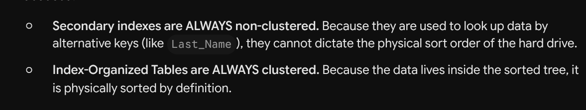

# How secondary index looks up data
- Here both has its own pros and cons
- though in first diagram it has less disk seek but updation cost is expensinve
- in 2nd u have to update only primary key but con you have to go through primary index
- mysql inno db decides 2nd is much better than 1st


## pillars of storage engine
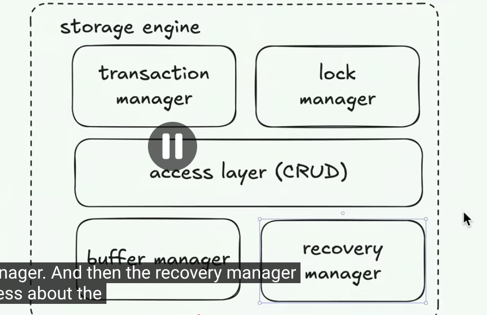
-here buffer manager helps to evict also
- buffered makes the execution very fast but it can lose data
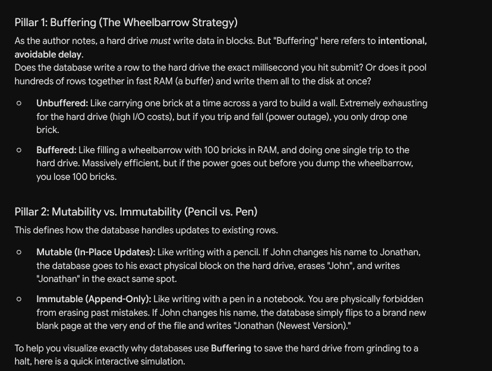
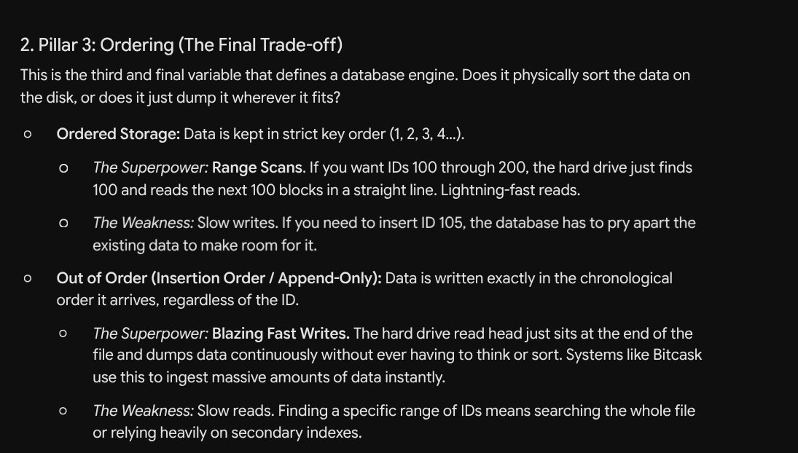
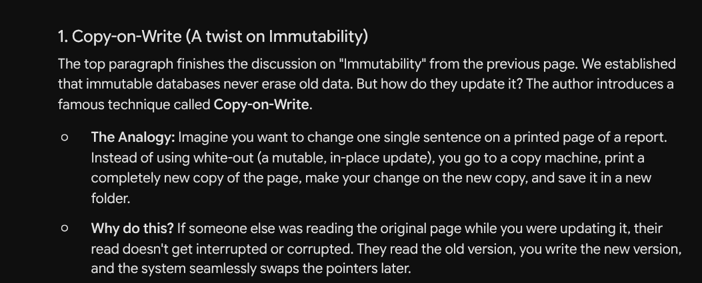
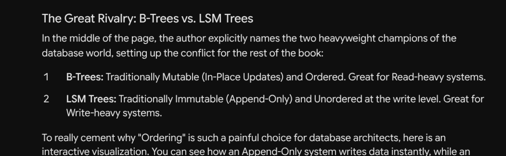
- what does mean by offset?
-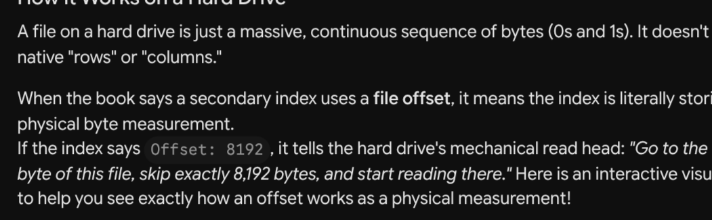


# Chapter-2
- B_TREE BASICS
- Here we are assuming mutablitiy(means in-place updates)although modern systmes use MVCC(multi-version concurrency control).. but assume one key=one physical location
- EVEN log2(n)is very high for disk seeks meaning for million records you have 20 disk seeks . this will crush database performance and moresover for balanced tree- there is restructuring cost


- now b-tree
-High Fanout: Instead of a node holding just 1 key and 2 pointers, what if a node was the exact size of a disk block (e.g., 4 Kilobytes) and held 100 keys and 101 pointers? This groups neighboring keys tightly together on the disk (improving locality).

## SSD
- pages -(2-16 kb)
- blocks-(64 to 512 pages)
-he Write/Erase Asymmetry (The Whiteboard Problem)
-This is the most important concept on the page. On an SSD, you cannot simply overwrite data like you can on a spinning disk.

-Reading and Writing: The SSD can read and write data in small, nimble chunks called Pages (e.g., 4 Kilobytes).

-Erasing: The SSD cannot erase a single Page. It can only erase an entire Block (which might contain 64 to 512 pages). Furthermore, you cannot write new data into a cell unless it has been completely erased first.
-The Janitor: Flash Translation Layer (FTL)
-Because of this weird whiteboard rule, the SSD needs a tiny computer inside of it called the FTL.

-When you "update" a database row, the FTL doesn't delete the old row. It just writes the new row to an empty Page and marks the old Page as "garbage" or "stale."

-Garbage Collection: Eventually, your SSD blocks fill up with a mix of live data and stale garbage. The FTL has to pause, find all the live pages in a block, copy them to a brand new block, and then trigger a massive electrical charge to erase the entire old block so it can be used again. This background work slows down database writes.
-The Takeaway
-The B-Tree thinks it is mutable. It fully believes it is doing in-place updates.

-The SSD is actually immutable. It is secretly doing out-of-place updates and Garbage Collection behind the database's back.

## 2-3 Node and B tree
-2-3-Tree Node (The stepping stone): * Contains 2 Keys side-by-side.Contains 3 Pointers (Less than Key 1, Between Key 1 & 2, Greater than Key 2).
-B-Tree Node: * Contains $N$ Keys (often dozens or hundreds!).Contains $N+1$ Pointers.


## THE TWO STEP SEARCH
-The RAM Search (Fast): Because keys inside a single B-Tree node are perfectly sorted, the database can use a standard Binary Search algorithm on them. If a single disk block holds 200 keys, the computer loads that entire block into ultra-fast RAM and searches it in microseconds.

-The Level Jump (Slow): Once the RAM search finds the correct pointer, the database uses that pointer to jump to the next level of the tree. This is the expensive Disk Seek.
## EXAMPLE
- The 4-Billion Item Example:
-The author notes that searching through 4 billion items requires about 32 comparisons.

-If you used a standard Binary Tree, every single one of those 32 comparisons might live in a different physical disk block. That equals 32 slow Disk Seeks.

-In a B-Tree with a high fanout (e.g., 100 children per node), the tree is only about 4 or 5 levels deep. You still do 32 logical comparisons, but 28 of them happen instantly in RAM inside the nodes! You only suffer 4 or 5 Disk Seeks (one for each level jump).
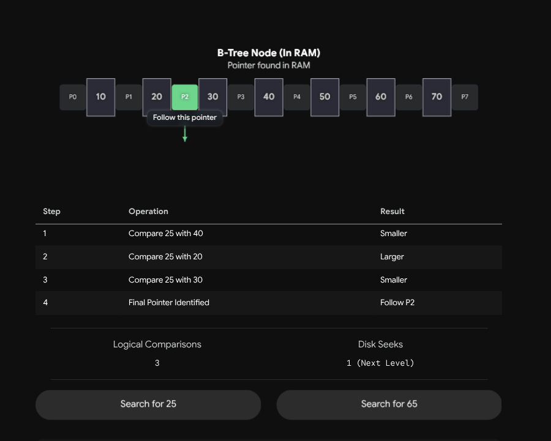

## QUESTION
-1. Does loading the node into RAM cost time?
```
Yes, absolutely. Loading the node into RAM is the Disk Seek. When the database needs to look at the Root Node, the physical hard drive arm has to swing to the right spot, read that 4 KB block of data, and copy it into the computer's RAM.

The Cost: This takes roughly 5 to 10 milliseconds on a mechanical hard drive. In computer time, this is an absolute eternity.

But once that block is copied into the RAM, the CPU can run the binary search on those keys in about 0.0001 milliseconds.
```
-2. When it follows the pointer to the next node, is that another Disk Seek?
```
YES! You nailed it. This is the exact reason why the tree's height matters so much.

If the target key is not in the Root Node, the binary search in RAM will tell the database: "The number you want is down Pointer #4." Pointer #4 is a physical address (like "Go to Block 850"). The database drops the Root Node from RAM, the mechanical arm physically swings to Block 850, reads it, and loads that new child node into RAM.

Level 1 (Root): 1 Disk Seek.

Level 2 (Internal): 1 Disk Seek.

Level 3 (Leaf): 1 Disk Seek.

If your tree is 3 levels deep, finding a record will always cost exactly 3 Disk Seeks.

This is exactly why database engineers created the rule we saw on the last page: High Fanout = Low Height. If you pack 500 children into every single node, your massive 1-billion-row database will only be 4 levels deep. That guarantees the hard drive will never have to do more than 4 Disk Seeks to find any piece of data.
```
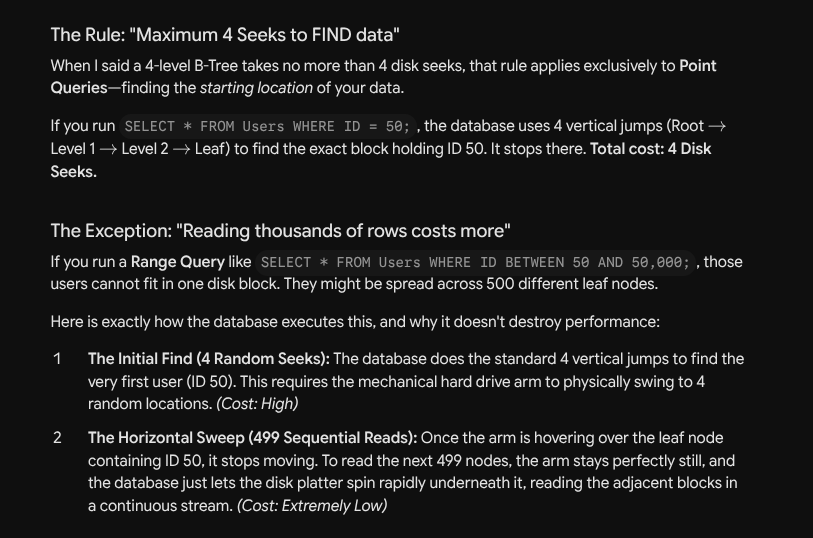

## 50 % utilization programme
-The final paragraph notes that B-Trees intentionally leave massive amounts of empty space inside their nodes (sometimes operating at only 50% capacity).
Why? Because if every node was 100% full, the very next time a user registered on your app, the database would have to aggressively split nodes and rewrite the tree just to fit one row. Leaving empty space acts as a "shock absorber" for future inserts.

## FACT
-The author makes a brilliant point here: the search algorithm doesn't always find an exact match.

-If you run a Point Query (WHERE ID = 50), it searches until it finds exactly 50 at the leaf level. If it isn't there, it returns empty.

-If you do an Insert for ID 25, the database won't find 25. Instead, the algorithm finds its predecessor (e.g., ID 24). It does this so it knows exactly which leaf node has the physical space where ID 25 should be inserted.

## promotion of node
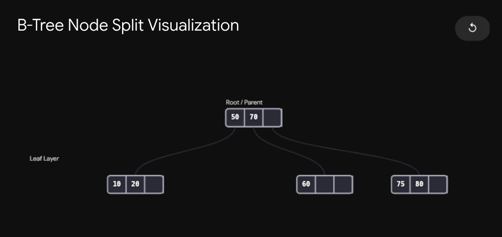
- Here 70 is pushed above becuase earlier 60|70|80 was there .. and when 75 came it seeks for another page and also 70 gets pushed above so one can know that after 70 there is split

## demotion of node while deletion
-Before Merge: The left leaf has [15, 16] and the right leaf has [20, 25]. The parent node routes traffic using the separator key 20.

-The Trigger: We delete 16. The left node now only has [15]. It underflows.

-The Merge: The database checks the right neighbor [20, 25]. Together, 15, 20, and 25 easily fit into a single 3-slot node. It combines them into a single leaf block.
-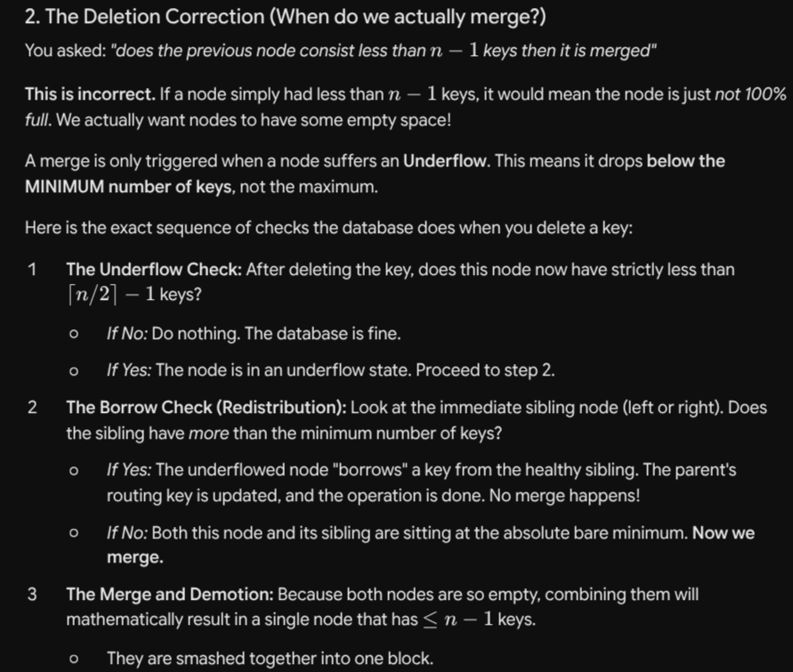

## no of nodes
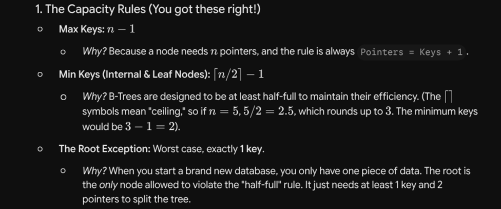
# Chapter-3
## Garbage collection
-In RAM: If you delete 1,000 objects, you don't really care where those empty holes are. The OS and your programming language handle the "Garbage Collection" and will seamlessly reuse that space or ignore it without a performance hit.

-On Disk: If you delete 1,000 database rows, you now have 1,000 tiny holes scattered across your hard drive. This is called Fragmentation. The hard drive will not clean this up for you. As a database developer, you have to build a custom tracking system to remember exactly where those holes are so you can recycle them for new inserts. If you don't, your database file will bloat infinitely.

## problem of serialization and deserilazation
-Serialization: The act of translating a complex piece of data (like the number 1,000,000 or the word "Hello") into a strict sequence of raw bytes so it can be written to disk.
- happens when we read from disk
-Deserialization: Reading those raw bytes back off the disk and reconstructing them into the original number or word.

## How we read strings
-Null terminated(c way)- end with null or /0
- pascal way- have a length in front of string [8]abhishek
## Bit packing
-A boolean is a simple True or False. In computer hardware, that only requires 1 bit (a 1 or a 0).
H-owever, the absolute smallest unit of memory a computer can allocate is a Byte (which is 8 bits). If you save a simple True boolean normally, you use 1 bit for the data and waste 7 bits of empty space.

-To fix this, engineers use Bit-Packing. They take 8 different boolean settings and stuff them all into a single byte!

## how record layout
-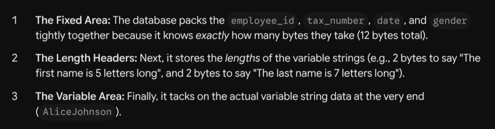
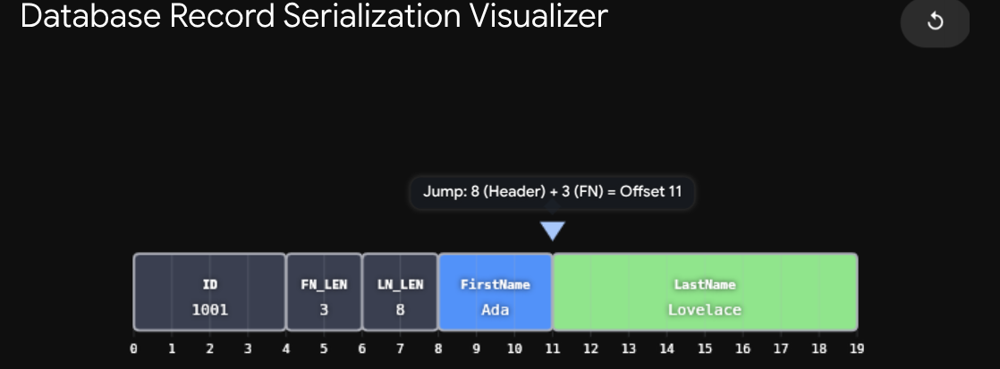
-Page IDs (Global): When an internal routing cell points to a child node, it uses a Page ID (like "Go to Page #50"). The database uses a separate master lookup table to figure out where Page #50 physically lives on the multi-gigabyte hard drive.

-Offsets (Local): Inside a single 4 KB slotted page, the pointers in the slot array don't use massive, heavy Page IDs. They use tiny, lightweight Offsets (like "Jump to byte #145"). These coordinates only make sense relative to the start of that specific page.
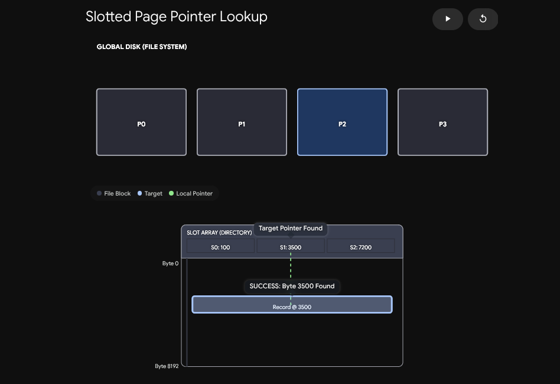
## What happens if you have ten tiny 10-byte holes scattered around the page, and you need to insert an 80-byte record?
-You technically have 100 bytes of free space, but no single hole is big enough to hold the record!

-This is when the database is finally forced to do the heavy lifting: Defragmentation. It briefly locks the page, physically scoops up all the live data cells, and shoves them tightly together at the end of the page.
- All those tiny scattered holes are merged into one massive, contiguous block of free space, allowing the 80-byte record to finally be inserted.
-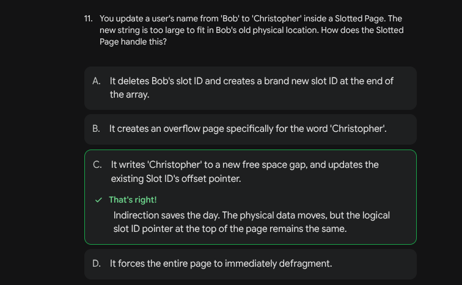
## protection-
##Checksumming (Protecting Against Hardware Decay)
-Hard drives are physical objects, and they are imperfect. Sometimes, due to a microscopic scratch, a power surge, or even cosmic rays, a 0 on your hard drive might spontaneously flip to a -1. This is called "bit rot" or silent data corruption.

-If a database reads corrupted data without realizing it, it could charge a customer $10,000 instead of $10. To prevent this, databases use Checksums and CRCs (Cyclic Redundancy Checks).

-How it works: Before the database writes a 4 KB page to the disk, it runs all the data through a math formula to generate a tiny "signature" (the checksum). It saves this signature in the Page Header. Later, when it reads the page back into RAM, it runs the math again. If the new signature doesn't perfectly match the saved signature, the database immediately knows the hardware corrupted the data, and it throws an error instead of using it.

-Checksum vs. CRC: Basic checksums (like simple addition) are fast but weak. If two bits flip at the same time, they might cancel each other out, and the basic checksum wouldn't notice. CRCs use more complex polynomial math to detect "burst errors" (multiple corrupted bits in a row), making them much safer for storage drives


# chapter -4
-The Page Header (The Metadata)
-Just like a file has a header, every single fixed-size block (page) inside the file also has its own mini-header. The Page Header acts as the dashboard for that specific 4 KB chunk of memory.

-Before the database even looks at the data records, it reads the header to understand the layout. The text highlights that headers typically track:

-Flags: Tiny bits that describe the page type (e.g., "Is this an internal routing page or a leaf data page?").

-Cell Count: Exactly how many records are currently stored on this page.

-Offsets (The Free Space Boundaries): Remember the Slotted Page from Chapter 3? The pointers grew from the top down, and the data grew from the bottom up. The header stores the exact byte coordinates (lower and upper offsets) of where that "free space" gap currently starts and ends, so it knows exactly where to append the next piece of data.

## THE high key concept
- there is a special key kn+1 so that last pointer dont feel left out at the end
-Instead of leaving the rightmost pointer as an unpaired orphan, this architecture artificially adds one extra key to the node: the High Key ($K_{N+1}$).This High Key does not represent a standard routing boundary between two child nodes. Instead, it represents the absolute maximum value that is allowed to exist anywhere in that node's entire subtr

## advantages of high key
-) Using $+\infty$ as a virtual key: In a standard B-Tree, the final pointer ($P_2$) handles everything greater than or equal to $K_2$. Its upper bound is literally infinity. The database just assumes "anything bigger than $K_2$ goes down this path."(
 -b) Storing the High Key: In this approach, the final pointer ($P_2$) is strictly bounded. It handles values from $K_2$ up to a strict ceiling of $K_3$.

 - one more reason is concuurency support
 -easy for locking
 -Why does PostgreSQL do this? The author notes this is tied to Concurrency (specifically B$^\text{link}$-Trees). If you have thousands of users reading and writing to the tree simultaneously, having strict upper boundaries on every single node makes it significantly easier to lock specific portions of the tree without accidentally blocking queries that belong in a different subtree.

 ## the chopped database-it-images/image concept
 -To maintain performance, the database doesn't just put the entire massive record into the overflow page. It wants to keep the beginning of the record on the Primary Page so it can still read the keys and headers quickly.

-Databases enforce a strict max_payload_size limit for any single cell.
Look at Figure 4-6:

-The Chop: When Payload1 exceeds the maximum allowed size, the database literally chops the data in half.

-The Anchor: The first chunk of Payload1 is saved safely on the Primary Page.

-The Spill: The remaining bytes of Payload1 "spill" over into the Overflow Page.

-The Pointer: A pointer is embedded at the end of the first chunk, telling the database exactly where to find the rest of the chopped-up data.

