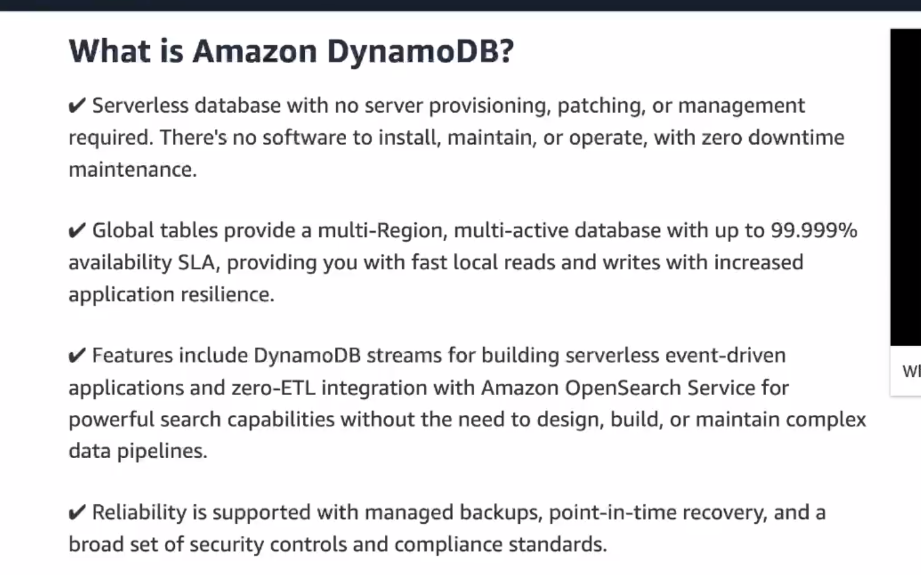
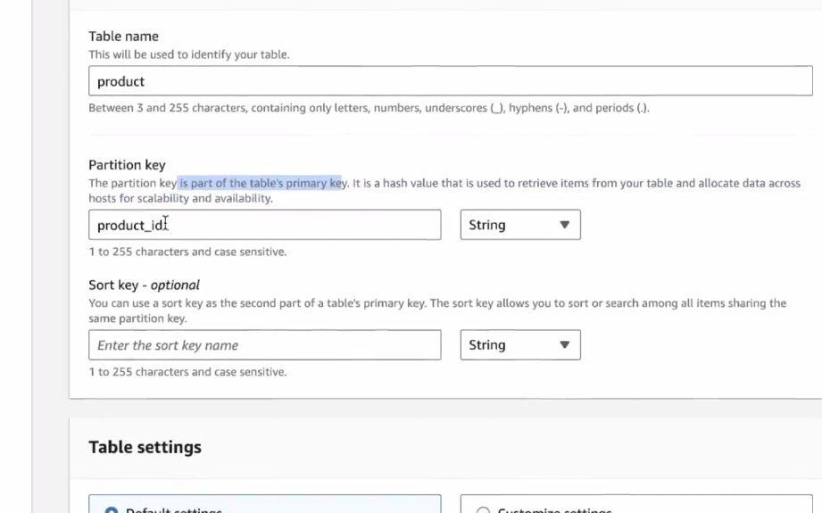
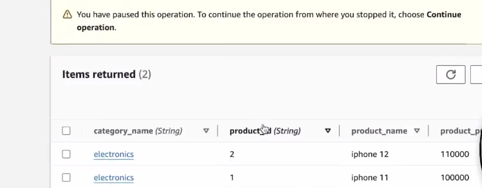
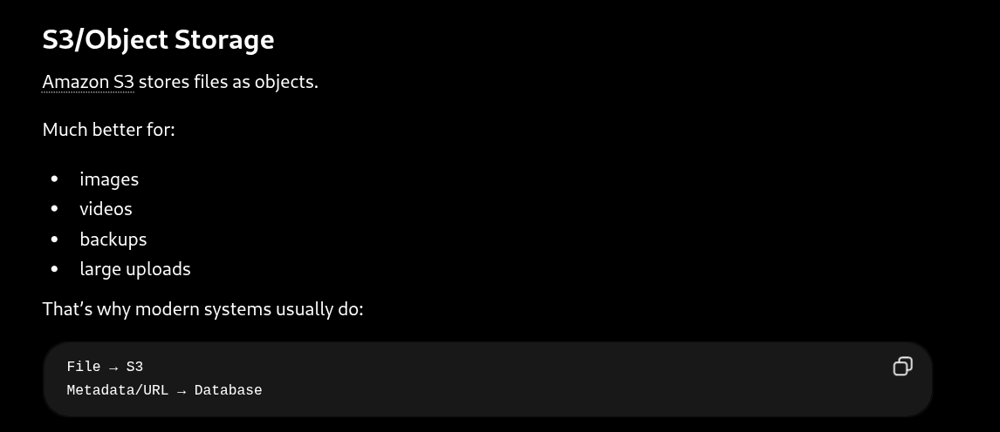
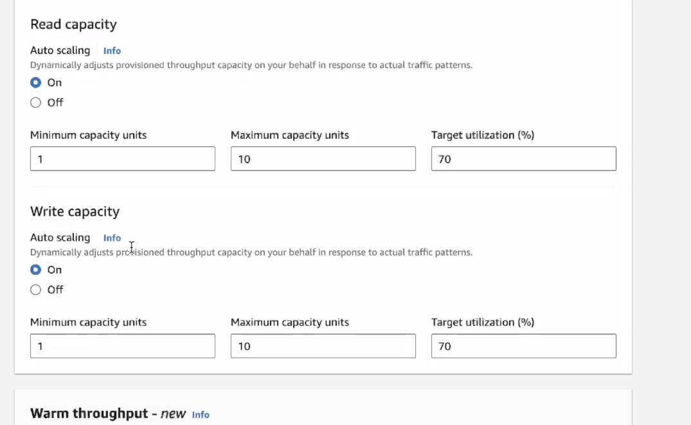
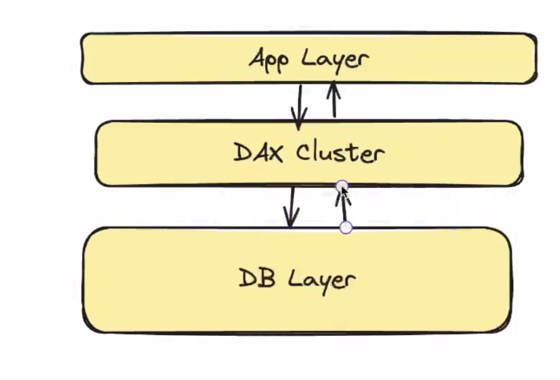
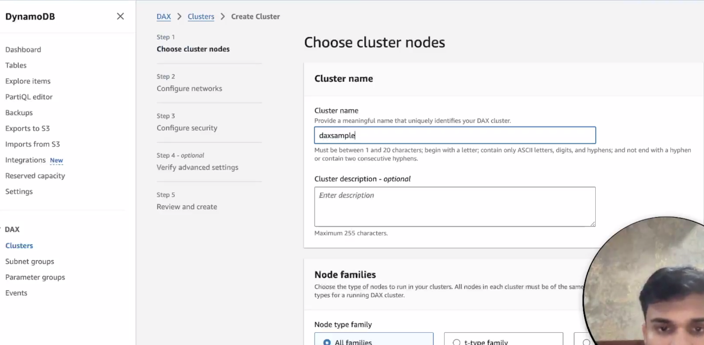
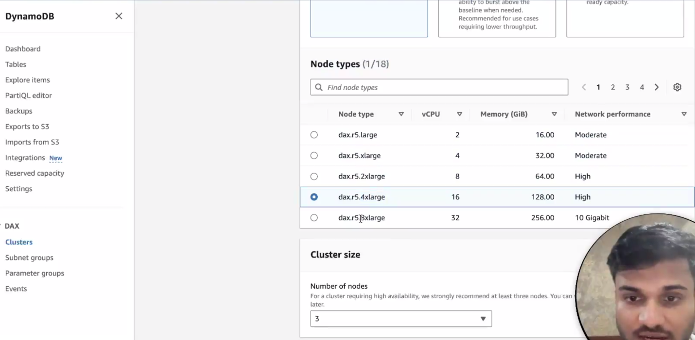
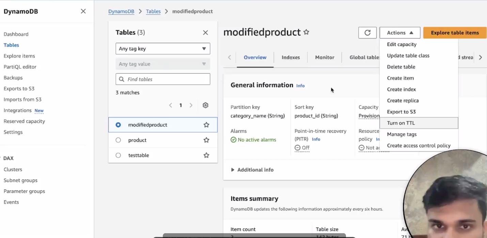

# DYNAMO_DB
- It can take millions of requests per second

- auto scaling
-dynamo db is made of tables

## partition key
- decide server instance
## sort key
- it decides how data will be ordered with same partition key

## partition key+sort key-> primary key

- with the help of sort key .. we are able to create same category_name otherwise it was not possible 


- if u want to store metadata of blob like url, log ingestion

## capacity mode
### provisioned mode
- you yourself specify the number of reads and writes  that can happen on db instances
- you need to estimate the capacity yourself

### on demand
- reads and writes are automatically determined by aws
- pay as you go

### in provision capacity mode
- the read throughput

- the rcu(right capacity unit)-i
- the write throughput( write capacity unit)-insert,update,delte

- one wcu - one writes per second for upto 1kb of data
- then how much 20 records with atmost 2 kb -40wcu

- the default model in dynamodb- is strong constitency
- you can change to eventual consistency

-if one rcu is 1 strong consistenr read of atmost 4kb of data
## imp thing- rcu and wcu will get partitioned equally means u bought 1000 wcu and 10 partiotions then 100 wcu for

## question- what is the use of autoscaling in provisioned mode
- simple u will not get all the time maximum so u can turn on autoscaling


## dynamodb indexes
- lsi(local secondary index)-alternate sort key
- gsi(global secondary index)-alternate primary key- can be created after table

```
In a system like DynamoDB, data is strictly organized by its Primary Key (Partition Key + Sort Key). If you want to search by any other attribute, it's normally very slow because the database has to scan every single item. Secondary Indexes are the solution to this—they are basically automated, alternative ways to look up your data.

1. Global Secondary Index (GSI): The "Completely New View"
Think of a GSI as the database automatically creating and maintaining a completely separate copy of your data, organized in a brand new way.

How it works: You pick a totally new Partition Key (and an optional new Sort Key).

Under the hood: Because you changed the Partition Key, DynamoDB has to store this index on entirely different physical servers.

The tradeoff: It gives you maximum flexibility to query your data however you want, but it costs extra money and storage because you are essentially maintaining a secondary copy of your database.

Local Secondary Index (LSI): The "Different Sort Order"
An LSI is a more lightweight approach. It's used when you want to find things within the same physical location, but just ordered differently.

How it works: You must keep the same Partition Key as your main table, but you get to choose a new Sort Key.

Under the hood: Because the Partition Key is the same, this index is stored on the exact same physical server as the original data.

The tradeoff: It's very efficient and doesn't require separate storage infrastructure, but it's less flexible because you are still locked into querying by your original Partition Key.

The Real-World Chat App Example
The text gives a great practical example to illustrate when to use a GSI:

The Base Setup:
Imagine you are building a chat app (like WhatsApp or Discord).

Partition Key: chat_id (This groups all messages for a specific conversation onto one server).

Sort Key: message_id or timestamp (This orders them chronologically).

Result: This is perfect for opening a chat and loading the history.

The Problem:
Now, let's say you want to build a "User Profile" feature that shows every single message a specific user has ever sent, across all of their different chats.

You can't do this efficiently with the base setup, because the messages are scattered across many different chat_id partitions!

The Solution:
You create a GSI.

New Partition Key: user_id

New Sort Key: message_id

Result: DynamoDB automatically copies your data and groups it by user_id on new physical servers. Now, when you search for "User X", you instantly get all their messages.
Local Secondary Indexes (LSIs)
LSIs are utilized when you need to perform range queries or sort data within a specific partition using an attribute different from the original sort key.

The Chat Application Example: If you are already inside a specific chat group (partition) but want to quickly find the messages that contain the most attachments, you can create an LSI on the num_attachments attribute.

Structure: Unlike a GSI, an LSI retains the exact same partition key (chatId) as the main table. However, it establishes a new sort key, such as num_attach. Other attributes can also be optionally projected here.

Crucial Limitation: A major caveat of LSIs is that they must be explicitly planned and defined at the time the table is created; they cannot be added or removed later.

Key Differences: GSI vs. LSI
The provided documentation details a strict comparison between the two index types:

Architecture: A GSI uses a different partition key than the main table, whereas an LSI uses the same partition key but a different sort key.

Size Limits: Items in a GSI have no size restrictions, but an LSI is strictly limited to 10 GB per partition key.

Capacity and Throughput: GSIs operate using separate read/write capacity units distinct from the base table. Conversely, LSIs share the read/write capacity units of the base table.

Consistency: Because of how they are built, GSIs only support eventually consistent reads. LSIs, on the other hand, support both eventually consistent reads (which is the default) and strongly consistent reads.

Lifecycle: GSIs can be freely added or removed at any time without impacting the base items. LSIs are permanent upon table creation and cannot be deleted unless the entire base table is deleted.

Limits: You can create up to 20 GSIs per table, but only up to 5 LSIs per table.

Key Differences: GSI vs. LSI
The provided documentation details a strict comparison between the two index types:

Architecture: A GSI uses a different partition key than the main table, whereas an LSI uses the same partition key but a different sort key.

Size Limits: Items in a GSI have no size restrictions, but an LSI is strictly limited to 10 GB per partition key.

Capacity and Throughput: GSIs operate using separate read/write capacity units distinct from the base table. Conversely, LSIs share the read/write capacity units of the base table.

Consistency: Because of how they are built, GSIs only support eventually consistent reads. LSIs, on the other hand, support both eventually consistent reads (which is the default) and strongly consistent reads.

Lifecycle: GSIs can be freely added or removed at any time without impacting the base items. LSIs are permanent upon table creation and cannot be deleted unless the entire base table is deleted.

Limits: You can create up to 20 GSIs per table, but only up to 5 LSIs per table.

What Happens Under the Hood?
DynamoDB automatically manages and maintains these indexes for you.

GSI Mechanics: Each GSI functions essentially as an entirely separate internal table with its own partitioning scheme. When you add, update, or delete an item in your main table, DynamoDB asynchronously propagates those changes to the GSI. This asynchronous background updating is the reason GSIs only offer eventual consistency.

LSI Mechanics: LSIs are physically co-located on the same partitions as the main table because they share the same partition key. Within that shared partition, DynamoDB maintains a separate B-tree structure indexed specifically by the LSI's sort key. Because the data lives in the same place, updates to LSIs occur synchronously alongside writes to the main table, allowing for strongly consistent reads.

Query Routing: When a user executes a query against a secondary index, DynamoDB automatically routes the request to the separate table (for a GSI) or the specific B-tree structure (for an LSI) to retrieve the requested data efficiently.

```
## accessing data
```
1. Scan Operation: The "Read the Whole Book" Method
A Scan does exactly what it sounds like: it scans your entire table.

How it works: If you want to find all users named "John," a Scan will look at row 1, then row 2, then row 3... all the way to the very end of your database, checking every single record to see if the name is "John."

The Catch: While useful if you truly need to export your entire database, Scans are incredibly inefficient and expensive for normal operations. If you have 10 million users, a Scan has to read 10 million records just to find the three named "John."

2. Query Operation: The "Use the Index" Method
A Query is the highly optimized way to retrieve data.

How it works: Instead of reading the whole book, a Query uses the index at the back of the book. You must provide a specific Partition Key (like a User ID or a Chat ID). DynamoDB uses that key to instantly jump to the exact physical location of the data.

The Benefit: It only reads the specific items that match your key. Whether your database has 100 items or 100 billion items, a Query will find your specific record in milliseconds. It can also perform "range queries" if you have a sort key (e.g., "Give me user 123's messages between Monday and Friday").

Traditionally, because DynamoDB is a NoSQL database, you don't use standard SQL (like SELECT * FROM table). You use AWS SDKs (code) to construct JSON-like requests.

What it is: To make things easier for developers who already know SQL, AWS created PartiQL.

How it works: It allows you to write familiar SQL statements (SELECT, INSERT, UPDATE). However, the text points out an important caveat: it's just a convenience layer. Under the hood, PartiQL translates your SQL string right back into standard DynamoDB Scans and Queries.


```

## in js vs sql

```
1. Querying Data: SQL vs. DynamoDB
The first image illustrates the syntax differences between a traditional SQL query and a DynamoDB query.

In SQL, querying a specific user is straightforward: SELECT * FROM users WHERE user_id = 101.

In DynamoDB, this translates to a JavaScript object where you specify the TableName (e.g., 'users') and use a KeyConditionExpression (e.g., 'user_id = :id').

You must also provide ExpressionAttributeValues to map the variable (e.g., ':id': 101) before executing the operation with the dynamodb.query() method.


2. Scanning Data
If you need to perform a scan rather than a targeted query, you use the scan method.

The SQL equivalent of a scan is simply selecting everything from a table: SELECT * FROM users.

The corresponding DynamoDB operation requires only the TableName in its parameters before calling dynamodb.scan().

However, the text strongly advises against using expensive scan operations whenever possible. To ensure queries are performant and efficient, you must rely on careful data modeling by choosing the right partition key and sort key.

Data Reading Costs and Projection Expressions
A critical warning is provided regarding how DynamoDB reads data and calculates costs. When you query DynamoDB, it reads the entire item by default.

DynamoDB supports a ProjectionExpression feature that allows you to return only specific attributes.

However, using a ProjectionExpression only reduces network bandwidth.

The database still physically reads the full item from storage.

As a result, you are still charged the full Read Capacity Unit (RCU) cost based on the item's total size.

This behavior is fundamentally different from traditional SQL column selection.

4. Normalization and Data Modeling Strategy
Because of how RCU costs are calculated, the documentation advises normalizing your data appropriately for large items to avoid reading more than necessary.

The text provides an example of designing a Yelp-like application where you need to store business details alongside user reviews.

If you store a list of reviews directly inside the main business table, every request to read basic business information (like the name or address) will force the database to read the entire record, including the bulky reviews.

Instead, the wise approach is to pull the reviews out into a separate table and query that specific table using the business ID.


```
## CAP
```
1. Eventual Consistency (The Default)
By default, DynamoDB operates as a highly available ("AP") system.

How it works: When you write data, it goes to a primary server, which then copies it to backup servers (replicas) in the background. If you read that data immediately, your request might hit a backup server that hasn't received the update yet.

The Trade-off: You get incredibly fast response times (low latency) and high availability, but you might occasionally read slightly "stale" data for a fraction of a second.

Best for: Social media feeds, view counters, or product catalog listings where a slight delay in updates isn't catastrophic.

2. Strong Consistency
If your application cannot tolerate stale data, you can override the default by adding ConsistentRead=true to your code for that specific request.

How it works: DynamoDB forces the read to verify it has the absolute latest successful write before returning a result.

The Trade-off: Because it has to double-check across servers, it might be slightly slower. More importantly, it costs twice as much (consuming 1 Read Capacity Unit instead of 0.5 per 4KB).

Best for: Financial balances, inventory for an e-commerce checkout, or booking systems where reading outdated information would cause critical errors.

3. Advanced ACID TransactionsThe bottom of the text notes that DynamoDB goes even further than simple reads/writes. It supports full ACID transactions (TransactWriteItems, TransactGetItems). This means you can update up to 100 items across multiple different tables simultaneously, guaranteeing that either all of the updates succeed together, or none of them do, preventing partial, corrupted states in your database.To help visualize why you might get stale data with eventual consistency, I've created an interactive simulation below. You can write a new value and then immediately test both read types while the data is still replicating across the network.

```
## consistency models
```
Consistency Models Under the Hood
DynamoDB's ability to offer different consistency models is deeply tied to its distributed replication mechanisms.

Strongly consistent reads are exclusively supported on the base table and Local Secondary Indexes (LSIs), meaning Global Secondary Indexes (GSIs) only support eventual consistency.

Eventually Consistent Reads (the default) can be served by any of the three replicas within a partition's replication group.

Because the leader node replicates writes to follower nodes asynchronously, an eventual read might return slightly stale data.

Eventual reads consume less read capacity (0.5 RCU per 4KB) and provide lower latency.

Strongly Consistent Reads are explicitly routed directly to the leader node for that partition.

Because all writes go through the leader first, querying it guarantees the most current data.

Strong reads consume more capacity (1 RCU per 4KB) and may result in higher latency.

Architecture and Scalability
DynamoDB handles massive scale by automatically managing partitions and leveraging AWS's global infrastructure.

The database scales via auto-sharding and load balancing, meaning it automatically splits and redistributes data when a partition reaches its size or throughput capacity.

It utilizes hash-based partitioning to ensure even data distribution and balanced traffic across nodes.

To scale globally and reduce latency for worldwide users, DynamoDB offers Global Tables, which enable real-time replication across different AWS regions.

The system also integrates across multiple Availability Zones within each region to ensure continuous service and data durability.

Fault Tolerance and Availability
To prevent data loss and downtime during hardware or network failures, DynamoDB relies on automatic replication and consensus algorithms.

AWS automatically replicates your data across three Availability Zones within a single region, a feature that is not user-configurable.

Each partition maintains a group of three replicas consisting of one leader node and two follower nodes.

The system uses Multi-Paxos consensus to manage this leader-based replication group.

The leader handles all write operations by generating a write-ahead log (WAL) entry and sending it to the followers.

A write is only considered successful once a quorum (2 out of the 3 nodes) acknowledges and persists the log record.

Security
DynamoDB includes several built-in security features that require little to no configuration from the user.

Data is secured and encrypted at rest by default.

Data in transit is always encrypted because DynamoDB strictly enforces TLS for all API calls.

Fine-grained access control is managed through integration with AWS Identity and Access Management (IAM), allowing strict policies on who can access data and what actions they can perform.

For applications requiring network isolation, Virtual Private Cloud (VPC) endpoints allow secure access to DynamoDB directly from within a VPC, preventing the data from being exposed to the public internet.


```

## to see data in dynamodb tbale
- there is left explore items go there

## you can write a sql query there also
partiQL editor

## DAX -Dynamo db Accelerator
-fully aws managed, in memory , highly available cache service for dynamodb
-microseconds latency for RW
- expiry time is 5 minutes
-
- go to cluster and create a new cluster
-
-high cost
-

## TTL
- go to actions 
-
- you have to enter epoch value 


## different ids
```
Auto-incrementing counters per partition: This is the traditional database approach where a counter just goes up by 1 for each new row. In a large system, this is broken down by "partitions" (chunks of data) to prevent bottlenecks.

UUID v7: Standard UUIDs (like v4) are completely random, meaning they don't sort by time. UUID v7 is specially designed to put a timestamp at the very beginning of the ID string. This means when you sort them alphabetically/alphanumerically, they automatically sort chronologically. The snippet also notes it's better than older versions (v1) because it doesn't leak your server's hardware address (MAC address) for security and privacy.

Snowflake IDs: Originally created by Twitter, this is a highly popular format for distributed systems. It combines a timestamp, a server/worker ID, and a tiny sequence number to guarantee unique, time-sortable IDs across thousands of servers without them having to check in with each other.

ULID (Universally Unique Lexicographically Sortable Identifier): Similar in purpose to UUID v7, ULIDs combine a timestamp with random data to generate an ID that is both globally unique and perfectly sortable as a string of text.


```
## facts
```
B-trees (Sorting Within the Server)
Once you are routed to the correct server, you still need to find your specific record quickly among millions of others on that machine.

Sort Key: If your table uses a sort key (like a timestamp or a secondary ID), DynamoDB stores the items inside that specific server using a B-tree data structure. * Why B-trees? B-trees are highly optimized for searching and sorting. Instead of scanning every single row one by one, a B-tree allows the database to instantly jump to a specific range (e.g., "give me all records from last week") by following a tree-like path, vastly reducing the amount of data it has to read.

3. Composite Key Operations (Working Together)
When you query the database using both keys, DynamoDB does a highly efficient one-two punch:

It hashes the Partition Key to instantly route your request over the network to the correct physical server.

Once at the server, it uses the Sort Key to quickly traverse the B-tree and grab your specific items.


```
