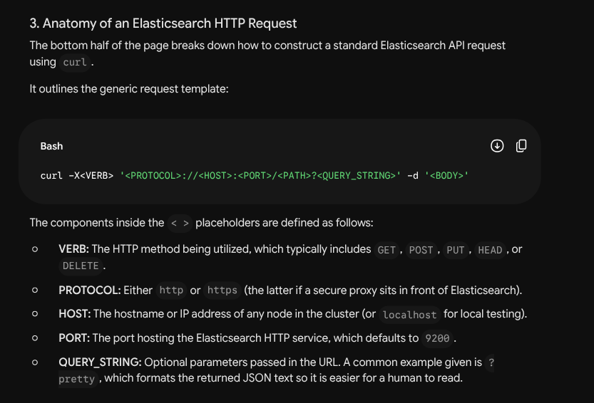
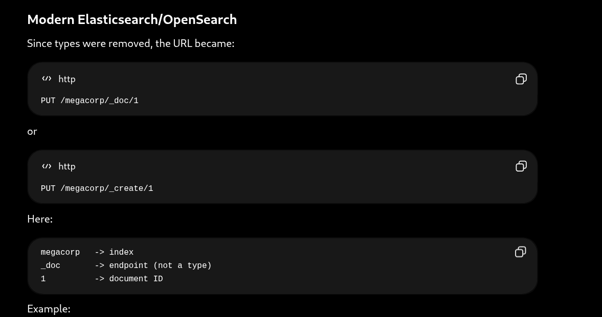
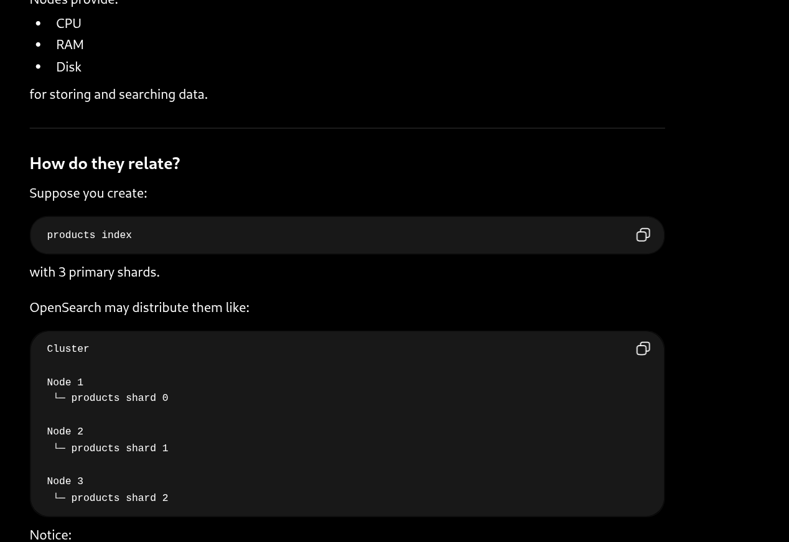
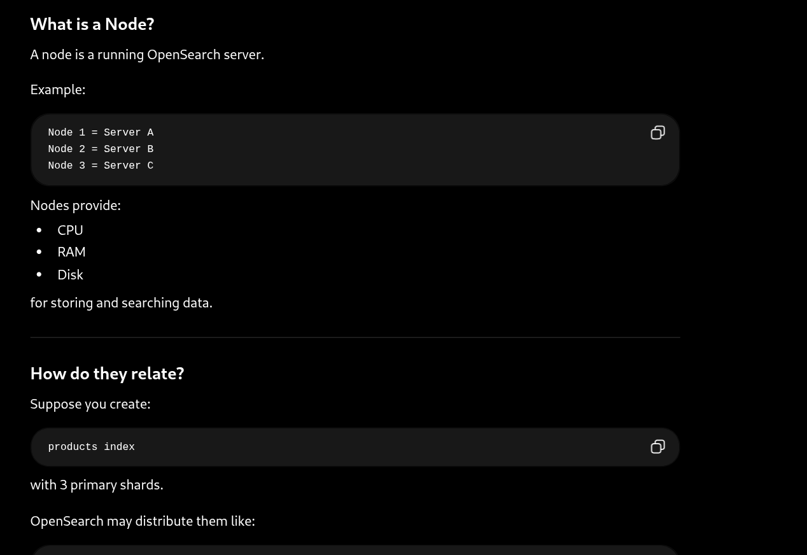
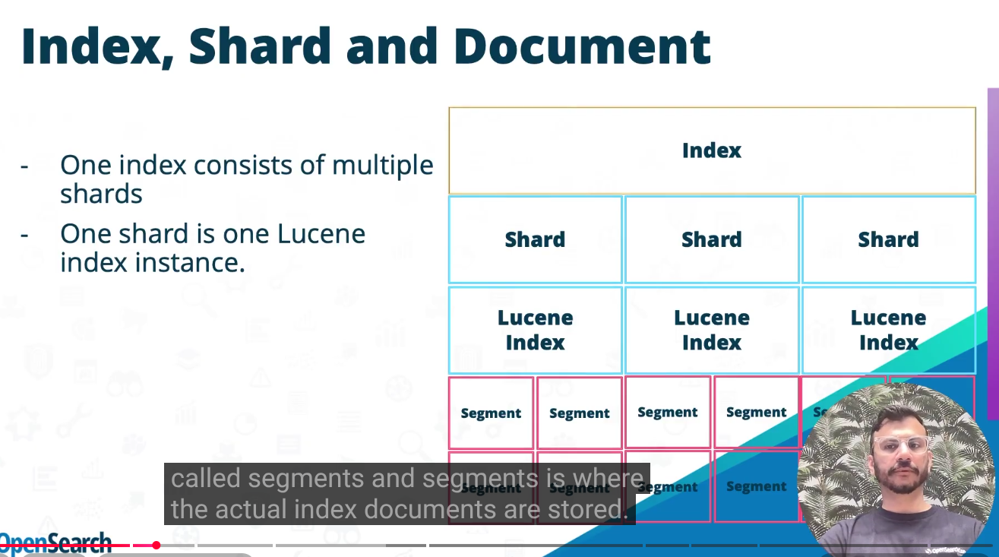
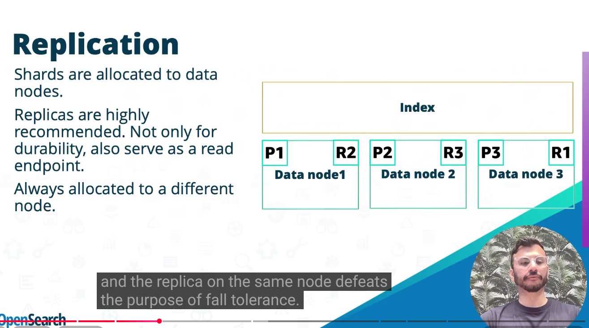
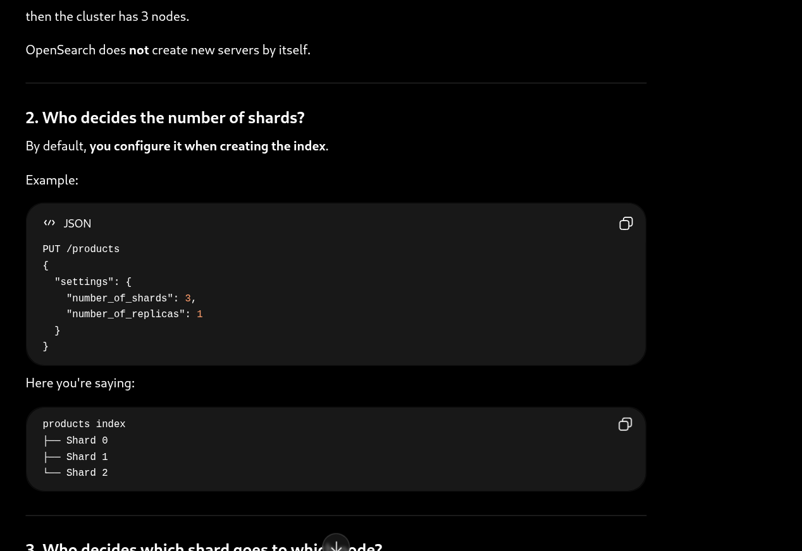
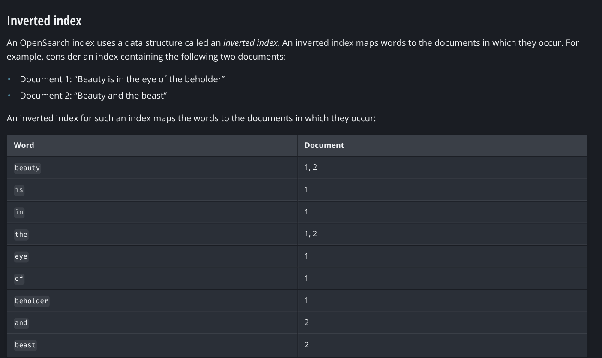

# elastic search
- built on top of apache lucene
- apache 2 license

- Node -> a single running instance of elasticsearch file
- Cluster -> a collection of one or more nodes working under the same cluster.name



```
curl -XGET 'http://localhost:9200/_count?pretty' -d '
{
    "query": {
        "match_all": {}
    }
}'
### 2. Understanding the Elasticsearch Response
* Elasticsearch responds with a standard HTTP status code (such as `200 OK`) along with a JSON-encoded response body (unless a `HEAD` request was sent).
* The example response block shows:
  * `"count" : 0` – No documents have been matched yet.
  * `"_shards"` metadata – Indicating that 5 total shards were checked, all 5 were successful, and 0 failed.

---

### 3. Viewing HTTP Headers
The text notes that standard terminal `curl` commands hide HTTP headers by default. If a developer needs to view headers, they should include the `-i` (include) switch in their command:
```bash
curl -i -XGET 'localhost:9200/'

```

## stores in JSON
```
{
    "email":      "john@smith.com",
    "first_name": "John",
    "last_name":  "Smith",
    "info": {
        "bio":       "Eco-warrior and defender of the weak",
        "age":       25,
        "interests": [ "dolphins", "whales" ]
    },
    "join_date": "2014/05/01"
}

```

## example
```
Relational DB       Elasticsearch/OpenSearch

Database      ->    Index
Row           ->    Document
Column        ->    Field
An Elasticsearch cluster contains multiple indices (databases), which contain multiple types (tables), which hold multiple documents (rows), which are made up of multiple fields (columns).


```



### Starting opensearch
- a collection of documents called index
- When you search for information, you query data contained in an index.
- so let say you have infinte documents so good way is to partition the index into shards
- each shard is called lucene index on its own
- each node can have differnt shards of same index
-Splitting a 400 GB index into 1,000 shards, for example, would unnecessarily strain your cluster. A good rule of thumb is to limit shard size to 10–50 GB.
-


- and each lucene index has segments where actual documents are stored

- here you see replication of one node is kept on a different node
-

```
Cluster
│
├── Node 1
│   ├── Shard A
│   └── Shard B
│
├── Node 2
│   ├── Shard C
│   └── Shard D
│
└── Node 3
    └── Shard E

```

- Question
-is opensearch decides itself how to distribute the index on basis of shards and which shard will go to which node and how many nodes will be in one cluster

-Yes, OpenSearch automatically decides shard placement, but you decide how many nodes exist in the cluster.

Let's break it down.
-
-

## inverted index
-


## BM25
-more occurence, more relevance
-penalises long documents
-how many times appeared in the document
-rarer words -more score
-

## Creating index
-
```
let index="books"

var settings={

    settings:{
        index:{
            number_of_shards:4,
            number_of_repicas:2
        }
    }
}
var response= await client.indices.create({
    index=index.name,
    body=settings
})

```
## Indexing a document- means putting documents to the index(table)
```
var document = {
  title: "The Outsider",
  author: "Stephen King",
  year: "2018",
  genre: "Crime fiction",
};

var id = "1";

var response = await client.index({
  id: id,
  index: index_name,
  body: document,
  refresh: true,
});

Here refresh means as soon it is inserted it is ready for query as well
```

## Searching up a document

```
var query = {
  query: {
    match: {
      title: {
        query: "The Outsider",
      },
    },
  },
};

var response = await client.search({
  index: index_name,
  body: query,
});
The match query is a full-text search, not a strict, exact-string match. Here is a breakdown of how it works behind the scenes and how to actually get an exact match if you need one.

How the match Query Actually Works
When you index a document and when you search for it, the engine passes the text through an analyzer. By default, it does two main things:
Lowercases everything.
Splits the text into individual words (tokens).
So, your query "The Outsider" is broken down by the search engine into a list of words: ["the", "outsider"].
Because of this, a match query for "The Outsider" will successfully find documents with titles like:
"The Outsider" (Exact match)
"the outsider" (Case does not matter)
"Outsider" (It found one of the words)
"The Great Outsider" (It found both words, even with another word in the middle)

How to Get an Exact Match Instead
If you truly only want to match the exact phrase or the exact string, you have to use different types of queries:

1. match_phrase (Exact Words & Order)
If you want the words to appear in the exact order you typed them, you use a match_phrase query. This would match "The Outsider" or "Read The Outsider", but it would fail to match "The Great Outsider".
"match_phrase": {
  "title": "The Outsider"
}
2) term Query (100% Exact, Case-Sensitive Match)
If you want a strict, exact match where "The Outsider" only matches "The Outsider" (and fails on "the outsider" or "Read The Outsider"), you use a term query. This is usually run against a special sub-field called a keyword field, which skips the analyzer entirely.

"term": {
  "title.keyword": "The Outsider"
}
here title.keyword is necessary beacuase
When you index a text field in OpenSearch/Elasticsearch, the engine actually saves two versions of it in the background:

title (Text): It lowercases and chops up the words so you can do fuzzy searches or match_phrase searches.

title.keyword (Keyword): It takes the exact string exactly as you typed it (casing, punctuation, and all) and saves it as one single block of data.
```


## updaing a document
```
we have seen while indexing we were writing body:document

means body:{title:""....}but here in updating why we are introducing doc inside body which is correct

When you use the index method, you are doing a Full Document Replacement (or creation). You are telling the database, "Take exactly what I am giving you and make this the new document."

Because the system expects the entire complete object, you just pass the raw document directly into the body:
// INDEXING (Full Replacement)
body: {
  title: "The Outsider",
  author: "Stephen King",
  year: "2018"
}

Updating (client.update) = "Here is a set of instructions."
When you use the update method, you are doing a Partial Update. You are telling the database, "Keep the existing document, but just change or add these specific pieces."

Because the Update API is very powerful, it can accept different types of update instructions. Wrapping your fields inside "doc": {} explicitly tells the engine: "I am providing a partial document. Please merge these fields into the existing one."
// UPDATING (Partial Merge)
body: {
  doc: { 
    year: "2019" // Only updates the year, leaves title and author alone
  }
}
client.update({
    index: "books",
    id: "99",
    body: {
        doc: {
            title: "The Outsider",
            year: "2019"
        },
        doc_as_upsert: true
    }
})
Why does it need to know it's a "doc"?
Because you don't have to use doc. The Update API also allows you to update documents using scripts (code that runs on the server to calculate a new value).

If you wanted to increase a book's "view count" by 1, instead of using doc, you would pass a script:
body: {
  script: {
    source: "ctx._source.views += 1"
  }
}

```

## Deleting a document
```
var response = await client.delete({
  index: index_name,
  id: id,
});

```
## Deleting an index
```
var response = await client.indices.delete({
  index: index_name,
});


```


## indexing document through dashborad console/kibana(REST API)

```
PUT /books/_doc/1
{
  "title": "The Outsider",
  "author": "Stephen King",
  "year": "2018",
  "genre": "Crime fiction"
}
or one more way through terminal
curl -X PUT "localhost:9200/books/_doc/1" -H 'Content-Type: application/json' -d'
{
  "title": "The Outsider",
  "author": "Stephen King",
  "year": "2018",
  "genre": "Crime fiction"
}'

```


## bulking
-In OpenSearch, the _bulk API allows you to perform multiple indexing, updating, or deleting operations in a single HTTP request. Instead of telling the database to save a document, waiting for a response, and then asking it to save the next document, you hand the database a massive list of instructions and say, "Process all of these at once."


```
The first time you look at a _bulk request, it looks broken. It is not formatted like a normal, pretty JSON array. It uses a format called NDJSON (Newline Delimited JSON).
It works in pairs of lines (except for deletes, which only take one line).
Line 1 (The Action/Metadata): Tells the engine what you want to do (index, update, delete, create) and where to do it (which index, which ID).
Line 2 (The Data): The actual JSON document or the update fields.
Here is what a POST _bulk request looks like:

POST _bulk
{ "index" : { "_index" : "books", "_id" : "1" } }
{ "title" : "The Outsider", "author" : "Stephen King" }
{ "create" : { "_index" : "books", "_id" : "2" } }
{ "title" : "Dune", "author" : "Frank Herbert" }
{ "update" : { "_index" : "books", "_id" : "1" } }
{ "doc" : { "year" : "2018" } }
{ "delete" : { "_index" : "books", "_id" : "3" } }


When should you use _bulk?
Use it when:
Initial Data Migration: Moving your data from a relational database (like MySQL) into OpenSearch for the first time.
Log Ingestion: If you are streaming logs from your servers, tools like Logstash or Filebeat automatically batch logs together and send them using _bulk every few seconds.
Batch Processing: Whenever you have an application job that processes data in the background (e.g., syncing user accounts every night at midnight).


Issue->
1) lets say you are indexing the documents in bulk and one of the documents gets error so it will indexed the rest of documents , it is not like it will rollback whole process
so u have to check
POST _bulk
{ "index": { "_index": "books", "_id": "1" } }   // Action 0: Valid
{ "title": "Book One" }
{ "index": { "_index": "books", "_id": "2" } }   // Action 1: INVALID (Let's pretend it causes a mapping error)
{ "title": { "bad_object": "error" } }
{ "index": { "_index": "books", "_id": "3" } }   // Action 2: Valid
{ "title": "Book Three" }


here check if errors are true or false
{
  "errors": true, 
  "items": [
    {
      "index": {
        "_id": "1",
        "status": 201 // SUCCESS (Action 0)
      }
    },
    {
      "index": {
        "_id": "2",
        "status": 400, // FAILED (Action 1)
        "error": {
          "type": "mapper_parsing_exception",
          "reason": "failed to parse field [title]"
        }
      }
    },
    {
      "index": {
        "_id": "3",
        "status": 201 // SUCCESS (Action 2)
      }
    }
  ]
}
Because OpenSearch behaves this way, you cannot just send a _bulk request and assume it worked if the server responds with a 200 OK.

If you are writing an application (like in Node.js or Python) that uses the _bulk API, your code must always follow these steps:

Check if the top-level "errors" key in the response is true.

If it is true, your code must loop through the items array.

Because the order matches perfectly, if your code finds an error at index [1] of the response, it knows that item [1] in your original request is the one that failed.

You can then log that specific failure or try to fix it and send it again, without accidentally re-sending the ones that already succeeded!
```

## Naming restriciont on indexes
```
Here are the rules your index names must follow:
1)Lowercase only: You cannot use capital letters (e.g., MyBooks is invalid; it must be mybooks).
2)No forbidden starting characters: They cannot start with an underscore (_) or a hyphen (-). Note: OpenSearch uses the underscore to denote internal system features (like _doc or _search), so it prevents you from starting your index names with one to avoid confusion.
3)No forbidden symbols or spaces: You cannot include spaces, commas, or any characters that would break a URL or a background file system (:, ", *, +, /, \, |, ?, #, >, <).


```

## Get document
```
GET movies/_doc/1
the response loook like this

{
  "_index" : "movies",
  "_type" : "_doc",
  "_id" : "1",
  "_version" : 1,
  "_seq_no" : 0,
  "_primary_term" : 1,
  "found" : true,
  "_source" : {
    "title" : "Spirited Away"
  }
}
The Metadata (System Information)
These fields are generated and managed automatically by OpenSearch. They tell you about the document, rather than showing you the document itself.

_index: The name of the index (think: database or table) where this document is stored. In our example, this was "movies".

_id: The unique identifier for this specific document.

_version: Every time you update a document, OpenSearch increments this number (1, 2, 3...). This is crucial for optimistic concurrency control—it prevents two users from accidentally overwriting each other's changes at the exact same time.

_seq_no & _primary_term: These are highly advanced internal tracking numbers. OpenSearch is a distributed system (running across many servers). It uses these two numbers to keep track of the exact sequence of operations to ensure that the primary data and all of its backup copies (replicas) stay perfectly perfectly synchronized.

found: A simple boolean (true or false).

If it is true, the document exists, and the response will include the data.

If it is false, the database checked, but no document with that ID exists.

The Actual Data
_source: This is the payload. It contains the exact original JSON document that you uploaded in the first place (e.g., the title, director, and year). If you ever use "Source Filtering" (like we saw in the previous image), this block will shrink to only show the specific fields you requested. (Note: This field only appears if found is true).


1. Sequence Number (_seq_no)
The Sequence Number is simply a counter that goes up by 1 every single time any operation (create, update, or delete) happens on a shard.

If you index a new book, it gets _seq_no: 0. If you update that book, it gets _seq_no: 1. If you add a totally different book, that new book gets _seq_no: 2. It is a strict historical record of the exact order of operations.

2)The Primary Term is a counter for leadership changes.
Remember how data goes to the Primary Shard first? What happens if the server holding the Primary Shard catches on fire and dies?

OpenSearch will instantly promote one of the backup Replica Shards to become the new Primary Shard. When this happens, the _primary_term goes up by 1. It essentially acts as the "reign" of a specific leader.

```

```
POST requests make partial updates to documents. To altogether replace a document, use a PUT request:

PUT movies/_doc/1
{
  "title": "Spirited Away"
}


```
## Question-
-when we put documents without id ...opensearch automatically puts id to it .. and this will gets updated on its own means same documents can get mulitple ids but when we exquisitley put id with it and do put multiple times its version only changed whic is above version for optimistic concurrency control am i right? 

-no there is no document id like mongo db 
-{
  "_index": "movies",
  "_id": "1042",                 // <-- The OpenSearch Primary Key (Metadata)
  "_version": 1,
  "found": true,
  "_source": {
    "movie_id": "1042",          // <-- Your Custom Data ID (Inside the document)
    "title": "Spirited Away",
    "director": "Hayao Miyazaki"
  }
}
here you see that you have exquisitely create movie_id so that u can get aall the data

## upsert
- here when we post a doc if it is present then do the upper block and if it is not present do the lower block measn insert it(update it or insert it)
-POST movies/_update/2
{
  "doc": {
    "title": "Castle in the Sky"
  },
  "upsert": {
    "title": "Only Yesterday",
    "genre": ["Animation", "Fantasy"],
    "date": 1993
  }
}


## Index sorting
```
The Crucial Warning (The Blue Box)
The documentation highlights a massive "gotcha" that you must know before using this feature:
It is permanent: You can only set this up when you are creating a brand-new index. You cannot change it later.
It hurts write performance: Because OpenSearch has to constantly re-organize and sort documents on the disk as new data flows in (during "flush and merge" operations), your indexing speed will drop.
The Takeaway: You are trading write speed to get faster read/search speed. The docs highly recommend testing this in a safe environment before putting it into production.

Sorting by single field
1)
PUT /sample-index
{
  "settings": {
    "index": {
      "sort.field": "timestamp",
      "sort.order": "desc"
    }
  },
  "mappings": {
    "properties": {
      "timestamp": {
        "type": "date"
      }
    }
  }
}
The settings block: This is where you activate the feature. You tell it which field to sort by ("sort.field": "timestamp") and what direction to sort it in ("sort.order": "desc" for descending/newest-first).

The mappings block: You still have to tell OpenSearch what type of data the timestamp field is (in this case, "type": "date").

Sorting by multiple fields
PUT /sample-index
{
  "settings": {
    "index": {
      "sort.field": [
        "category",
        "timestamp"
      ],
      "sort.order": [
        "asc",
        "desc"
      ]
    }
  },
  "mappings": {
    "properties": {
      "category": {
        "type": "keyword",
        "doc_values": true
      },
      "timestamp": {
        "type": "date"
      }
    }
  }
}
To sort by multiple fields, you change the sort.field and sort.order settings from single strings to arrays (lists wrapped in [ ]).

"sort.field": ["category", "timestamp"]

"sort.order": ["asc", "desc"]


3) sorting by nested field
Sorting by Nested Fields (The Big Caveat)
This page covers what happens when you try to use Index Sorting on complex data structures, specifically Nested Objects (like an array of comments inside a main user document).

There is actually a bit of a contradiction in the documentation's phrasing here, but the blue warning box at the bottom is the absolute truth you need to remember:

The Setup: The code shows a mapping where a document has a standard user_id and a nested object called comments (which contains a message and a timestamp).

The Limitation (The Blue Box): You cannot use Index Sorting on fields that live inside a nested object.

Why? Under the hood, OpenSearch stores a nested array of comments not as a single block of data, but as separate, hidden, mini-documents tied to the parent document. If you tried to physically sort the main index based on the timestamps of these hidden sub-documents, it would break the structural integrity of how the database links parents and children together.

The Takeaway: If an index has nested fields, that is perfectly fine. But your "sort.field" rules can only apply to standard, top-level fields (like user_id), never the nested ones.

PUT /nested-index
{
  "settings": {
    "index": {
      "sort.field": [
        "user_id",
        "comments.timestamp"
      ],
      "sort.order": [
        "asc",
        "desc"
      ]
    }
  },
  "mappings": {
    "properties": {
      "user_id": {
        "type": "keyword"
      },
      "comments": {
        "type": "nested",
        "properties": {
          "message": { "type": "text" },
          "timestamp": { "type": "date" }
        }
      }
    }
  }
}
 to take the top 10 documents
GET /events/_search
{
  "size": 10,
  "sort": [
    {
      "timestamp": "desc"
    }
  ]
}

## One more optimisation
1. The Ultimate Speed Hack: track_total_hits: false
In our previous filing cabinet analogy, we said OpenSearch grabs the top 10 newest logs and instantly terminates the search.

However, by default, OpenSearch still feels obligated to give you an accurate total count of the results (e.g., "Showing 10 results out of 1,452,391 total matches"). Even though it found your top 10 instantly, it still has to run through the rest of the database just to count them!

If you are building a "Top 10" list, you probably don't care about the exact total number of logs in the background. By adding "track_total_hits": false to your query, you are telling the database: "Grab the top 10, don't bother counting the rest, and return immediately." This is what truly unlocks millisecond response times.

 ##Optimizing Conjunction Queries (AND Operations)
The bottom section explains a secondary benefit of Index Sorting. It speeds up complex AND queries (e.g., "status": "active" AND "department": "sales").

To understand why, you need to know the term "Low-Cardinality":

High-Cardinality: A field with mostly unique values (like User_ID or Email_Address).

Low-Cardinality: A field with very few unique values (like Status which is only ever "Active" or "Inactive", or Day_of_Week).

If you sort your index by a low-cardinality field like Status, all the "Active" documents are physically grouped together on the disk, followed by a massive chunk of "Inactive" documents.

If you run a query looking for "status": "active" AND "user": "Bob", the engine searches the "Active" block, but as soon as it hits the "Inactive" block, it completely stops looking. It can safely skip millions of documents in a fraction of a second because it knows none of them will match the AND condition!
```

