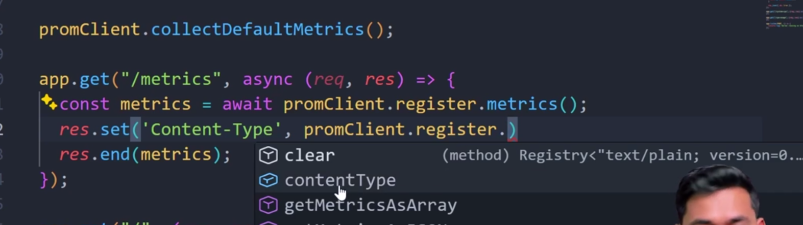

- GIT(global information tracker)


```
1) jis folder ko tmko git version control mein daalna hai wohan jaake git init daalo
2) usme .git ki file aa jayegi and how to check , ye hmesha chupa rhega , check by typing ls -a means show all folders(hidden folders too)
3) to check all the commands associated with it , egs - use (man ls) it will show all commands associated with ls
4) to check whether your files are untracked, tracked,staged or not - use git status
5) to move from untracked to staged - use git add .
6) aur tmko wapas staged se untracked mein bhejna hai toh use - git rm --cached {file_name}
7) agar tmko staged se tracked jana hai toh - git commit
8) let say u remove the file , so it will be removed from file system but can be taken back by writing ( git restore {file_name})
9) to config ur name use git config --global user.name rishiraj 
10) to config ur email use git config --global user.name {email id}
11) to see all the history type git log
```
## tree


```
to check branches - git branch
to create a new branch- git checkout -b dev
- if you checkout and add new file in vcs then it starts from where u leave main branch
- ye automatically master branch mein ni aa jata hai
- git checkout branch name se branch switch hota hai aur -b add krne se naya branch aur switch hote ho
- git log --online se one line comment aayega
- head matlab latest commit jaise image shown hai latest commit add readme hai
- agar dev branches ke changes master branch mein daalna hai- git merge dev


```
- git workflow
```
Start fresh: Always make sure your local computer is up to date before starting new work.
git checkout main
git pull origin main
Create your sandbox: Create your new branch for your specific task.
git checkout -b feature/my-cool-new-button

Write code and save: Do your work, add, and commit.
git add .
git commit -m "Add cool new button"
Push your specific branch: Send only your branch up to GitHub.
git push origin feature/my-cool-new-button

The Staging Phase (Testing):
Go to GitHub and open a Pull Request asking to merge feature/my-cool-new-button into staging.
Your team reviews the code. Once approved, you click the "Merge" button on GitHub.
The QA (Quality Assurance) team tests the app on the staging server to make sure your button works and doesn't break anything else.

The Main Phase (Production):
Once everything in staging is tested and confirmed working, a new Pull Request is opened to merge staging into main.
When that PR is merged, your code goes live to the real users!

```
- git merge issue
```
Scenario 1: The Team Conflict (Your Example)

This is exactly what you described, and it is how most team conflicts happen on GitHub:
You branch off main and change line 5.
You open a Pull Request but leave it sitting there.
A coworker branches off main, changes line 5 to something else, and merges their branch into main before you.
When you finally try to merge your PR, GitHub sees the clash and throws a conflict.

Scenario 2: The Solo Local Conflict (No PRs required)

You can easily create a merge conflict all by yourself, completely offline, without ever touching GitHub or opening a Pull Request:
You are on your laptop on the main branch.
You create a new branch called feature-A, change line 10 in index.html to say "Hello", and commit it.
You switch back to the main branch.
You create a second new branch called feature-B.
You change line 10 in index.html to say "Goodbye" and commit it.
While still on feature-B, you type git merge feature-A in your terminal.

```
- git merge resolving
```
1. GitHub Pull Requests vs. CLI Merges
Yes, both ways are doing the exact same thing under the hood.
When you click the green "Merge Pull Request" button on GitHub, GitHub's servers are literally just running the git merge CLI commands on their computers behind the scenes.
The only difference is the wrapper around it:
CLI Merge: It is instant, local, and done entirely by you.
GitHub PR Merge: It provides a nice visual interface, allows your team to leave comments on your code before the merge happens, and acts as a security gate to protect branches like staging or main.

2. The "Target First" Rule (git checkout then git merge)
You are 100% correct about the order of operations. The golden rule of merging is: You must always be standing in the room where you want the furniture to go.
However, be careful with the exact command you mentioned (git merge staging). You always name the branch you want to pull in to your current location.
If you want to merge feature INTO staging:
First, go to the destination (target) branch:

Bash
git checkout staging
Then, pull the source branch into your current location:

Bash
git merge feature
If you want to update your feature branch with new stuff from staging:

First, go to the destination (your feature):

Bash
git checkout feature
Then, pull the updates from staging in:

Bash
git merge staging

```
- when u create branch in github ui means from website u need to use git fetch to update all branches


## how to transfer local git repo to remote git repo

```
1) first check kro ki tmhara local git remote git se connected hai ki ni- git remote -v
2) tm dekhoge ki origin likha hoga woh https se connect hua hoga jab tmhara connect hoga woh url ke liye hota hai origin
3) then u can push git push origin master means master branch remote mein bnega aur wohan push ho jayega
4) lekin tmse username aur password maangega toh personal access token se baar baar ni puchega
5) git remote set-url origin https://{Pat}@github.com/irajspace/repo-name.git
6) lets say there are some files which are in remote and in your local - then git pull origin master- remote ke master branch se current branch mein la dega 

```
- git rebase
```
Step 1: Tell Git to Rebase
Since you got that error message previously, you first need to configure Git to use rebase for this pull. Run this in your terminal:

Bash
git config pull.rebase true

Step 2: Run the Pull Command
Now, execute your pull command exactly as you did before:

Bash
git pull origin main

What to Expect Behind the Scenes

When you hit enter, Git is going to do a fascinating little dance. Instead of smashing the two branches together in a single "Merge Commit," Git will do this:
The Rewind: It temporarily unplugs or "sets aside" all the new commits you made locally on your branch.
The Fast-Forward: It pulls down the new commits from GitHub's main branch and fast-forwards your local branch to match GitHub perfectly.
The Replay: It takes your set-aside local commits and pastes them (replays them) one by one on top of the newly updated main branch.
Your history will look like a single, straight line as if you wrote your code after your teammates pushed their updates!

How to Handle Rebase Conflicts

Because Git is replaying your commits one by one, if there is a conflict, it pauses the rebase right in the middle of the process.
If Git stops and tells you there is a conflict, the process to fix it is slightly different than a standard merge:
Fix the file: Open VS Code (or your editor), find the conflict markers (<<<<<<<), and fix the code exactly like you did before.
Stage the fix: Tell Git you resolved it by running:

Bash
git add .
Continue the replay (CRUCIAL): Do not run git commit. Instead, tell Git to pick up where it left off by running:

Bash
git rebase --continue
Git will then move on to replaying your next commit. If there are more conflicts, repeat steps 1-3.

The "Panic Button"
If you get halfway through a rebase, get completely overwhelmed by conflicts, and want to cancel the whole thing to go back to exactly how it was before you typed git pull, just run:

Bash
git rebase --abort
Go ahead and run the commands! Let me know what the terminal outputs if you get stuck.


```

## how can u take remote repo to ur local


```

1) clone - isme do tarah hota hai pat aur ssh 
2) if ssh -how to generate ssh-pair key (means private public key)- ssh-keygen
3) to see diff use git diff
4) kisi bhi public repo ko pull krne mein ssh ya pat ni lgti only for pushing changes lgti hai
5)git clone  = download an existing Git repository + initialize it
6) jaise tmne kisi repo ko clone kr liya usme check kro woh uska origin ... git remote -v se... ye output aayega ..origin  https://github.com/someone/project.git
7) then u can remove git remote remove origin, then u can add urs origin  https://github.com/someone/project.git

```
## forking vs cloning


## git branching strategies


- see in photo the arrow dev->master


- reverting commit

```
kya be 
```
- locations

```
There are several locations where Git can be configured. From more general to more specific, they are:

system: /etc/gitconfig, a file that configures Git for all users on the system
global: ~/.gitconfig, a file that configures Git for all projects of a user
local: .git/config, a file that configures Git for a specific project
worktree: .git/config.worktree, a file that configures Git for part of a project
In my experience, 90% of the time you will be using --global to set things like your username and email. The other 9% of the time you will be using --local to set project-specific configurations. The last 1% of the time you might need to futz with system and worktree configurations, but it's extremely rare.


```
## .gitignore
```
Patterns
It would be rough if .gitignore files only accepted exact filepath section names. Luckily, they don't!

Let's go over some of the most common patterns.

Wildcards
The * character matches any number of characters except for a slash (/). For example, to ignore all .txt files, you could use the following pattern:

*.txt

This would ignore files like /princess_diaries.txt and /contacts/your_mom.txt since they're both .txt files.

Rooted Patterns
Patterns starting with a / are anchored to the directory containing the .gitignore file. For example, this would ignore a main.py in the root directory, but not in any subdirectories:

/main.py

This ignores /main.py but not /src/main.py since /src is a subdirectory.

Negation
You can negate a pattern by prefixing it with an exclamation mark (!). For example, to ignore all .txt files except for important.txt, you could use the following pattern:

*.txt
!/important.txt

This would not ignore /important.txt, but would ignore /self_affirmations/important.txt.

Comments
You can add comments to your .gitignore file by starting a line with a #. For example:

# Ignore all .txt files
*.txt

Comments are especially helpful when doing something unconventional or complex, especially when collaborating.

Order Matters
The order of patterns in a .gitignore file determines their effect, and patterns can override each other. For example:

temp/*
!temp/instructions.md

Everything in the temp/ directory would be ignored except for instructions.md. If the order were reversed, instructions.md would be ignored.


```
## rebasing
```
Deleted Commit
What happened??? Why is our I: commit just gone!?!

Well, let's think about what happened during our rebase conflict resolution:

We started a rebase of banned onto main, meaning we're rewriting the
history of banned to include all the changes from main.
We effectively removed all the changes from the I commit by choosing to keep the changes from main instead of banned.
We continued the rebase, and Git realized that the I commit was pointless, and because we're rewriting history anyway, it just removed it.
If our changes had been more complicated, say we had kept some of the changes from the I commit, and overwritten others, then Git would have kept the I commit in the history.

```
