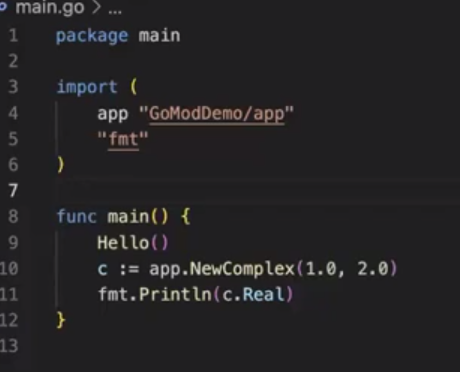

## Basics
- compiled language
- go-routines (concurrency support)
- statically type
- garbage collector

## 
``` 
import "fmt"

func main()
{
    fmt.println("hello world")
}
```
## to create variable

```
 var _namofvariable _typeofvariable=""
 var product="phone" this will work
 var product string ="phone" this will work
 product :="phone" this will work
 var product ; this will not work
 const product=50 cant update

 for i=:5;i<10;i++{
    this how loop works
 }

 var productprices[map]string{}

 how to make a func

 x,y:=check_odd_even(10)
 func check_odd_even(num int)(string,int){
    if(num%2==0)return "even",0
    else return "odd",1
 }


 pointer
 i :=120
 var ptr *int=&i
```


```
 type Product struct{
    name string 
    price int
 }

 p := Product{
    name: "Iphone-15",
    price" 1000
 }

 // resembelance to constructor

 func newProduct(name string, price int)Product{
    p:=Product{
        name:name,
        price:price,
    }
    return p 
 } returning a copy of the product

 if we return pointer to the copy then
  func newProduct(name string, price int)*Product{
    p:=Product{
        name:name,
        price:price,
    }
    return &p 
 }
 it is returning address of p 
 and if new_p=newProduct() then new_p is having a pointer to product

 you can manually dereferecne or go to dereference 

 

```


```

   func (p *Product)display(){
      fmt.Println("Product details)
   }
   how can we display new_p.display()

```

```
 multi file module

 you have to install go module
 and also you have to write function name in capital letter for different package only

 how to take function of same packages


```


# this is for same package

solution- go run *.go