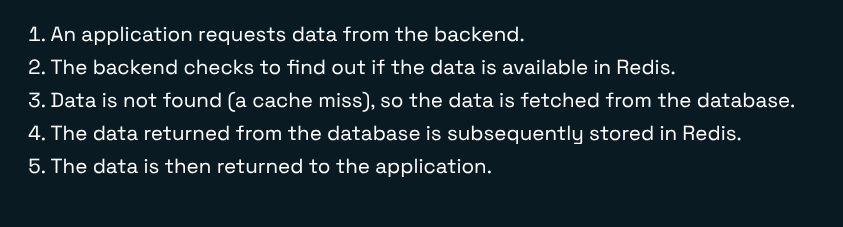
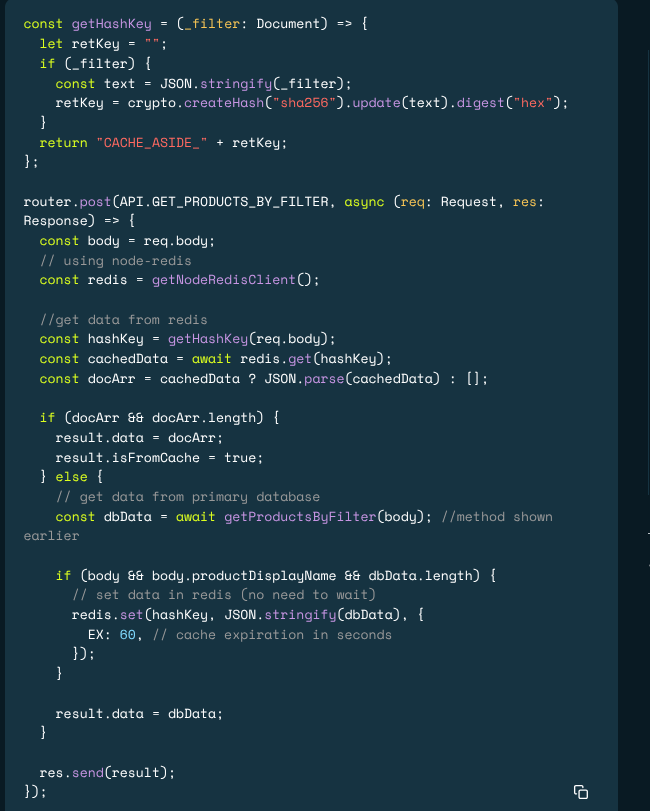
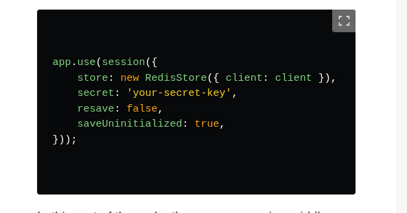
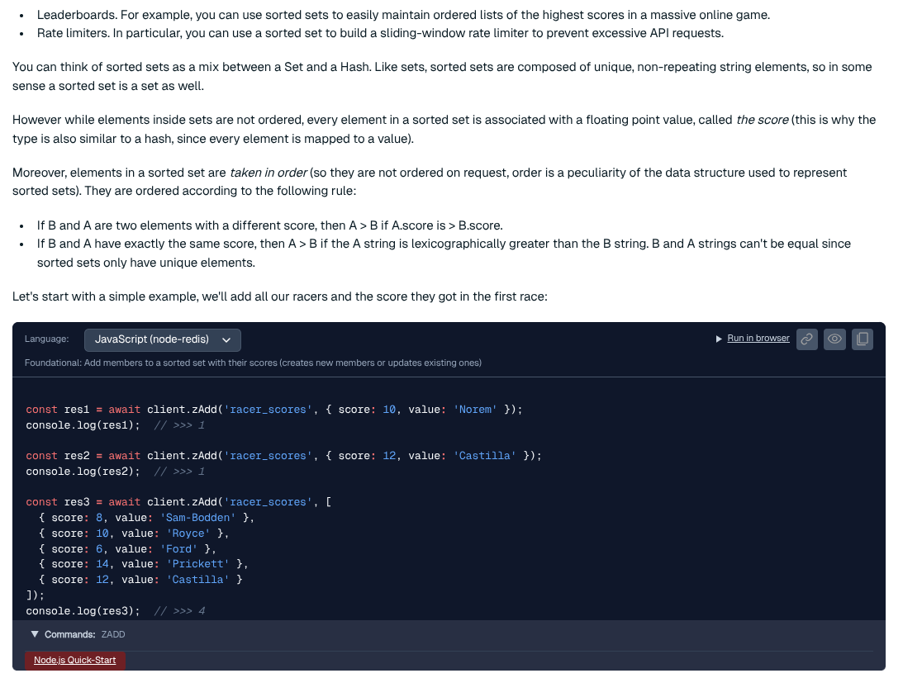
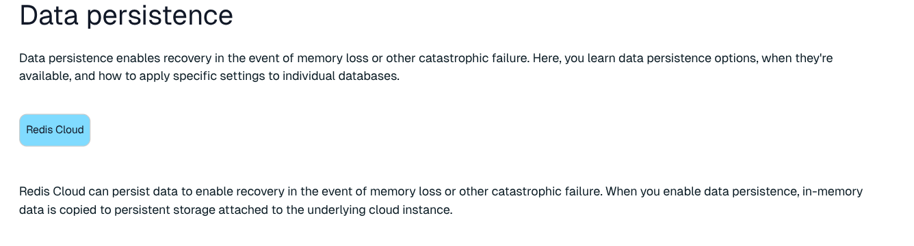
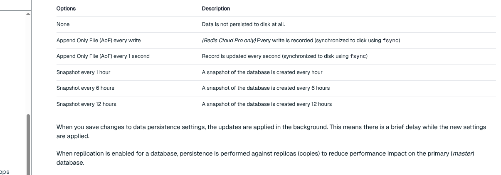
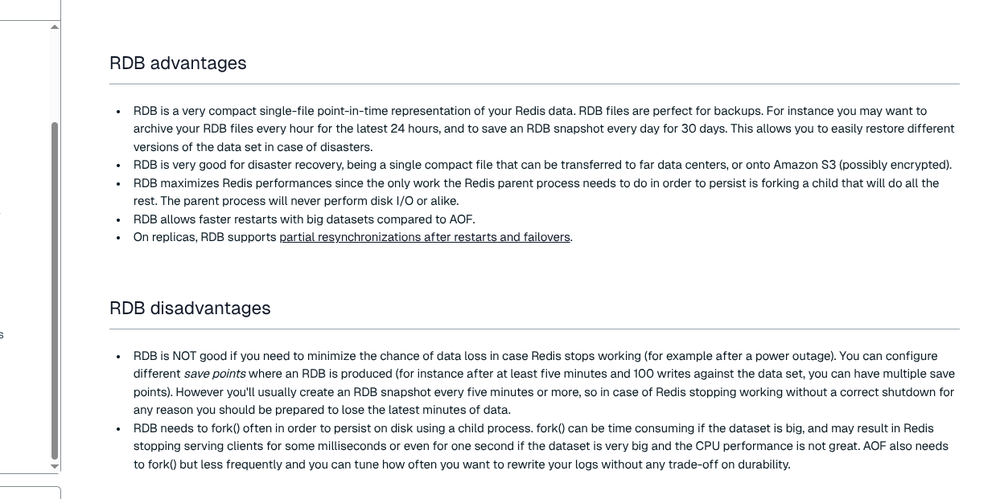

# What is cache-aside pattern?
``
    The cache-aside pattern is lazy-loading caching strategy where the application is responsible for reading and writing to both cache and database

    The goal of this design pattern is to set -up optimal caching(load as-you-go) for better read operations. the cache is populated when data is requested and not found in redis .. then application fetches it from the database and store it in redis.

``

# SESSION_MANAGEMENT

# SORTED_SETS

# DATA_PERSISTENCE

``An AOF(Append-only File) maintains a record of write operations. This allows the data to be restored by using the record the reconstruct the database up to the point of failure``

