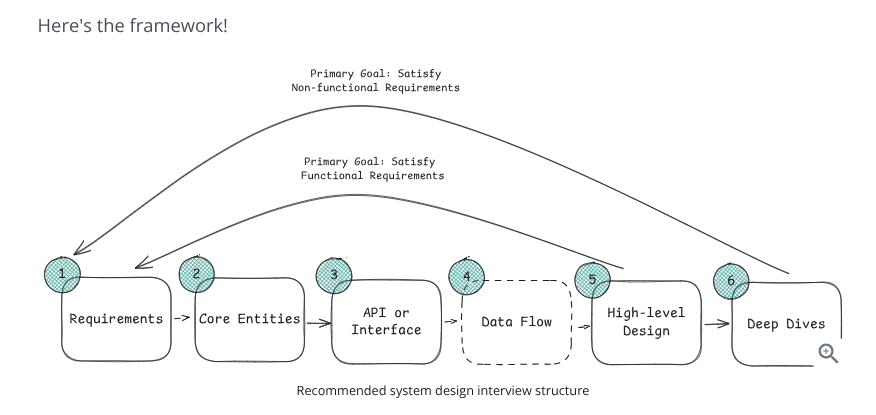
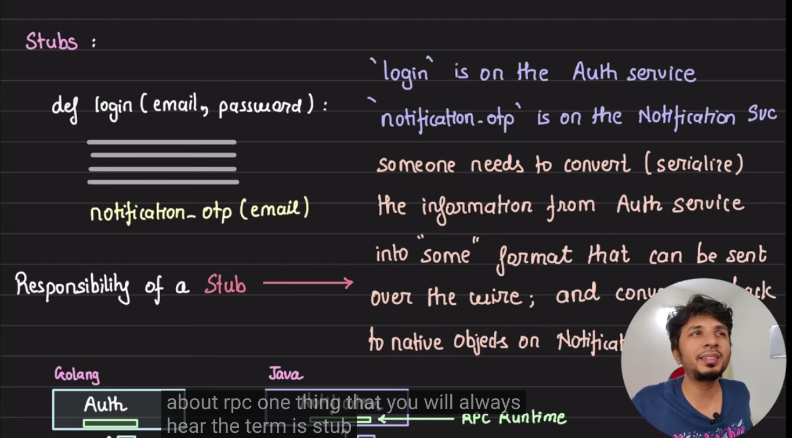
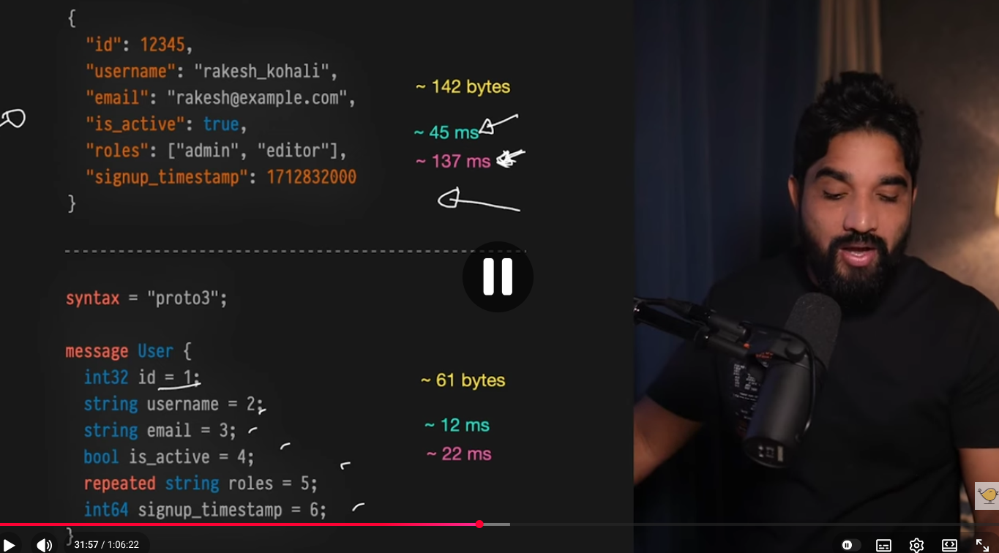
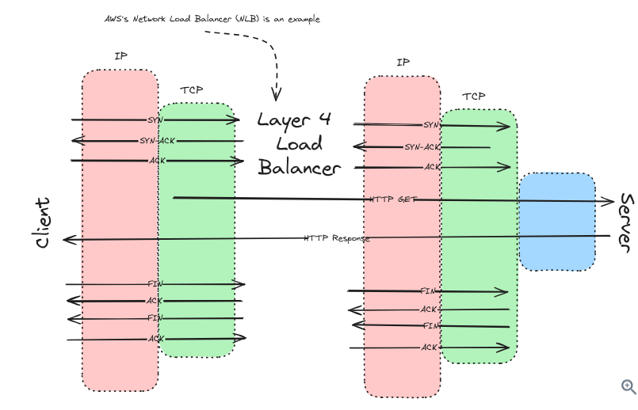

# How to tackle interview
## 
~~~
Requirements-> Core entities ->(API or interface)->Data flow->High Level Design->Deep dives
~~~

## Requirements
### Functional requirements

```
1) Here you have to ask the core features of the product
2) Does user should be able to post tweets
3) Does user be able to see tweets from users they follow

For cache
1)Clients should be able to insert items
2)Clients should be able to set expirations
3)Clienst should be able to read items

```
### Non-functional requirements

```
1) The system should be highly available , prioritizing availability over consistency
2)the system should be able to support 100 M+ DAU(daily active users)
3)low latency


```
### there are many ways u can find how to find nfr(non-functional requirement)
```
 - The worst case scenario method
 - What is the absolute worst thing that could happen to a user using this system?
 - if the worst thing is losing money- consistency or durability is happening
 - if the worst thing is staring at a loading screen for 5 seconds- latency is top priority


```
### CAP theorem(Consistency vs Avaialabilty)
- When a network partition happens(egs- server loose connection  to each other). do you keep consitency or availanbiity
-Consistency-> financial system,booking a flight seat
-availaiabilty- streaming services

### Scalabiluty-
- for read heavy- 100 reads for every 1 write->(twitter, youtube)-> YOu will need heavy caching and CDN

### fault torenace
-7. Fault Tolerance

What it is: The system's ability to continue operating properly in the event of hardware or software failures.

### Capacity estimation

-dont do math in early processing ( back of envelope calculation)

```
Many traditional interview guides tell you to immediately calculate Storage, Daily Active Users (DAU), and Queries Per Second (QPS) right after gathering requirements.

The authors argue this is often a trap. If you spend five minutes calculating that your system has 100,000 QPS and requires 5 Petabytes of storage, just to conclude, "Okay, this is a large system," you have wasted valuable time. The interviewer already knew it was a large distributed system, and you've only proven that you can multiply numbers.
I'm going to hold off on upfront capacity estimations to save time, but I will do the math later when we hit a specific design bottleneck."

```

### Core entities
```
Core entities are the foundational "building blocks" or the primary data objects your system will handle. They are the things your system will eventually save in a database (Data Model) and send back and forth over the network (APIs).

How to find them: The text offers a great trick—look at your functional requirements and pick out the actors (who is using the system) and the nouns (what resources they are interacting with).

Example: If your functional requirement is "Users can post a tweet and follow other users," your core entities are naturally going to be User, Tweet, and Follow.

Dont overengineer
Many candidates make the mistake of spending 10 minutes writing out every single database column (e.g., user_id, first_name, last_name, created_at, profile_picture_url).

The text advises against this because "you don't know what you don't know." As you move into drawing the High-Level Design later in the interview, you will inevitably realize you need new tables or fields to make things work.

The Strategy: Treat this as a simple, bulleted rough draft. Just jot down the names of the main entities to get on the same page as your interviewer, and tell them you will flesh out the specific columns later when the architecture is clearer.


```
# When do we use RPC(REMOTE PROCEDURE CALLS)

```
Functions
1) Unary GRPC-(single request and response)
2) Server streaming-the client sends a single request. The server responds with a stream of messages. The client reads from the returned stream until there are no more messages.
The video streaming example from your presentation image is perfect here. You click "Play" on a YouTube video (one request), and Google's servers continuously send you chunks of video data (a stream of responses) so you can watch it without downloading the entire 2GB file first.
3) Client streaming-
he client writes a sequence of messages and sends them to the server using a provided stream. Once the client has finished writing the messages, it waits for the server to read them all and return its single response.
Uploading a massive high-resolution image to a server, or an IoT temperature sensor constantly streaming its readings to a central server which replies with an "Acknowledged" status once a minute.
4) Bidirectional-
Both the client and the server send a sequence of messages using a read-write stream. The two streams operate completely independently, meaning the client and server can read and write in whatever order they like.
A multiplayer video game where the client is constantly streaming player movements to the server, and the server is simultaneously streaming the movements of all other players back to the client


Here in all rest of protocols
-1) they need client librarires which are hard to maintain and patch libraries
-2) they are not comptabile all languages
-3) for rest api they need http library
-4)these all requests are handled by browser client .. they take requst . they se http requst they verify tls certiifcates
but lets say it is python client , go client

why grpc?
-one library for popular languages
-How gRPC Solves This Automatically
If this company used gRPC instead of REST, this drift would be impossible. The backend team would update the .proto file:

Protocol Buffers
message User {
  int32 user_id = 1; // Changed to int
  string name = 2;
  int32 user_age = 3; // Added age
}
The moment they save this file, the gRPC compiler automatically generates the updated Java code and the updated Python code simultaneously. Both teams get the exact same update at the exact same time with zero manual coding, eliminating the nightmare entirely.

Have you ever had to deal with an API suddenly changing its response structure while you were building something?

main advantage
That is the absolute core superpower of gRPC. The .proto file acts as the single source of truth for your entire system.

Here is the exact workflow of how it happens:

You make a change: You edit the .proto file (for example, adding string email = 4;).

You run the compiler: You run a single terminal command using the gRPC compiler tool (called protoc).

Code is generated: The compiler instantly generates the updated, ready-to-use code (the schemas, classes, methods, and network routing logic) for Python, Java, Go, Node.js, or whatever languages your team uses.
```


```
here in image u see authentication service needs to talk to notification service
every languaage has its own HTTP library and request and every one has to talk to notification to talk to client make massive no of request
```




## Problem with JSON

-grpc(http/2)
```
serialization deserialisation (grpc framework)uses protobuff
protobuf
keys ko integer mein convert krta hai


```



### GraphQL
```
let say tmhe server se kuch chaiye like todo
toh woh pura bhej dega
1) userid,title,completed,id
but tmhe sirf title chaiye matlab fetch hi kyun kiya

```

# why you need to take userid and name from backend ..adds authentiation... and not directly take from frontend
```
const jwt = require("jsonwebtoken");

function authenticate(req, res, next) {
    const authHeader = req.headers.authorization;

    const token = authHeader.split(" ")[1];

    try {
        const decoded = jwt.verify(token, SECRET_KEY);

        req.user = decoded;   // { userId: "alice" }

        next();
    } catch (err) {
        return res.status(401).send("Invalid token");
    }
}
app.delete(
    "/posts/:postId",
    authenticate,
    async (req, res) => {

        const postId = req.params.postId;

        const userId = req.user.userId;

        const post = await Post.findById(postId);

        if (!post) {
            return res.status(404).send("Post not found");
        }

        if (post.owner !== userId) {
            return res.status(403).send("Forbidden");
        }

        await Post.deleteOne({ id: postId });

        res.send("Deleted");
    }
);

here u ques might be what is stored in decoded?
{
  userId: 'alice',
  role: 'admin',
  iat: 1750000000
}

```
Data flows
```
How to do it: Don't draw it yet. Just write a simple numbered list, like the web crawler example in the image.

Fetch seed URLs.

Download HTML.

Extract new links from HTML.

Save data to a database.

Put the newly extracted links back into a queue to repeat the process.

By listing these steps out loud, you are essentially creating a checklist for the High-Level Design drawing phase. You now know you will need a component to fetch URLs, a worker to parse HTML, and a queue to manage the new links.


```


## networking essentials
```
1. Layer 3: Network Layer (The Post Office)

What it is: This layer is primarily about IP (Internet Protocol). It handles routing and addressing. Think of it as the postal service figuring out how to get a package from New York to Tokyo by hopping through different mail sorting facilities (routers).

Interview Relevance: You don't usually spend much time here in an interview, but you must implicitly understand that every component you draw (servers, databases) needs an IP address to find each other. The text mentions InfiniBand for ML—this is a great buzzword to know if you are interviewing for heavy AI/Machine Learning infrastructure roles, as it's much faster than standard IP networking.

2. Layer 4: Transport Layer (The Delivery Method)

What it is: Once Layer 3 finds the destination, Layer 4 decides how to deliver the data.

Interview Relevance (Crucial): You will frequently be asked to choose between the main protocols here:

TCP (Transmission Control Protocol): Reliable, ordered, and checks for errors. If a packet of data is lost, TCP resends it. Most of the web (including HTTP) runs on TCP.

UDP (User Datagram Protocol): Fast but unreliable. It just fires data at the destination and doesn't care if it actually arrives or in what order.

3. Layer 7: Application Layer (The Language)

What it is: This is the layer you interact with as a software engineer. It builds on top of TCP or UDP to provide meaningful abstractions.


```
## How a simple request gets the response

```
-first dns convert the domain name into ip address  called dnsresolution
-then client initiates a 3-way handshake with the server 
-TCP Handshake: The client initiates a TCP connection with the server using a three-way handshake:
SYN: The client sends a SYN (synchronize) packet to the server to request a connection.
SYN-ACK: The server responds with a SYN-ACK (synchronize-acknowledge) packet to acknowledge the request.
ACK: The client sends an ACK (acknowledge) packet to establish the connection.

HTTP Request: Once the TCP connection is established, the client sends an HTTP GET request to the server to request the web page.
Server Processing: The server processes the request, retrieves the requested web page, and prepares an HTTP response. (This is usually the only latency most SWE's think about and control!)
HTTP Response: The server sends the HTTP response back to the client, which includes the requested web page content.

HTTP Request: Once the TCP connection is established, the client sends an HTTP GET request to the server to request the web page.
Server Processing: The server processes the request, retrieves the requested web page, and prepares an HTTP response. (This is usually the only latency most SWE's think about and control!)
HTTP Response: The server sends the HTTP response back to the client, which includes the requested web page content.


Connections are Expensive: A connection between a client and a server isn't just a tube; it's a state that consumes memory and resources on both ends.

The Reconnection Penalty: If you close a connection after every single API request, you have to pay the "TCP Handshake" latency tax all over again for the next request.

The Solution: The text mentions HTTP keep-alive and HTTP/2 multiplexing. These are techniques to hold a connection open so multiple requests can flow through it without repeating the setup phase. If you are designing a chat app or a live stock ticker, you will rely heavily on persistent connections (like WebSockets) to avoid this massive overhead.

```

## HTTP 2 multiplexing
```
The Problem: HTTP/1.1 and the "Single Lane"
Imagine you are loading a modern webpage like Amazon.com. Your browser doesn't just make one request; it might need 50 different things (the HTML, the CSS file, a Javascript file, and 47 different product images).

In the old days of HTTP/1.1, a single TCP connection could only handle one request at a time.

Your browser says: "Give me the HTML."

It has to sit and wait for the entire HTML file to download before it can say "Okay, now give me the CSS file."

This is called Head-of-Line Blocking. If one large image gets stuck in traffic, everything else behind it has to wait.

The Problem: HTTP/1.1 and the "Single Lane"
Imagine you are loading a modern webpage like Amazon.com. Your browser doesn't just make one request; it might need 50 different things (the HTML, the CSS file, a Javascript file, and 47 different product images).

In the old days of HTTP/1.1, a single TCP connection could only handle one request at a time.

Your browser says: "Give me the HTML."

It has to sit and wait for the entire HTML file to download before it can say "Okay, now give me the CSS file."

This is called Head-of-Line Blocking. If one large image gets stuck in traffic, everything else behind it has to wait.


```

## DHCP( Dynamic Host Configuration Protocol)
```
THe servers get their IP addresses from a DHCP server when they boot up
Think of a DHCP server as a receptionist at a hotel handing out room keys. When a computer connects to a network, it asks the DHCP server, "Who am I?" and the server hands it an IP address to use while it's connected

Private vs. Public IP Addresses
This is the most critical takeaway from the text for your interviews.

Private IPs: You can set up a cluster of 100 database servers in a warehouse and give them whatever IP addresses you want (e.g., 10.0.0.1, 10.0.0.2). However, these are internal to your network. If a user in London tries to access 10.0.0.1, the global internet has no idea where that is.

Public IPs: If you want your servers to be accessible from the open internet, they need a Public IP. These must be globally unique and are distributed by authorities called RIRs (Regional Internet Registries)

The internet's core routers maintain massive maps (using a protocol called BGP, though you don't need to memorize that for basic HLD).

Because Apple owns the entire block of IP addresses starting with 17 (e.g., 17.x.x.x), every major router in the world has a simple rule: "If a packet's destination starts with 17, pass it toward Apple's network." ---

```

## transport layer
```
When data is sent over the internet, it gets chopped up into tiny pieces called packets. These packets don't always take the same physical route across the globe, meaning Packet #5 might arrive before Packet #2.

TCP- here if any packet doesnt arrived at the end .. it pauses and asks for again
how does the ordering
-The Receive Buffer (The Waiting Room)
When the packets arrive at the server, they don't immediately go straight into the application (like a web browser or a game). Instead, TCP catches them and puts them into a staging area in the server's memory called the Receive Buffer.

Here is how the server handles the chaos:
The "Next Expected" Rule: The server knows it is waiting for Sequence #1.
Out of Order Arrival: Let's say Sequence #3 and #4 arrive first because they took a faster route across the internet. The server does not throw them away, but it also doesn't let the application see them yet. It puts them in slots #3 and #4 in the waiting room.
Filling the Gap: The server pauses and waits. Once Sequence #1 and #2 finally arrive, it drops them into slots #1 and #2.
Delivery: Now that the sequence is complete (1, 2, 3, 4), TCP scoops them all up, stitches them together in perfect order, and hands the complete, correct data to the application.

Stateful Connection: Unlike UDP's "spray and pray," TCP maintains a strict "state." Both the client and the server keep track of exactly what has been sent, what has been received, and what is missing.
Flow Control (Protecting the Receiver): Imagine a supercomputer trying to send a massive file to an old, slow smartphone. If the supercomputer blasts data too fast, the phone's memory will overflow and crash. TCP uses Flow Control to let the phone say, "Whoa, slow down, my receive buffer is almost full!" The sender will dynamically slow its transmission rate to match what the receiver can handle.
Congestion Control (Protecting the Network): Imagine millions of people trying to stream Netflix at 8:00 PM. The routers and cables in the middle of the internet get jammed. If TCP detects that packets are dropping because the network itself is congested, it will throttle back the speed for everyone slightly to prevent the entire internet backbone from collapsing.


QUIC- HTTP/3 connection built on UDP with reliability of TCP


UDP-
isse chlega fortnite, doesnt care if packet arrives or not
4 characterisitics-
a) connectionless- no tcp handshake save time
b)no gurantee of delivery
c)no ordering
d)fastest way

where to use- VOIP or zoom call, if there is sound glitch doesnt matter,gaming

The Limitation: Standard web browsers (Chrome, Safari) generally do not let developers open raw UDP connections. (The only major exception is WebRTC, a specific protocol used for browser-to-browser video chats)
The Interview Solution: If an interviewer asks you to design a live reaction system for both mobile apps and a website, you should propose a hybrid approach. Tell them: "I will use fast UDP for the iOS/Android apps, but for the web browser users, I will fall back to a TCP-based connection (like WebSockets) and batch the reactions together every few milliseconds to save bandwidth." ### 2. The TCP Workhorse (State & Ordering)
Since we just covered how TCP orders packets with Sequence Numbers and a Receive Buffer, this section should sound very familiar!

What is Telemetry? Imagine you are designing a system to monitor the health of 100,000 servers. Every server sends its CPU temperature to your database every single second.

the hybrid
When the user opens the app, logs in, loads their contacts, and sends a chat message, that data must be perfectly reliable. You route this traffic over standard TCP.
The moment they click "Join Video," the actual webcam and microphone streams are blasted over UDP (or WebRTC) because speed becomes the only thing that matters.


```

## Load balancers
```
Layer 4 Load Balancers: These operate primarily in or near Kernel Space. They only look at the IP address and the port (e.g., "Send this TCP packet to Server B"). Because they don't drag the data up into User Space to read it, they are astonishingly fast and can handle massive amounts of traffic with very little CPU power.

Layer 7 Load Balancers: These operate in User Space. They fully open the HTTP request and read the contents (e.g., "Oh, the user is requesting the /images URL, let me route this to the Image Server"). Because they process this in User Space, they are much "smarter," but they are slower and require more CPU power to run.

```
## THe HTTP protocol
```
The most critical sentence in this image is: "HTTP is a stateless protocol." Wait, didn't we just learn that TCP (the layer underneath HTTP) creates a stateful connection? Yes! This is a classic interview concept:

Layer 4 (TCP) is Stateful: The pipe itself remembers that it is open and tracks the sequence of packets.

Layer 7 (HTTP) is Stateless: The messages sent through that pipe have no memory of each other. If you ask the server for your profile picture, and then one millisecond later ask for your friend's profile picture, the HTTP server treats those as two completely independent events. It doesn't say, "Oh, it's the same guy from a millisecond ago."


```

## Request modes
```
GET: Request data from the server. GET requests should be idempotent and don't have a body.- idempotent means at last final result is same u will get same user
POST: Send data to the server.- non-idempotent .. final result will not be same
PUT: Update data on the server.- idempotent .. final result will be same if we do multiple times
PATCH: Update a resource partially.
DELETE: Delete data from the server. DELETE requests should be idempotent.- here user 1 deleted once if u send multiple user 1 will not be there
3. The Nuance of PATCH-Interviewers love asking about the difference between PUT and PATCH.The text highlights a brilliant edge case: PATCH is not mathematically guaranteed to be idempotent.If your patch is "Set user's age to 25", running that 10 times is safe (Idempotent).If your patch is "Add $5 to user's wallet", running that 10 times gives them $50 (Not Idempotent).Here is an interactive simulator so you can visually experience exactly how these verbs interact with the database during a dreaded "Network Retry" storm!
```

## status codes
```
Success (2xx)
200 OK: The request was successful
201 Created: The request was successful and a new resource was created
Moved (3xx)
302 Found: The requested resource has been moved temporarily
301 Moved Permanently: The requested resource has been moved permanently
Client Error (4xx)
404 Not Found: The requested resource was not found
401 Unauthorized: The request requires authentication
403 Forbidden: The server understood the request but refuses to authorize it
429 Too Many Requests: The client has sent too many requests in a given amount of time
Server Error (5xx)
500 Server Error: The server encountered an error
502 Bad Gateway: The server received an invalid response from the upstream server


```
### Content negotiation
```
The best example of this is Content Negotiation.

The Problem: Sending massive amounts of JSON data over the internet is slow. It would be much faster if the server could compress the data into a ZIP file before sending it. But what if an older client app doesn't know how to unzip it?

The Solution: The client sends an Accept-Encoding: gzip header. This politely tells the server, "Hey, if you know how to compress things using gzip, I know how to read them." The server zips the data, attaches a Content-Encoding: gzip header to the response, and sends it.

Interview Context: This demonstrates Graceful Degradation. If an old mobile phone connects and doesn't send that header, the server safely falls back to sending plain, uncompressed text. Your API didn't crash; it just adapted.

```

### The red box
```
This is the most critical part of the image, and it loops back to the exact vulnerability we discussed earlier: IDOR (Insecure Direct Object Reference).

It is very easy to confuse encryption with trust.

What HTTPS does: It guarantees that nobody between the user and your server can read or alter the data.

What HTTPS does NOT do: It does not guarantee that the person sending the data isn't a hacker.

The Scenario: A hacker logs into their own account. Because they are logged in, they have a valid, encrypted HTTPS connection to your server. They then intercept their own request before it leaves their computer and change the JSON body from {"delete_user": "hacker123"} to {"delete_user": "alice"}. HTTPS will happily encrypt that malicious payload and safely deliver it to your server.

The Lesson: Never trust the request body for sensitive actions. Always figure out who the user is by verifying their secure Authentication Token (which they cannot forge) on the backend.


```
### REST APP
```
Good: /users or /tweets

Bad: /createNewUser or /getTweets
GET /users/{id}.

Creating (POST /users):here server generates the ID and save it

in names remember dont use verbs 
how to name to start game?
Verb: PATCH

URL: /games/123

JSON Body: ```json
{
"status": "ACTIVE"
}


```


### Graphql-solution
```
In a perfect REST API, every specific resource has its own unique URL (e.g., /profile, /status, /groups).
in graphql u can only do post which can be mutated into insert,delte
Look at the "App View" in the drawing. Imagine you are opening the Facebook app to look at a friend's profile. That single screen needs their profile picture, their current status, and a list of the 3 groups they are in.

The REST Way: Because REST forces you to hit specific endpoints for specific data, your mobile app has to make 5 separate trips to the server:

Fetch the profile (/profile/{id})
Fetch the status (/status/{id})
Fetch group 1 (/group/{id1})
Fetch group 2 (/group/{id2})
Fetch group 3 (/group/{id3})

Think back to what we just learned about Layer 4 Networking and Latency. Every single one of those arrows in the diagram represents a network request that has to travel across the internet, get processed, and travel back.
If each round-trip takes 100 milliseconds, forcing the client to make 5 sequential trips means the user is staring at a blank loading screen for half a second. This is brutal for mobile users on slow 3G networks.

The Solution: GraphQL

- heavytyped( schema based design )
- transport agnostic( can be based on HTTP, raw tcp, websockets,udp)

Underfetching-
GraphQL flips the entire REST paradigm upside down. Instead of having dozens of rigid endpoints (/users, /posts, /groups), a GraphQL server usually only has one single endpoint (e.g., POST /graphql).

Instead of the server dictating what data you get, the client dictates exactly what it wants.

The GraphQL Way: The mobile app sends one single request to the server that essentially says: "Give me user 123's profile, their status, and the names of all their groups."

The server does all the heavy lifting of gathering that diverse data internally, packages it into one neat JSON payload, and sends it back in a single round-trip.

the trade-offs
Because GraphQL is significantly harder to build and cache on the backend. With REST, you can easily cache a popular response (like GET /tweets/1) in a CDN so it never even hits your server. Because GraphQL queries are totally custom and bundled together, caching them at the network layer is incredibly difficult.

Overfetching-
The REST Scenario: Imagine you are building a mobile app screen that shows a list of users, but you only need to display their username and avatar. If you call the standard REST endpoint (GET /users), the server doesn't know what you need. So, it sends back a massive JSON object for every single user containing their username, avatar, email, home address, phone number, date of birth, and account settings.

Why it's bad: You just downloaded 100 kilobytes of data when you only needed 5 kilobytes. For mobile users on weak 3G connections, this drains battery life, eats up data plans, and slows down the app significantly.
Look closely at the code block in the image. It looks almost exactly like a JSON object, but with the "values" missing. This is the Query Language.

Here is what that specific query is doing:

Pagination Variables: ($limit: Int = 10, $offset: Int = 0). This tells the server, "I don't want a million users, just give me the first 10."

The Graph Traversal: Notice how the data is nested. Inside users, it asks for profile. Inside profile, it asks for groups. And inside groups, it asks for category.

The Magic: Because the backend developer explicitly linked these tables together in the GraphQL schema, the frontend can infinitely traverse these relationships in a single network request without writing custom SQL joins or building brand new API endpoints.

GraphQL is a strongly typed language. Before a GraphQL server can run, you have to write a strict "Schema" (a contract).

GraphQL
type User {
  id: ID!
  username: String!
  age: Int!        # This MUST be an integer. The '!' means it cannot be null.
  isOnline: Boolean!
}

cons:
complexity
no caching
no standard errors
expensive queries backend


```
## what does mean by stronlgy typed?

```
GraphQL is a strongly typed language. Before a GraphQL server can run, you have to write a strict "Schema" (a contract).

GraphQL
type User {
  id: ID!
  username: String!
  age: Int!        # This MUST be an integer. The '!' means it cannot be null.
  isOnline: Boolean!
}
It slows down initial development. You can't just hack things together quickly; you have to meticulously define the type of every single piece of data in your system before you can write the actual logic.
```


## the N+1 
```
The GraphQL Way (Server-Side N+1): The mobile phone makes exactly one request over that weak 3G network. Your GraphQL server receives it. Your server then makes the 101 requests to the database/APIs. Because your server and your database usually live inside the exact same AWS Datacenter, connected by literal fiber-optic cables, those 101 requests happen in a fraction of a millisecond

```
Rule of thumb for system design
Small filters/search parameters → GET
Large request data → POST
Don't assume 2048 is a universal limit.
The actual limit is usually determined by browsers, proxies, load balancers, and web servers—not HTTP itself.

```
One of the biggest reasons GET is preferred for reads is that it works very naturally with HTTP caching mechanisms like ETag, Cache-Control, and Last-Modified.

First request

Client sends:

GET /products/123

Server responds:

200 OK
ETag: "abc123"

{
  "id": 123,
  "name": "Laptop"
}

The browser caches both:

Response body
ETag value "abc123"
Second request

Later the browser asks again:

GET /products/123
If-None-Match: "abc123"

This means:

"I already have version abc123. Has it changed?"
```

## The grpc
```
. The Core Engine: Protocol Buffers (Protobufs)
The image introduces Protocol Buffers as the replacement for JSON. Just like GraphQL, gRPC is heavily typed. You have to write a strict contract before any servers can communicate.

Look at the first code block:

Protocol Buffers
message User {
  string id = 1;
  string name = 2;
}
This is the schema. But notice the = 1 and = 2. Those aren't values; those are positional tags. You are telling the system, "ID is always the first piece of data, and Name is always the second piece of data." ### 2. The Magic Trick: JSON vs. Binary (The Weight Loss)
The middle of the image is the most important part. It visually demonstrates exactly why gRPC is so much faster than REST.
The gRPC/Protobuf Solution:
Because both Server A and Server B already have a copy of the Protobuf schema (the contract we wrote in step 1), they don't need the keys anymore.
Server A just encodes the raw values ("123" and "John Doe") into a pure machine-readable binary stream based on those = 1 and = 2 positional tags.

The image shows this exact same data squashed down into hexadecimal machine code: 0A 03 31 32...

It only takes 15 bytes.

By stripping out all the curly braces, quotes, and key names, gRPC shrinks network payloads by 60-80%. It also requires far less CPU power because the server doesn't have to parse a giant text string; it just reads raw binary


```
## how grpc is fast
```
Here is the secret to why gRPC is so incredibly fast: gRPC pays the cost during Build Time, while REST pays the cost during Run Time.

1. The gRPC Way (Build-Time Cost)
When you say the schema "must be known beforehand," you are entirely correct. But the server doesn't figure this out while it's running.

When a developer writes a gRPC service, they use a compiler (called protoc). Before the server is even turned on, this compiler reads the .proto file and physically generates hard-coded JavaScript, Go, or Java code.

The "cost" is paid once, by the developer's laptop, before the code is ever deployed.

By the time the server is running and receiving live traffic, it already natively understands that "Tag 1 = ID". It doesn't have to think; it just executes.

2. The REST Way (Run-Time Cost)
JSON is "self-describing." Because there is no strict beforehand contract, the REST server has to figure out the schema on the fly, every single time a request hits it.

If your REST server receives 10,000 requests per second, it has to read the string "id": 1 and parse it into computer memory 10,000 separate times.

Why Your Conclusion is Spot On
As you correctly deduced, stripping all of this beforehand work out of the runtime environment gives servers a massive advantage in two ways:

Network Latency (Bandwidth): As you pointed out, the network body takes up far less physical space. Sending 15 bytes over a fiber optic cable is mathematically faster than sending 40 bytes. When you have millions of requests, those saved bytes prevent network traffic jams.

CPU Latency (Processing): Computers do not naturally speak "Strings" (text). They speak binary. When a REST server receives a JSON string, the CPU has to work hard to translate that text into a usable memory object (Deserialization). gRPC skips this entirely. The data arrives as raw binary, and the CPU reads it instantly.


```
## how request looks like
```
message GetUserRequest {
  string id = 1;
}

message GetUserResponse {
  User user = 1;
}

service UserService {
  rpc GetUser (GetUserRequest) returns (GetUserResponse);
}

```
## stub baby stubs
```
The text mentions: "These definitions are compiled into a client and server stub..." This is the exact "beforehand" compilation cost you mentioned earlier. When you run the gRPC compiler, it generates a piece of code called a Stub.

The Client Stub: Imagine you have a Node.js server that needs to talk to a Python server. The compiler generates a Node.js Stub. Your Node.js developer just writes UserService.GetUser({ id: "123" }). The Stub intercepts that local function call, automatically translates it into that tiny 15-byte binary stream, and shoots it over the network.

The Server Stub: The compiler also generates a Python Stub. This stub catches the incoming binary, translates it back into a native Python object, and hands it to the Python developer's logic.

Neither developer ever has to write code to parse JSON, manage HTTP headers, or write network routing logic. The Stubs handle all of it natively.


```
## golang
```
package main

import (
	"context"
	"log"
	"net"

	"google.golang.org/grpc"
	
	// This is the package generated by the protoc compiler at build time
	pb "your_project/generated/users" 
)

// 1. THE SERVER STRUCT
// We create a struct to hold our server. We embed the "Unimplemented" server
// generated by gRPC to ensure forward compatibility if the .proto file changes later.
type server struct {
	pb.UnimplementedUserServiceServer
}

// 2. THE RPC IMPLEMENTATION (The actual logic)
// This signature exactly matches the `rpc GetUser` definition from our .proto file.
// Notice how it takes a context and the strictly-typed GetUserRequest.
func (s *server) GetUser(ctx context.Context, req *pb.GetUserRequest) (*pb.GetUserResponse, error) {
	log.Printf("Received a gRPC request for User ID: %s", req.GetId())

	// In a real application, you would query your database here.
	// For this example, we will just return a hardcoded response.
	
	// We construct the strictly-typed GetUserResponse to send back
	return &pb.GetUserResponse{
		User: &pb.User{
			Id:   req.GetId(),
			Name: "John Doe",
		},
	}, nil
}

// 3. STARTING THE ENGINE
func main() {
	// Open a raw TCP connection on port 50051 (The standard gRPC port)
	lis, err := net.Listen("tcp", ":50051")
	if err != nil {
		log.Fatalf("failed to listen: %v", err)
	}

	// Create a brand new, empty gRPC server
	grpcServer := grpc.NewServer()

	// Register our custom 'server' struct with the newly created gRPC engine
	pb.RegisterUserServiceServer(grpcServer, &server{})

	log.Printf("gRPC server is running and listening at %v", lis.Addr())

	// Start accepting incoming binary traffic!
	if err := grpcServer.Serve(lis); err != nil {
		log.Fatalf("failed to serve: %v", err)
	}
}


```
## try to implement benchmarks test like this
https://medium.com/@i.gorton/scaling-up-rest-versus-grpc-benchmark-tests-551f73ed88d4

## server -side events
```
1. The Problem: Polling vs. Waiting
If a browser wants live updates using standard REST, it historically had two terrible options:

Polling: The browser blindly sends a GET /score request every 1 second, just in case something changed. This creates massive, unnecessary network traffic and crushes your server.

The Giant Blob (Top of the image): As the image shows, standard HTTP requires the server to build a single, cohesive JSON object. If you request 100 events, the server holds the connection open, waits until all 100 events have happened, packages them into a single array, and sends them all at once. The user stares at a loading spinner the entire time.


```
## the sse strucuture
```
The Format: Notice the bottom code block uses data: {...}. This is the strict format required by the SSE spec. The server sends data: , followed by your JSON, followed by two newline characters (\n\n), which tells the browser, "That's the end of this specific message, update the screen!"

One-Way Street: SSE is strictly Server-to-Client. The browser opens the connection, but only the server can push data down it.

```
## the code
```
package main

import (
	"fmt"
	"net/http"
	"time"
)

func sseHandler(w http.ResponseWriter, r *http.Request) {
	// 1. Set the mandatory headers for SSE
	w.Header().Set("Content-Type", "text/event-stream")
	w.Header().Set("Cache-Control", "no-cache")
	w.Header().Set("Connection", "keep-alive")

	// 2. Check if the server actually supports flushing
	flusher, ok := w.(http.Flusher)
	if !ok {
		http.Error(w, "Streaming unsupported!", http.StatusInternalServerError)
		return
	}

	// 3. Stream 5 events to the client, one per second
	for i := 1; i <= 5; i++ {
		// Format the data exactly as the image showed: "data: {json}\n\n"
		fmt.Fprintf(w, "data: {\"id\": %d, \"message\": \"Live Update %d\"}\n\n", i, i)

		// 4. FLUSH! This forces the chunk over the network immediately
		flusher.Flush()

		// Wait 1 second before sending the next event
		time.Sleep(1 * time.Second)
	}

	// The function ends, and the HTTP connection finally closes.
}

func main() {
	http.HandleFunc("/events", sseHandler)
	fmt.Println("SSE Server running on :8080")
	http.ListenAndServe(":8080", nil)
}


```
## the middlemen problem
```
The "Broken Pipe" Problem (Timeouts)
The second paragraph introduces the biggest enemy of SSE: Middlemen.
Between your server and the user's phone, the connection passes through Load Balancers, Proxies, and Firewalls. These middlemen hate open, idle connections. They are designed to kill connections that stay open too long to save memory.

The Reality: Your beautiful SSE connection will inevitably get abruptly severed by an aggressive Load Balancer every few minutes.

3. The Built-in Fix: Auto-Reconnect & Last-Event-ID
Because dropped connections are guaranteed, the SSE standard has a built-in recovery mechanism.

The Client Side: The browser's EventSource object is smart. If the connection drops, it automatically tries to reconnect. When it does, it looks at the id of the last message it successfully read (e.g., Event 100) and sends a special HTTP header to the server: Last-Event-ID: 100.

The Server Side: This puts a massive burden on the backend. Your server cannot just blindly start streaming current events. It has to look at that ID, check a database or cache, find the events the user missed while disconnected (e.g., Events 101, 102, 103), and replay them before sending new ones.

The third paragraph highlights a frustrating edge case. Some corporate firewalls or aggressive antivirus software don't understand streaming.

When they see chunks of data coming through, they intercept them, hold them in a buffer until the connection closes, and then deliver them to the browser all at once.

This completely destroys the real-time nature of SSE, turning it back into the "Giant Blob" we were trying to avoid in the first place.

four mandatory rules
. Keep the Pipe Open (Connection: keep-alive)
2. Push Manually (http.Flusher)
3. Tell the Browser to Listen (Content-Type: text/event-stream)
The Strict Formatting (data: ... \n\n)
```
## why we keep connection-alive here
```
In normal HTTP, keep-alive is used to send multiple different files over one connection.

But in SSE, you are using it for a different reason: you are sending one single file that never ends. If you didn't include Connection: keep-alive, intermediate firewalls, proxies, or even older browsers might look at the connection, assume it's a glitch because the file is taking too long to download, and forcefully cut the connection.

By explicitly declaring keep-alive, you are telling the entire internet infrastructure between your Go server and the user: "Do not hang up this phone line. We are going to be talking for a very long time."

```
## the bidirectional way
```
The text then pivots to your exact scenario: what if the application requires Bidirectional (Two-Way) Communication? What if you are building a multiplayer browser game, a live chat room, or a collaborative Google Doc where multiple people are typing at the exact same time?
It is a Persistent, TCP-Style Connection: * Standard HTTP (REST/GraphQL/SSE): Think of this like a Walkie-Talkie. The client presses the button, asks a question, and waits. The server replies. Only one person can talk at a time (Half-Duplex). Even with SSE, the server is just holding the button down and talking continuously; the client still can't talk back.

WebSockets: Think of this like a Telephone Call. The client dials the server. The server picks up. Now the line is completely open in both directions simultaneously (Full-Duplex). Either side can speak at the exact same time without asking permission.

No "Prompting" Required: With a WebSocket, the server can push a chat message to your screen without you ever refreshing the page or asking for it. Conversely, the moment you move your mouse in a multiplayer game, your browser instantly shoots that coordinate data to the server without waiting for an HTTP header to process.

```
## how connection looks like in websockets
```
: If WebSockets are a completely different protocol than HTTP, how does the browser know how to connect to them? The answer is the Upgrade Handshake.
WebSockets actually start their life as a completely standard, boring HTTP GET request. However, the client sneaks two special headers into the request:

Connection: Upgrade

Upgrade: websocket
When the server reads those headers, it replies with an HTTP 101 Switching Protocols status code. At that exact millisecond, the HTTP connection "dies" and is instantly reborn as a persistent WebSocket connection over the exact same TCP network pipe.

Why is this brilliant? Because the initial request was standard HTTP, it automatically carries your user's auth cookies and headers. The server can verify who the user is before agreeing to upgrade the connection.

the same problem of sse happens here too-

Pro-Tip: To fix this, WebSocket developers have to build "Heartbeats"—sending a tiny, invisible "ping" message every 30 seconds just to keep the Load Balancer awake
Keep-Alive says:

"After this request finishes, don't close the TCP connection yet."

Browser -----------------> Server
          GET /home

Browser <----------------- Server
          HTML

Connection stays open

Now another request can reuse the same TCP connection:

Browser -----------------> Server
          GET /image1

Browser <----------------- Server
          image

No new handshake is needed.

Problem solved by Keep-Alive

It reduces:

latency
CPU usage
number of TCP handshakes

It is mainly about reusing connections.

3. What is an idle connection?

Imagine:

Client <------ TCP ------> Server

The connection exists.

But nobody sends data for 5 minutes.

No bytes
No bytes
No bytes

This is called an idle connection.

4. Why are idle connections a problem?

Network devices have limited memory.

Things like:

Load balancers
Proxies
Firewalls
NAT gateways

track every open connection.

They don't want to keep millions of idle connections forever.

So they often have rules like:

If no traffic for 60 seconds:
    close connection


```
## the code
```
package main

import (
	"fmt"
	"log"
	"net/http"

	"github.com/gorilla/websocket"
)

// 1. Configure the "Upgrader"
// This is the engine that transforms an HTTP request into a WebSocket
var upgrader = websocket.Upgrader{
	ReadBufferSize:  1024,
	WriteBufferSize: 1024,
	// Security: Allow connections from any origin for this example
	CheckOrigin: func(r *http.Request) bool { return true },
}

// 2. The actual API Handler
func wsHandler(w http.ResponseWriter, r *http.Request) {
	// THE MAGIC HAPPENS HERE: We catch the HTTP request and "Upgrade" it
	conn, err := upgrader.Upgrade(w, r, nil)
	if err != nil {
		log.Println("Upgrade failed:", err)
		return
	}
	// Make sure we close the pipe when the function eventually ends
	defer conn.Close() 

	fmt.Println("Client successfully upgraded to WebSocket!")

	// 3. The Infinite Two-Way Loop
	for {
		// Wait and READ a message from the client
		messageType, message, err := conn.ReadMessage()
		if err != nil {
			log.Println("Client disconnected:", err)
			break
		}
		
		fmt.Printf("Client says: %s\n", message)

		// Create a JSON string to reply with
		reply := []byte(`{"status": "Message received loud and clear!"}`)

		// WRITE the message back down the pipe to the client
		err = conn.WriteMessage(messageType, reply)
		if err != nil {
			log.Println("Failed to send reply:", err)
			break
		}
	}
}

func main() {
	// We still register it to a standard HTTP route!
	http.HandleFunc("/chat", wsHandler)
	
	fmt.Println("Server listening on :8080")
	http.ListenAndServe(":8080", nil)
}


```
## wwe suplex-duplex
```
1)Simplex (The One-Way Street)-API Example: The Server-Sent Events (SSE) we discussed earlier operates conceptually like a simplex connection. The server pushes data to the browser, but the browser cannot use that same stream to talk back.

Half-Duplex (The One-Lane Bridge)
In a half-duplex system, data can travel in both directions, but only one at a time.
API Example: Standard HTTP/1.1 (REST/GraphQL) acts like this. The client sends a request and waits. The server receives it, processes it, and sends the response back. They take turns.

Full-Duplex (The Two-Lane Highway)
WebSockets are actually the ultimate example of Full-Duplex communication! Once the WebSocket connects, the client can shoot 100 messages to the server at the exact same millisecond the server is shooting 100 messages back to the client. They do not have to wait their turn.

Multiplexing in HTTP/2 (The Carpool Lane)
HTTP/2 introduced multiplexing over a single connection.
Instead of sending whole files one by one, HTTP/2 chops every file up into tiny, numbered "frames". It then mixes all the frames from the HTML, CSS, and Video together and blasts them all down one single TCP connection simultaneously.

full duplex http2 also

```
## no rules is ws
```
At the top, you see wss:// /tickers.
Just like http:// upgrades to https:// for security, ws:// upgrades to wss:// (WebSocket Secure). This is the initial endpoint the client hits to upgrade the connection.

Look at the right side ("Sent"). Because the client can no longer use standard HTTP methods like GET or POST, it has to include the "verb" inside the JSON payload itself.

action: "subscribe": The client sends this JSON object to tell the server, "I am keeping this pipe open, but I specifically want you to start blasting live price updates for stock XYZ down the pipe."

action: "unsubscribe": Later, if the user navigates away from that stock's page, the client sends this JSON so the server stops wasting bandwidth sending data the user isn't looking at.


```
## the tradeoff
```
REST is Stateless: When you send an HTTP request, the server processes it, sends the response, and instantly forgets who you are. If a company gets a surge of traffic, they just turn on 100 new servers behind a Load Balancer. The Load Balancer can blindly throw your next request to any of those 100 servers, and it will work perfectly.

WebSockets are Stateful: When you open a WebSocket, you form a permanent physical bond with Server #1. The server has to dedicate a piece of its RAM to keep your specific connection alive.

What happens if Server #1 crashes? Your connection instantly dies.

What happens if the Load Balancer tries to route your next message to Server #2? Server #2 has no idea who you are, and drops the message.

What if User A is connected to Server #1, and User B is connected to Server #2, and they are in the same chat room? The servers now have to be wired together (usually using a tool like Redis Pub/Sub) just to talk to each other.

```

## THe WEBRTC
```
web real-time communication
WebRTC (Web Real-Time Communication) completely flips the script. It allows two web browsers to stream heavy video, audio, or arbitrary data directly to each other, completely bypassing your backend servers.
The Switch to UDP (Speed over Perfection)
The text notes this is the only protocol we've covered that uses UDP instead of TCP.

Before a WebRTC connection can begin, both clients connect to a Signaling Server (usually built using WebSockets!).

This server does not handle the heavy video data.

It acts like a Matchmaker. Peer A sends a message saying: "Hi, I want to call Peer B. Here are my video codecs and my IP address." * The Signaling server hands that message to Peer B so they know where to aim their walkie-talkies.

The NAT Problem (Why P2P is incredibly hard)
In a perfect world, the Signaling Server connects them, and they start streaming. In reality, NAT (Network Address Translation) ruins everything.

Your home router hands out fake, private IP addresses (like 192.168.1.5) to your laptop. If your laptop tells Peer B to connect to 192.168.1.5, Peer B's browser will fail, because that is a fake internal address, not a public internet address. Furthermore, your home router's firewall actively blocks random inbound connections to keep you safe from hackers.

To bypass these strict routers and firewalls, WebRTC uses two incredibly clever techniques:

The First Attempt: STUN (The Mirror)

STUN stands for Session Traversal Utilities for NAT.

Think of the STUN server as a mirror on the public internet. Before the call, your browser yells out to the STUN server: "Hey! What do I look like to the outside world?"

The STUN server replies: "Your public IP is 98.201.x.x, and you are talking out of Port 4000."

Your browser takes that public information, gives it to the Signaling Server, and uses a technique called "Hole Punching" to trick your router into leaving Port 4000 open so Peer B's video stream can get through the firewall.

The Fallback: TURN (The Relay)

Sometimes (especially on strict corporate or university networks), firewalls are so intense that STUN hole-punching completely fails. Direct P2P is impossible.

When this happens, WebRTC falls back to a TURN server (Traversal Using Relays around NAT).

If they can't connect directly, both Peer A and Peer B connect to the TURN server, and the TURN server relays the heavy video data between them.

Note: Using TURN completely defeats the purpose of P2P, turning it back into a Client-Server model. It is expensive and slow, but it guarantees the call won't drop.

```
## Diff between signalling and turn
```
ou have to split the concept of a "Call" into two completely separate things: Control Data (Text) and Media Data (Video/Audio).
The Signaling Server (The Matchmaker)
The Signaling Server never touches your video or audio. It only handles Control Data.

What it does: It is essentially a text-chat room (usually built with WebSockets) where Peer A and Peer B exchange their IP addresses, port numbers, and camera capabilities.

The Analogy: It’s like a dating app. You use Tinder (Signaling Server) to exchange phone numbers with someone. Once you have their number, you delete Tinder and text them directly. The dating app doesn't listen to your actual phone call.

Once the connection is made: The Signaling Server's job is 100% done. The video flows directly from Peer A to Peer B.

2. The TURN Server (The Chaperone)
The TURN Server only handles Media Data (Video/Audio), and only if the direct connection fails.

What it does: If Peer A and Peer B have firewalls that are too strict to connect directly, they hire a TURN server to sit in the middle. Peer A streams 5 Gigabytes of video to the TURN server, and the TURN server forwards it to Peer B.

The Analogy: If you aren't allowed to text your date directly, you hire a courier to run back and forth between your houses carrying your messages.


```
```
// 1. Tell the browser where your STUN/TURN servers are
const configuration = {
  iceServers: [
    { urls: 'stun:stun.l.google.com:19302' }, // Free Google STUN server
    { urls: 'turn:my-expensive-server.com', username: 'user', credential: 'password' }
  ]
};
/*
the above code 
When you pass this config into RTCPeerConnection, the browser's internal engine immediately wakes up and shoots a hidden request to Google's STUN server asking, "What is my router's public IP address?" You don't have to write the HTTP or UDP request to Google; the browser does it automatically.


*/
// 2. Create the core WebRTC engine
const peerConnection = new RTCPeerConnection(configuration);

// ==========================================
// PHASE 1: THE SIGNALING (Control Data)
// ==========================================

// 3. The browser automatically generates "ICE Candidates" (its IP/Port info)
peerConnection.onicecandidate = (event) => {
  if (event.candidate) {
    // We MUST send this text data to the other peer via our Signaling Server (WebSocket)
    signalingServer.send({
      type: 'new-ice-candidate',
      candidate: event.candidate
    });
  }
};
/*
That event.candidate object? That is your IP address and UDP port. If you add a console.log(event.candidate.candidate) right there, you will see something that looks like this:
candidate:842163049 1 udp 1677729535 192.168.1.5 54321 typ srflx raddr 0.0.0.0 rport 0

Look closely at that string! It literally says udp, it has your IP (192.168.1.5), and your port (54321).
Your Go WebSocket server takes this string and hands it to the other person. That is how they find each other.


*/
// 4. Create the "Offer" (Hi, I want to call you)
async function startCall() {
  const offer = await peerConnection.createOffer();
  await peerConnection.setLocalDescription(offer);
  
  // Send the offer to the other peer via the Signaling Server
  signalingServer.send({
    type: 'video-call-offer',
    sdp: offer
  });
}

// ==========================================
// PHASE 2: THE MEDIA (Video/Audio)
// ==========================================

// 5. Grab the user's Webcam and Microphone
navigator.mediaDevices.getUserMedia({ video: true, audio: true })
  .then((stream) => {
    // Attach the webcam video to our WebRTC engine
    stream.getTracks().forEach(track => peerConnection.addTrack(track, stream));
  });

// 6. When the OTHER peer's video finally arrives, put it on our screen
peerConnection.ontrack = (event) => {
  const remoteVideoElement = document.getElementById('remoteVideo');
  remoteVideoElement.srcObject = event.streams[0]; // The video starts playing!
};


```
## diff between webrtc and websockets
```
If you try to use WebRTC (Peer-to-Peer) for a 50-person group chat or a massive multiplayer game, your system will instantly collapse due to The Full Mesh Network Problem.The WebSocket (Client-Server) Way: If 50 people are in a chat room, they all connect to your central server. Your server holds 50 connections.
The WebRTC (Peer-to-Peer) Way: Because there is no central server, every single person must maintain a direct connection with every other person.
 The mathematical formula for this is $\frac{N(N-1)}{2}$.For 50 people, that is $\frac{50(49)}{2} = 1,225$ simultaneous connections!
 Your laptop's CPU and network card would literally overheat trying to process and encode 49 separate outgoing video streams at the exact same time.


```
## how websockets uses multiple connections explain
```

package main

import (
	"fmt"
	"log"
	"net/http"
	"sync"

	"github.com/gorilla/websocket"
)

var upgrader = websocket.Upgrader{
	CheckOrigin: func(r *http.Request) bool { return true },
}

// 1. THE HUB (State Management)
// We create a global map to hold every active user's connection.
// We also use a Mutex (a lock) to prevent the server from crashing if 
// two people try to connect or disconnect at the exact same millisecond.
var clients = make(map[*websocket.Conn]bool)
var clientsMutex = &sync.Mutex{}

// 2. THE BROADCASTER
// A channel that acts like a loud-speaker. Any message pushed into 
// this channel will be sent to everyone.
var broadcast = make(chan []byte)

// 3. THE CONNECTION HANDLER (The Front Door)
func wsHandler(w http.ResponseWriter, r *http.Request) {
	// Upgrade the HTTP connection to a WebSocket
	conn, err := upgrader.Upgrade(w, r, nil)
	if err != nil {
		return
	}

	// Lock the map, add the new user to our Master List, and unlock
	clientsMutex.Lock()
	clients[conn] = true
	clientsMutex.Unlock()
	
	fmt.Println("New user connected! Total users:", len(clients))

	// When they leave, remove them from the list and close the pipe
	defer func() {
		clientsMutex.Lock()
		delete(clients, conn)
		clientsMutex.Unlock()
		conn.Close()
	}()

	// The Infinite Listening Loop for THIS specific user
	for {
		_, message, err := conn.ReadMessage()
		if err != nil {
			break // If they disconnect, break the loop
		}
		
		// Instead of replying directly to them, we throw their 
		// message into the global "broadcast" loudspeaker channel.
		broadcast <- message 
	}
}

// 4. THE MESSAGE ROUTER (Running in the background)
func handleMessages() {
	for {
		// Wait here until a message is thrown into the broadcast channel
		msg := <-broadcast
		
		// Lock the list, loop through EVERY connected user, and send the message
		clientsMutex.Lock()
		for client := range clients {
			err := client.WriteMessage(websocket.TextMessage, msg)
			if err != nil {
				client.Close()
				delete(clients, client)
			}
		}
		clientsMutex.Unlock()
	}
}

func main() {
	// Start the router in the background so it's always listening
	go handleMessages()

	http.HandleFunc("/chat", wsHandler)
	fmt.Println("WebSocket Hub running on :8080")
	http.ListenAndServe(":8080", nil)
}
```
### whole process

```
To make a direct Peer-to-Peer connection, you need to know the other person's IP address. But to ask them for their IP address, you need to already be connected to them!

The Signaling Server exists purely to break this impossible loop.

It acts as a central, reliable meeting room. Both Alice and Bob connect to the Signaling Server first, so they have a guaranteed way to send text messages to each other.

Alice uses STUN to find her own IP.

Alice uses the Signaling Server to text her IP to Bob.

Bob uses STUN to find his own IP.

Bob uses the Signaling Server to text his IP to Alice.

They hang up on the Signaling Server, and shoot video directly at each other's IPs.

```
## Trade-offs
```
The Google Docs Dilemma (WebSockets vs. WebRTC)
The text mentions that while you could theoretically use WebRTC to build a collaborative text editor like Google Docs, it is usually a terrible idea. Here is why:

The "Source of Truth" Problem: In a peer-to-peer WebRTC network, if you type "Hello" and I type "World" at the exact same millisecond, whose computer decides the final order of the words? Without a central server, resolving these conflicts is a nightmare.

The WebSocket Solution: By routing everything through a central WebSocket server, that server acts as the absolute referee. It puts the keystrokes in order, saves them to a database, and broadcasts the official document state back to everyone.

The Exception (CRDTs): The text briefly drops an advanced acronym: CRDT (Conflict-free Replicated Data Type). This is a heavy mathematical algorithm that allows offline, peer-to-peer data syncing. Unless you are specifically interviewing for a role that requires deep distributed systems mathematics, do not try to design a CRDT architecture in a 45-minute interview.

Interviewers use System Design rounds to test your practical engineering judgment, not just your textbook knowledge.

If an interviewer asks you to design a live sports scoreboard, and you immediately say, "Let's use a peer-to-peer WebRTC mesh network with STUN and TURN servers!" you will instantly fail the interview.

You just took a simple problem (which could easily be solved by SSE) and introduced massive infrastructure costs, horrible code complexity, and inevitable connection drops.

The text warns that many candidates try to "wrap a solution around a problem that doesn't actually need it" just to show off that they know what WebRTC is.

the guide boils it down to one simple, unbreakable rule for interviews: If the problem does not explicitly involve real-time Video or Audio calling, do not use WebRTC. --


```
## SSE production-trade-offs
```
The Incident: The "20-Minute Login"
The author built an application that relied heavily on SSE. When a user tried to log in, the frontend would send a request to the server. The server would instantly reply "Okay, you are in the queue," and then use an open SSE connection to stream the actual login success data back to the user seconds later.

In testing, it was lightning fast. But in production, a specific corporate client complained that logging in took 20 minutes.

the greedy proxy
The author discovered that the delay wasn't caused by their servers or the client's computer. It was caused by the Network Proxy (a security firewall or router) sitting in the middle of the client's corporate network.

Here is exactly why the proxy broke the application:

The Content-Length Problem: Standard HTTP requests have a Content-Length header that tells the receiver exactly how big the file is (e.g., "This image is 500kb").

The SSE Reality: SSE streams are theoretically infinite, so they do not have a Content-Length. They use something called Transfer-Encoding: chunked, which means "I am going to send this data in pieces over time."

The Proxy's Bad Behavior: When some older or highly strict corporate proxies see an HTTP request with no Content-Length, they panic. Instead of passing the live chunks of data to the user's browser one by one (as SSE intends), the proxy buffers them. It holds all the packets in its own memory, waiting for the server to close the connection so it can calculate the final size and deliver it to the user all at once.

solutions
-WebSockets: While powerful for two-way communication, the author notes they are notoriously difficult to keep stable across load balancers and aggressive firewalls. (This matches our earlier discussion about the "infrastructure headache" of stateful WebSockets).

Server-Sent Events (SSE): Great native features (like auto-reconnect), but fatally vulnerable to proxy buffering.

Polling: The client blindly asks the server "Are we there yet?" every 2 seconds. Terrible for performance and wastes massive amounts of server resources.

Long Polling (The Initial Fix): The client asks for data. If the server has no data, it keeps the connection hanging open. The instant data arrives, the server sends it, and the connection immediately closes. The client receives the data and instantly opens a new hanging connection.

Why this works: Because the connection actually closes every time data is sent, the greedy proxy has nothing to buffer. It successfully bypasses the corporate firewall issue, though it costs th

The 2025 update
The Test Ping: When a user connects, the server opens a standard SSE stream and immediately shoots a tiny "test" message down the pipe.

The Acknowledgement: The frontend is programmed to immediately send a standard HTTP POST request back saying, "I received the test message!"

The Decision:

If the server receives the acknowledgement quickly, it knows the network is clear. It keeps the SSE stream open and operates normally.

If the server doesn't get the acknowledgement, it assumes a greedy proxy has swallowed the test message. The server intentionally closes the stream. This forces the proxy to deliver the swallowed data. The system then automatically downgrades that specific user to use Long Polling instead.


```


## THe load Balancing
```
   Client side load balancing-microservice talking to another microservice
   The Service Registry (The Phonebook): Instead of sending data to a central middleman, the client first sends a quick message to a "Service Registry." This registry is just a simple directory that says: "Right now, Servers A, B, and C are online."

The Direct Connection: The client downloads this list, runs its own internal algorithm (like Round-Robin), picks Server B, and sends the heavy data directly to Server B.

The Refresh: Because servers crash or scale up, the client has to periodically ping the registry in the background to get an updated list.

there is no use of load balancer
Client-Side Hashing (The Math): If you want to look up a user's profile (user:123), your client doesn't ask a central load balancer where it is. Your client runs a quick mathematical hash on the text "user:123". The math formula tells the client: "Ah, user 123 lives on Server #3."
The Direct Hit: Your client sends the database query directly to Server #3.

The MOVED Fallback: What if the cluster changed recently and your client's map was outdated? If your client accidentally sends the request to Server #2, Server #2 doesn't process it. It replies with a MOVED error, basically saying: "I don't have that data anymore, it moved to Server #4. Update your map!" Your client updates its map and tries again.

one more example dns

```


## two problems in client load balancing
```
This image tackles two of the most notorious challenges in distributed systems: Single Points of Failure (SPOF) and Cache Invalidation (TTL).

Up until now, we’ve treated the Load Balancer as the ultimate savior for high traffic. But what happens if the Load Balancer itself crashes? Your entire cluster of perfectly healthy backend servers becomes completely unreachable.

fixing spof
To ensure your system never goes down, you cannot rely on just one Load Balancer. You need at least two, preferably located in entirely different physical data centers (e.g., one in New York, one in London).

But now you have a new routing dilemma: How does the user's browser know which Load Balancer to talk to?

The Solution: You use DNS (Client-Side Load Balancing).

When the user types yourwebsite.com, the DNS server acts as the absolute first line of defense. It holds a list of both of your Load Balancers' IP addresses.

If the New York Load Balancer catches on fire, the DNS server detects it and instantly stops giving out the New York IP address. It tells all new clients to go to the London Load Balancer instead.

. The Two Realms of Client-Side Routing
The text splits the use cases for Client-Side Load Balancing into two distinct worlds:

Scenario 1: High Control (Internal Microservices): If you are building the internal backend of a company, your servers are constantly talking to each other using tools like gRPC or Redis. Because you own all of the code, you can build incredibly smart clients that instantly detect when a backend server goes down and immediately route traffic to a healthy one. Latency is virtually zero.

Scenario 2: Low Control (The Public Internet): You do not control your user's iPhone or Google Chrome browser. The only way you can direct their traffic is through public DNS.

2nd trap
The TTL Trap (Time to Live)
The final paragraph introduces the biggest headache of public DNS: The TTL (Time to Live).

Every time a DNS server tells a browser, "The Load Balancer is at IP 192.168.1.5," it also hands the browser a TTL expiration timer (e.g., 5 minutes).

The Benefit: For the next 5 minutes, the browser doesn't have to waste time asking the DNS server where to go. It just uses its cached memory.

The Danger: What happens if that Load Balancer crashes exactly 1 minute into the TTL timer? For the next 4 minutes, the user's browser will stubbornly keep trying to send data to a dead, flaming server, resulting in a completely broken website for the user. The browser refuses to ask DNS for a new, healthy IP address until that TTL timer completely hits zero.

This means your recovery time is entirely at the mercy of your TTL settings.
```

## does browser talking need to always look to dns server
```

Realm 1: The Browser (Public Internet)
Do we use DNS here? Yes, almost exclusively.
Why? Because you have absolutely zero control over a user's iPhone or Google Chrome browser. You cannot force them to download a custom load-balancing algorithm. You have to rely on the internet's default, built-in phonebook: DNS.

Are there other ways besides standard DNS?
Yes! If you are a massive company like Cloudflare or Google, you don't just rely on basic DNS. You use something called Anycast.

How Anycast works: Instead of DNS giving out different IP addresses for different load balancers, you give every single load balancer in the world the exact same IP address.

When the browser sends a packet to that IP address, the physical hardware routers of the internet (using a protocol called BGP) automatically look at the map and say, "I see 50 servers with this IP. I will route this packet to the one physically closest to the user." It completely bypasses the need for smart DNS algorithms.
Do we use DNS here? No! Using DNS for internal microservices is generally considered a bad practice because of the TTL (Time to Live) caching delays we discussed earlier.
Why? If Microservice A needs to talk to Microservice B, and Microservice B crashes, you cannot afford to wait 5 minutes for a DNS cache to clear. You need millisecond-level reaction times.

What do they use instead?
They use a Service Registry (tools like Consul, Eureka, or ZooKeeper). It is essentially a live, real-time database of every healthy server in your network.

What are the "Other Algorithms" here?
Because you own the code for Microservice A, you can program it to be incredibly smart. When Microservice A downloads the list of 10 healthy "Microservice B" servers from the Registry, it doesn't just pick one randomly. It runs an internal algorithm to make the absolute best choice.

Here are the most common algorithms you will program into your client:

Round Robin: The simplest algorithm. The client just goes down the list in order. Server 1, then Server 2, then Server 3, then back to Server 1.

Least Connections: The client is smart enough to know how many active requests are currently processing on each server. It routes the next request to whichever server is currently the least busy.

Consistent Hashing: (This is what Redis uses). The client looks at the actual data being sent. If the data is for "User ID 123", the client runs a math equation on "123" that always spits out "Server 2". This ensures data for specific users always hits the exact same server, which is crucial for caching and databases.

Here is an interactive simulator so you can see exactly how a smart internal Microservice uses these different algorithms to route traffic, without ever touching a DNS server!

```
## client vs server
```
Client-Side Load Balancing: The client has the "brain." It looks at a map (the service registry) and decides for itself exactly which server to drive to.

Server-Side Load Balancing: The client is "dumb." It just blindly throws the data at a middleman (the Load Balancer). That middleman has the "brain," does the math, and forwards the data to the right server.

It tells you that for external traffic (User -> Your App), interviewers absolutely expect you to draw a dedicated Server-Side Load Balancer on the whiteboard.

However, if you are asked to draw the lines between your internal microservices (e.g., the User Authentication Service talking to the Video Processing Service), most candidates will incorrectly draw another Load Balancer between them.

If you confidently state, "For the internal services, we will skip the dedicated load balancer to save latency and use gRPC with built-in client-side load balancing," the interviewer will immediately recognize you as someone who actually understands modern distributed architecture.


```
## examples
```
Imagine you are building a live stock trading app or a healthcare emergency system. You cannot tell a user, "Sorry, your trade failed, please wait 5 minutes for your DNS cache to clear." You must use a central Server-Side Load Balancer (like AWS ALB). If a backend server dies, the Load Balancer instantly detects it in milliseconds and reroutes the traffic invisibly. The user never notices a thing.
If YES: The flowchart says "Client-Side Can Work."

Why? This means you are relying on DNS. You accept that the TTL (Time to Live) cache is going to trap some users, and they might have to refresh their page a few times before their browser gets the new, healthy IP address. For a standard blog or a social media feed, this is usually an acceptable tradeoff.


```
## server-side or dedicated 
```
The Tax (Latency): Having a dedicated load balancer explicitly adds an "additional hop" to every single network request. The data has to stop at the Load Balancer, get inspected, and get forwarded. This adds a few milliseconds of latency to every single thing your users do.

The Reward (Reliability): In exchange for paying that latency tax, you get "very fast updates." If Server 2 catches on fire, the Load Balancer instantly removes it from rotation in a matter of milliseconds. The next user request is seamlessly routed to Server 3. The user's app never crashes, and they never see an error screen.


```


## Layer-4 and Layer-7 protocol load balancer
```
Layer -4 blind
The bold text in the first paragraph is the most important sentence on the page: "...without looking at the actual content of the packets."

The Analogy: Imagine a post office sorting facility. A Layer 4 load balancer is a worker who only looks at the zip code on the outside of the envelope. They immediately toss the envelope into the correct bin. They never open the envelope to read the letter inside.

The Reality: When a user's packet hits the L4 Load Balancer, the load balancer sees Source IP: 99.0.0.1, Dest Port: 443. It runs a quick math equation (like a hash) on those numbers, picks Backend Server #2, and forwards the packet. It has absolutely no idea if the user is asking for a video file, a text document, or a database query.
The SYN / ACK Setup: On the left, the Client initiates a TCP connection. The Load Balancer acts as a simple pass-through pipe, ferrying the handshake to the Server.

The HTTP GET (The Magic Line): Look closely at the arrow labeled HTTP GET. Notice how it is one solid, unbroken line that shoots straight through the Load Balancer from the Client to the Server?
THe tradeoffs
This visually represents that the Load Balancer does not stop the HTTP request, read it, or process it. It just blindly passes the raw electrical bytes straight through to the backend.

Why it's great (Speed): Because it doesn't open the "envelope" to inspect the HTTP data, it requires almost zero CPU power. It is incredibly fast and efficient. AWS's Network Load Balancer (NLB) can handle tens of millions of requests per second with ultra-low latency.

Why it hurts (No Application Routing): Because it is blind to the content, you cannot do complex routing. You cannot say, "If the user goes to /images, send them to Server A, but if they go to /video, send them to Server B." To a Layer 4 load balancer, /images and /video are locked inside the envelope, so it can't read them.


```

## the persistent connection
```
1. The L4 "Solid Pipe" (Why WebSockets need it)
Remember the WebSocket chat app we discussed earlier? We learned that WebSockets require a single, unbroken, long-lasting connection between the client and the server.

The text explains exactly why a Layer 4 Load Balancer is perfect for this:

Because an L4 load balancer doesn't open the envelope to read the HTTP data, it just sets up a raw TCP connection.

Once that TCP connection is established between the client and Server A, the L4 load balancer steps back. It ensures that all subsequent requests within that session go to that exact same server.

As the text notes, conceptually, it feels like the client and the server have a direct wire connecting them, bypassing the load balancer entirely. This persistent connection is exactly what WebSockets need to survive.

```
## when to use
```

2. The Interview Golden Rule
The middle section ("Where to Use It") gives you a literal script for your interviews:

"If you're using websockets in your interview, you probably want to use an L4 load balancer."

"For everything else, a Layer 7 load balancer is probably a better fit."

for layer -7
Understanding HTTP: Unlike L4, an L7 load balancer operates at the Application layer. It actually understands the HTTP protocol.

Opening the Envelope: The text highlights that L7 balancers "can examine the actual content of each request." They open the envelope, read the URL, look at the headers, and inspect the JSON payload.

Intelligent Routing: Because it can read the content, it can make smart decisions. If it sees a user requesting GET /api/video, it can intelligently route that specific request to a server optimized for video streaming. If it sees GET /api/text, it can route it to a lightweight text server.

```
## layer-7
```
Instead of just looking at the IP address on the outside of the packet, an L7 load balancer completely opens the envelope. It reads the HTTP data inside. Because it can read the actual content, it can make highly complex routing decisions:

Path-Based Routing: If it reads GET /images/logo.png, it can route the traffic to a server cluster dedicated solely to hosting images.

Header-Based Routing: If it reads a header that says User-Agent: Mobile, it can route the traffic to servers optimized for mobile devices.

Cookie-Based Routing: It can read session cookies to ensure a specific user always gets routed to the exact same server holding their shopping cart data.
```
## the tradeoffs
```
The Pros (Flexibility): You get incredibly fine-grained control over your web traffic. You can route based on URLs, block malicious payloads, and even have the load balancer handle all of your SSL/HTTPS decryption so your backend servers don't have to work as hard. It is the absolute best choice for standard HTTP-based traffic.

The Cons (CPU Intensive): Opening up every single network packet, reading the HTTP headers, and maintaining two separate TCP connections (one to the client, one to the server) requires significantly more computing power. It is inherently slower and more CPU-intensive than the blind, lightning-fast L4 routing.

```
## why web-sockets bad for L7
```
When you use L7, it completely abstracts (hides) the underlying TCP connection from your backend servers. The load balancer is essentially saying, "Don't worry about the network cables, I'll handle the TCP handshake with the user, and I'll just hand you the cleaned-up HTTP request." But as we learned, WebSockets require a persistent, low-level TCP connection to function. If the Load Balancer abstracts that connection away, the WebSocket breaks.


```
## interview 
```
If an interviewer asks you to build a real-time feature (like a chat app, stock ticker, or live sports scoreboard), you have to choose a protocol, and that protocol dictates your Load Balancer:

If you choose WebSockets: You must pair it with a Layer 4 Load Balancer to keep that TCP connection alive.

If you choose Long Polling or Server-Sent Events (SSE): Because these operate entirely over standard HTTP, you must pair them with a Layer 7 Load Balancer to get all the routing flexibility.

```

## fault tolerance

### how does load balancer checks health for server
```
Health Checks (The "Heartbeat")
If you put a Load Balancer in front of three servers, and Server #2 catches on fire, how does the Load Balancer know to stop sending users to it? It uses Health Checks.

The Load Balancer constantly pings every backend server in the background (e.g., every 5 seconds) to ask, "Are you alive?" The text highlights that this happens differently depending on what Layer you are using:

Layer 4 (TCP Check): This is a "dumb" check. The Load Balancer just knocks on the server's port. If the server opens the door (accepts the TCP connection), the Load Balancer marks it as "Healthy." The Danger: The server might be turned on, but its internal database might be crashed. L4 doesn't know.

Layer 7 (HTTP Check): This is a "smart" check. The Load Balancer actually sends an HTTP request (like GET /health) to the server. The server's code must run, check its own database, and reply with a strict 200 OK status code. If it replies with a 500 Internal Server Error, or times out, the Load Balancer instantly marks it "Unhealthy" and routes traffic away.


```
## load balancing algo
```
2. Load Balancing Algorithms (The "Math")
Once the Load Balancer knows who is healthy, it has to decide how to distribute the incoming user traffic. The text lists the five most common algorithms you will configure:

Round Robin: The absolute simplest. It just deals traffic like a deck of cards. Server 1, then Server 2, then Server 3, repeat.

Best for: Identical servers handling quick, equally-sized requests.

Random: Exactly what it sounds like.

Best for: Massive clusters (1,000+ servers) where Round Robin math becomes too rigid or creates weird traffic patterns.

Least Connections: The Load Balancer keeps a live tally of how many active users are currently talking to each server. It routes the next user to whoever is the least busy.

Best for: Heavy tasks. If Server 1 is stuck processing a massive 5-minute video upload, you don't want Round Robin to blindly hand it another task. Least Connections sees Server 1 is busy and routes to Server 2 instead.

Least Response Time: It routes traffic to whichever server has been replying the fastest over the last few seconds.

Best for: Environments where some servers have faster hardware than others, or are physically closer to the user.

IP Hash (Sticky Sessions): The Load Balancer runs a math formula on the user's IP Address. IP 99.1.2.3 will always equal Server 2.

Best for: Applications where the user has a temporary "session" or shopping cart saved specifically in the memory (RAM) of Server 2. If they get routed to Server 1, their cart will be empty.

We just looked at algorithms like Round Robin and Least Connections. But how do you know which one to pick for your specific app? The text gives you the golden rule based on State:

Stateless Apps (Use Round Robin/Random): If you are building a standard REST API or a Wikipedia clone, every HTTP request is completely independent and finishes in milliseconds. Because servers aren't holding onto users for very long, simple Round Robin perfectly distributes the traffic evenly. Plus, if you add a new Server 4 to the cluster, Round Robin just seamlessly adds it to the rotation.

Stateful / Persistent Apps (Use Least Connections): Think back to our WebSocket or Server-Sent Events (SSE) discussion. These connections stay open for hours. If you use Round Robin for a chat app, Server 1 might randomly get dealt 50 users who stay online all day, while Server 2 gets dealt 50 users who log off immediately. Within a few hours, Server 1 will be completely overwhelmed with active connections while Server 2 sits empty. Least Connections mathematically prevents this pile-up.

```
## different types of load balancers
```
Hardware Load Balancers (The Heavy Metal): These are literal, physical pieces of metal (like an F5 BIG-IP server rack) that you buy for hundreds of thousands of dollars and install in a private data center. They use specialized microchips designed specifically to route network traffic at terrifying speeds.

Software Load Balancers (The DIY Approach): This is just a piece of software (like NGINX or HAProxy) that you install onto a normal Linux computer. It is vastly cheaper than hardware, incredibly customizable, but limited by the standard CPU and RAM of the computer it runs on.

Cloud Load Balancers (The Modern Standard): If you are using AWS, Google Cloud, or Azure, you don't buy hardware or install NGINX. You just click a button to create an AWS ALB (Application Load Balancer) or NLB (Network Load Balancer). AWS handles all the physical servers in the background for you.

```
## CDN
```
A CDN is the industry-standard way to achieve data locality without having to build a massive, multi-million dollar data center in every single city on earth.

Instead of building full data centers, companies like Cloudflare, AWS (CloudFront), and Akamai install thousands of mini-servers in almost every major city in the world. These mini-servers are called Edge Locations (because they sit on the "edge" of the network, right next to the user).

3. How CDNs Work: The Magic of Caching
If a user in London wants to load a profile picture from your app, and your main "Origin" server is in New York, here is how the CDN handles it:

The Cache Miss (The Slow First Try): The very first time the London user asks for that photo, the London Edge Server says, "I don't have this yet." It crosses the ocean to the New York Origin Server, grabs the photo, brings it back, and hands it to the user. Crucially, the Edge server saves a copy (caches it) on its own hard drive.

The Cache Hit (The Lightning Fast Second Try): Five minutes later, a second user in London asks for that exact same profile picture. The London Edge Server says, "I already have a copy of that right here!" It hands the photo directly to the user. The request never crosses the ocean. The latency drops from ~100ms down to ~5ms.
The text emphasizes that CDNs are heavily reliant on caching, which makes them perfect for Static Content.

Static Content (Use CDN): Profile pictures, video files, company logos, CSS stylesheets, and Javascript bundles. These things rarely change, so they are perfect to copy and distribute globally.

Dynamic Content (Don't use CDN): A live bank account balance or a real-time chat message. These change every second, so an Edge server can't safely cache them; they almost always have to go back to the main database.


```

## cdn code

```
1. The CDN (Infrastructure, not Application Code)
As you suspected, a CDN is almost entirely infrastructure. You don't write "CDN code" in your backend. You log into Cloudflare or AWS CloudFront and point it at your server.

The only code change happens on your frontend (HTML). Instead of asking your own server for an image, you change the URL to point to the CDN.

HTML


```
### how to know if network is fallen
```
Timeouts: The First Line of Defense
How do you stop your app from waiting forever? You use a Timeout.

If Server A sends a request to Server B, it starts a stopwatch. If Server B doesn't reply within a specific window (e.g., 2 seconds), Server A throws its hands up, throws a "Timeout Error," and moves on.

Why it matters: Without timeouts, a slow backend server will cause all of your frontend servers to get stuck waiting, rapidly consuming all available memory until the whole system crashes (a cascading failure).

The text explicitly highlights this phrase because interviewers actively listen for it. If you suggest adding retries to a system, you must immediately follow it with this mitigation strategy.Exponential Backoff (Giving the server room to breathe): Instead of retrying instantly, the client waits. But it doesn't just wait a flat 2 seconds every time. The wait time multiplies (grows exponentially)
.Attempt 1 fails $\rightarrow$ Wait 1 second.
Attempt 2 fails $\rightarrow$ Wait 2 seconds.
Attempt 3 fails $\rightarrow$ Wait 4 seconds.
Attempt 4 fails $\rightarrow$ Wait 8 seconds.This ensures that if the server is truly dead, clients back off and give it a chance to recover rather than spamming it to death.

Jitter (Adding Randomness): Even with exponential backoff, if those 10,000 users all failed at the exact same second, they will all wait exactly 1 second, and then all hit the server together again. They will wait exactly 2 seconds, and hit it together again.Jitter adds a random number of milliseconds to the wait time. User A waits 1.2 seconds, User B waits 1.7 seconds, User C waits 0.8 seconds. This randomness completely breaks up the synchronized wave, turning a massive spike of traffic into a smooth, manageable curve.
```
## code

```
package main

import (
	"fmt"
	"math"
	"math/rand"
	"net/http"
	"time"
)

func fetchWithBackoffAndJitter(url string, maxRetries int) (*http.Response, error) {
	var err error
	var resp *http.Response

	for attempt := 0; attempt < maxRetries; attempt++ {
		// Try the network request
		resp, err = http.Get(url)
		
		// If success (200 OK), return immediately
		if err == nil && resp.StatusCode == http.StatusOK {
			return resp, nil
		}

		// Close the body if it's an error response to prevent memory leaks
		if resp != nil {
			resp.Body.Close()
		}

		// EXPONENTIAL BACKOFF: 2^attempt (1s, 2s, 4s...)
		baseWaitSeconds := math.Pow(2, float64(attempt))

		// JITTER: Random decimal between 0.0 and 1.0 seconds
		jitter := rand.Float64()

		// Calculate total wait time
		totalWait := time.Duration((baseWaitSeconds + jitter) * float64(time.Second))
		
		fmt.Printf("Attempt %d failed. Waiting %v before retrying...\n", attempt+1, totalWait)
		
		// Pause this specific goroutine
		time.Sleep(totalWait)
	}

	return nil, fmt.Errorf("system down: max retries (%d) reached", maxRetries)
}

```
## idempotency keys
```
The bottom half of the page answers the exact question we had about the "Double Charge" problem. We know the API needs to be Idempotent so retries are safe, but how do you code that?

You use an Idempotency Key.

When the user clicks "Checkout", their phone generates a completely unique, random string of text (e.g., Key: abc-123-xyz).

The phone sends this key along with the $10 charge request.

The Server receives it, charges the $10, and saves abc-123-xyz in its database with a status of "Completed".

If the network drops and the phone Retries, the phone sends the exact same Key: abc-123-xyz.

The Server checks its database, sees abc-123-xyz is already "Completed," and simply replies "Success!" without running the credit card again.

Here is an interactive simulator so you can visualize exactly why "Exponential Backoff + Jitter" is fundamentally required to keep a recovering server from collapsing under the weight of synchronized retries!
```
##code
```
Idempotency Keys (Backend Server)
To prevent the "Double Charge" problem, your backend API must check if a request has already been processed before it actually does the work. The client generates a unique ID and sends it in the headers.

JavaScript
app.post('/api/charge-credit-card', async (req, res) => {
  // 1. Grab the unique key the user's phone generated
  const idempotencyKey = req.headers['x-idempotency-key'];

  // 2. Check the database: Have we seen this key before?
  const existingTransaction = await database.findTransaction(idempotencyKey);

  // 3. If YES, return the cached success message. Do NOT charge them again.
  if (existingTransaction) {
    return res.status(200).json({ status: 'Success', message: 'Already processed.' });
  }

  // 4. If NO, this is a fresh request. Do the heavy, dangerous work.
  const paymentResult = await StripeAPI.chargeCard(req.body.amount);

  // 5. Save the result in the database tied to that exact key
  await database.saveTransaction(idempotencyKey, paymentResult);

  return res.status(200).json(paymentResult);
});

```

## the thundering problem
```
1. The "Thundering Herd" Problem
Imagine your main database crashes completely. You finally get it to restart, but it needs a few seconds to warm up and load data into its memory before it can handle full traffic.

While it's trying to boot up, 10,000 angry users are constantly refreshing their apps. Even with backoff strategies, that is a massive "firehose" of traffic hitting a database that is just trying to wake up. The sheer weight of those requests instantly crushes the database, causing it to crash again. You are trapped in a loop. The database can never boot up because the users won't give it a chance to breathe.

solution
. The Solution: The Circuit Breaker Pattern
To fix this, software engineers stole a concept from electrical engineering. In your house, if you plug too many heaters into one outlet, a circuit breaker trips to physically cut the electricity and prevent a fire.

In System Design, a Circuit Breaker is a piece of code that sits between your Client and your Backend Server. It acts as a protective shield by operating in one of three states:

1. Closed (Normal Operation): Everything is healthy. The circuit is "closed," meaning the wire is connected and traffic flows normally from the Client to the Backend. The breaker quietly counts any errors that happen.

2. Open (The Shield is Up): If the Backend crashes and the error count crosses a certain threshold (e.g., 5 errors in a row), the circuit "trips" and opens. The wire is cut. This is the magic: While the circuit is Open, any new requests from the Client are instantly rejected by the Circuit Breaker itself. The request never reaches the Backend. This "Fail-Fast" mechanism gives the Backend complete silence to reboot and recover.

3. Half-Open (The Test): You don't want the circuit to stay Open forever. After a set timeout (e.g., 10 seconds), the breaker transitions to "Half-Open." It lets exactly one test request slip through to the Backend.

If that test request fails, the Backend is still broken. The breaker slams back to Open.

If that test request succeeds, the Backend has recovered! The breaker transitions back to Closed, and normal traffic resumes


```
## advantages of circuit breaker

```
The first section lists the massive advantages of implementing this pattern. It essentially acts as a protective shield for both your servers and your users.

Fail Fast: Instead of making a user stare at a spinning loading wheel for 10 seconds while the system waits for a timeout, the open circuit instantly rejects the request in 1 millisecond.

Reduce Load: It cuts off the "Thundering Herd" we talked about earlier, giving the dying server the silence it needs to reboot.

Self-Healing: Because of the "Half-Open" test state, human engineers don't have to wake up at 3:00 AM to manually flip the switch back on. The system tests itself and recovers automatically.

Improved User Experience: If the circuit breaker trips, your frontend code can instantly catch that failure and show a graceful fallback (e.g., "Comments are temporarily unavailable" or loading a cached offline version) instead of crashing the whole app.

System Stability: It prevents a failure in one tiny microservice from taking down your entire company. (Imagine if the "Recommendations Engine" crashed, and because there was no circuit breaker, it caused the entire Amazon checkout process to freeze. That is a cascading failure).


```
### where to use it
```
The Interview Strategy: "Where to Use It"
The text explicitly mentions that bringing up Circuit Breakers is how you show off "battle-won" knowledge. Junior engineers assume APIs always work; Senior engineers build shields around them.

In a system design interview, you should loudly announce you are placing a Circuit Breaker around:

External APIs: If you rely on Stripe for payments or Twilio for text messages, you must use a circuit breaker. You have zero control over their servers; if Stripe goes down, your app cannot go down with it.

Microservice Communication: If your "User Service" calls your "Order Service", put a breaker between them.

Heavy Database Queries: If a specific search query is known to occasionally lock up the database, wrap it in a breaker so it doesn't freeze all the other simple queries.

```
### code
```
package main

import (
	"errors"
	"fmt"
	"sync"
	"time"
)

type State string

const (
	StateClosed   State = "CLOSED"
	StateOpen     State = "OPEN"
	StateHalfOpen State = "HALF_OPEN"
)

type CircuitBreaker struct {
	mu               sync.Mutex // Locks the struct to prevent race conditions
	state            State
	failureCount     int
	failureThreshold int
	cooldownPeriod   time.Duration
}

// NewCircuitBreaker initializes our breaker
func NewCircuitBreaker(threshold int, cooldown time.Duration) *CircuitBreaker {
	return &CircuitBreaker{
		state:            StateClosed,
		failureThreshold: threshold,
		cooldownPeriod:   cooldown,
	}
}

// Execute wraps your dangerous network call
func (cb *CircuitBreaker) Execute(apiCall func() error) error {
	cb.mu.Lock()
	if cb.state == StateOpen {
		cb.mu.Unlock()
		return errors.New("circuit is OPEN: fast-failing request to protect server")
	}
	cb.mu.Unlock()

	// Perform the actual network call
	err := apiCall()

	cb.mu.Lock()
	defer cb.mu.Unlock()

	if err != nil {
		cb.failureCount++
		if cb.failureCount >= cb.failureThreshold {
			cb.state = StateOpen
			fmt.Println("Circuit tripped! Shield is UP.")
			
			// Start background timer to test recovery later
			go cb.startCooldownTimer()
		}
		return err
	}

	// On Success
	if cb.state == StateHalfOpen {
		fmt.Println("Test successful! Server recovered. Dropping shields.")
	}
	cb.failureCount = 0
	cb.state = StateClosed
	return nil
}

func (cb *CircuitBreaker) startCooldownTimer() {
	time.Sleep(cb.cooldownPeriod)
	cb.mu.Lock()
	defer cb.mu.Unlock()
	cb.state = StateHalfOpen
	fmt.Println("Timeout finished. HALF_OPEN: Letting ONE request through to test...")
}


```
