# These are the packages we get in next js already

# How does Root layout work check out

Here you can see we are exporting a component called root layout
- the children automatically catches the 

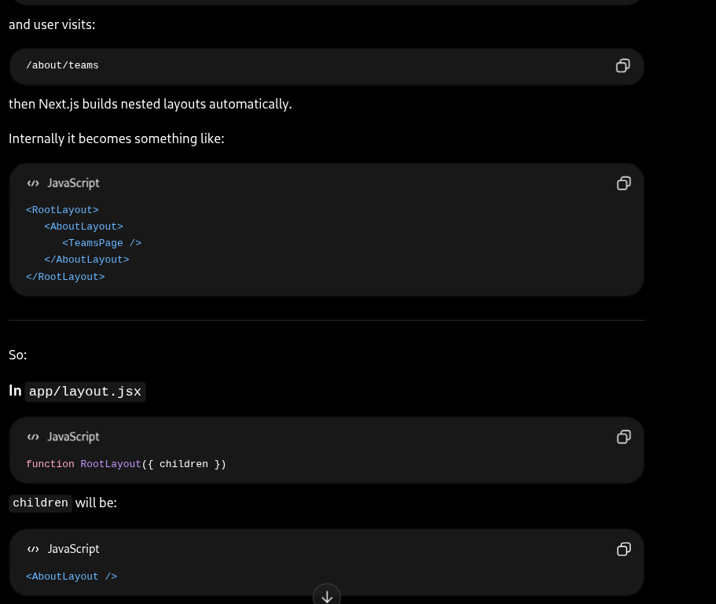

# when we want to move to /about page through headers we can use a href 
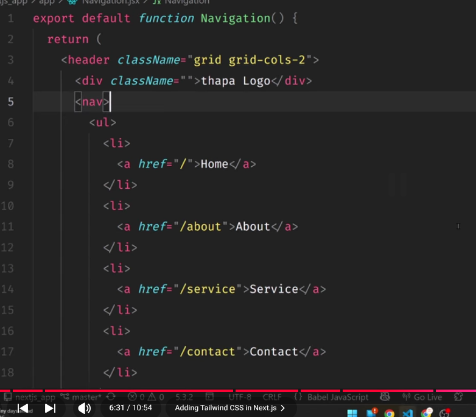
But this has his downside ... here pages gets to refresh
- Instead we can use Link tag

# GOOD PRACTICE
- when you render any external component
- Make a component folder and make that component inside that
- Then import it
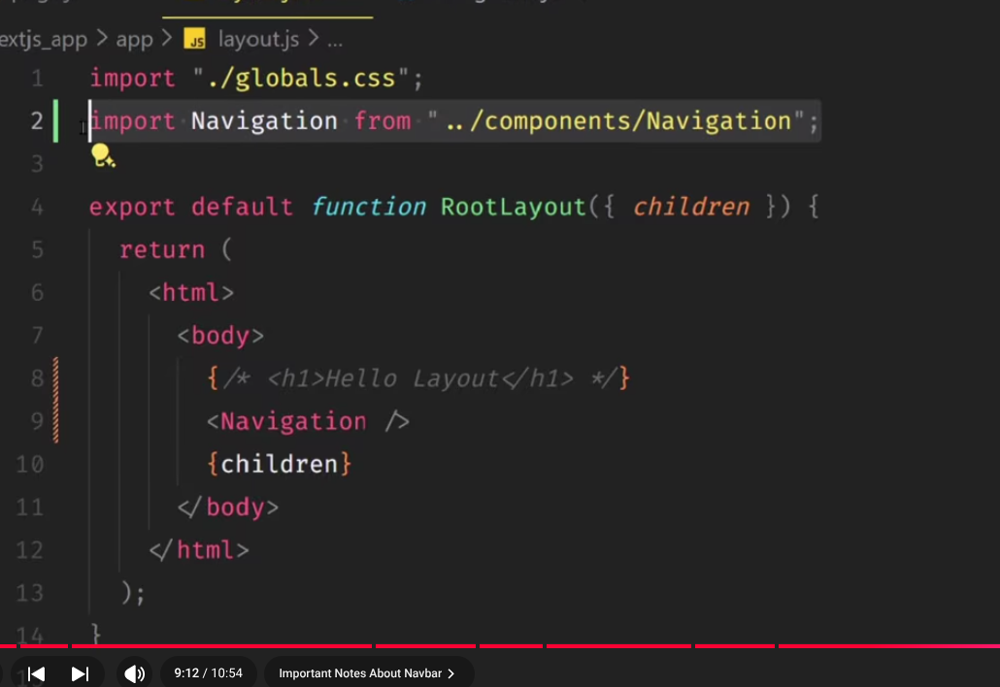

# ROUTE URL 
 you can use (users) means u can use brackets around
 means you can simply localhost:3000/about -> will link to about page of users directly
 you dont need to add specifically :3000/users/about
 
 or you can use this
 

# nextjs-images/image component
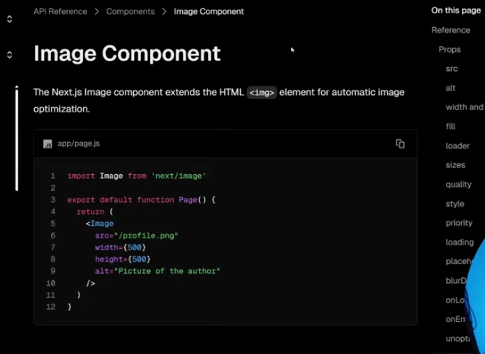
it can be easiky accesed thru /rishi.jpg if  it is public folder
- also can do lazy loading false if you keep priority-> false

# Font 

multiple fonts
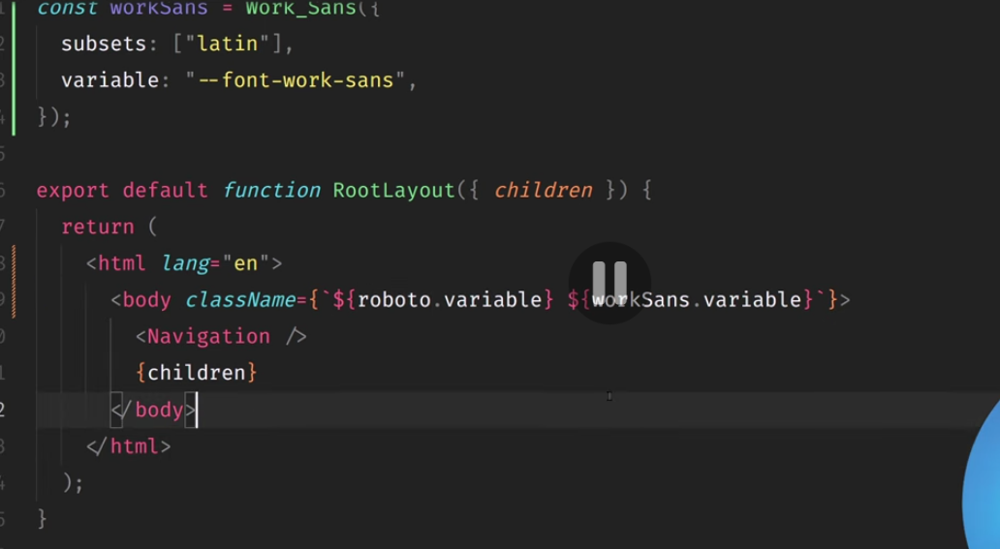

# Metadata

isse ye dikhega upar

key words bhi matter krta hai

# React CLient vs Server side components
    1) all event listeners must be on client side
    2) most database url when we are fetching must be taken from server side component
    3)all the components inside client page is automatically under client
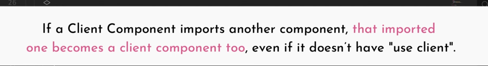
    4)

# Dynamic routes

user/?? koi sa bhi name le skte hian/posts/ ??koi sab hi id
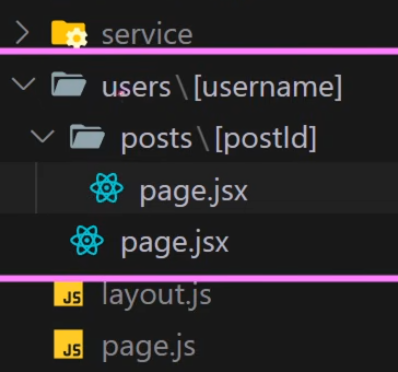
THis is server side dynamic route
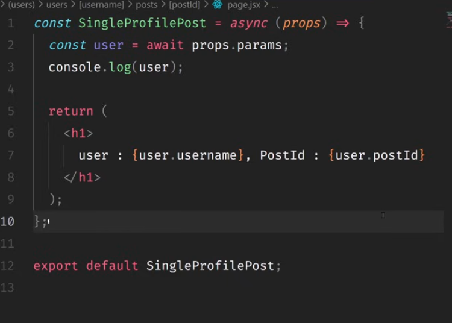
if you want client side dynamic route then??
- we can use useapi
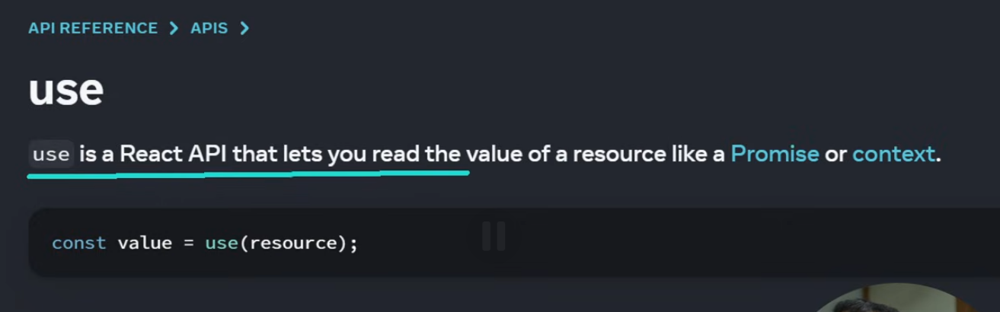

# searchParams
for server side
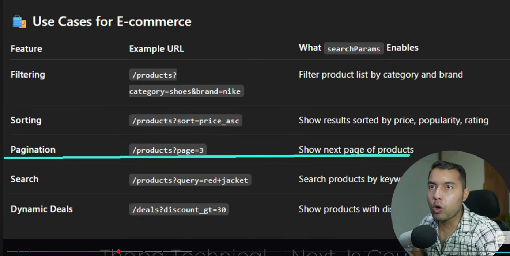
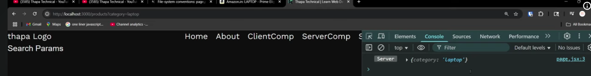
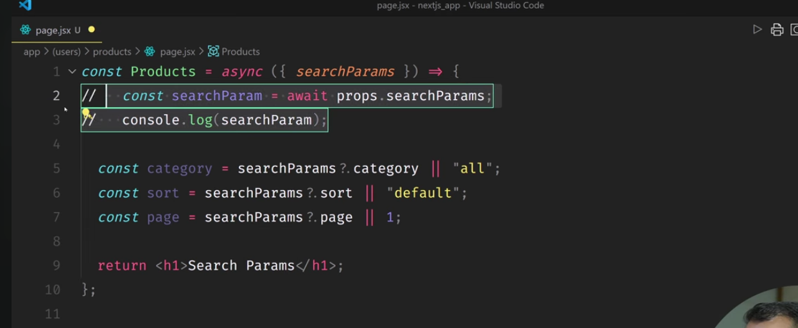

for client side
use useSearchParams

# Catch all segments

# loading before real page
use simple loading.jsx

# fallback

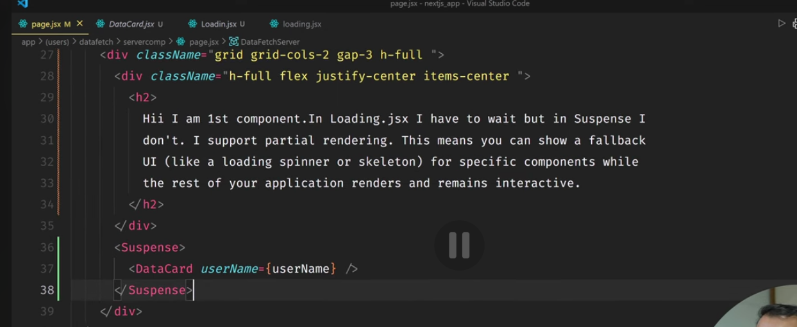
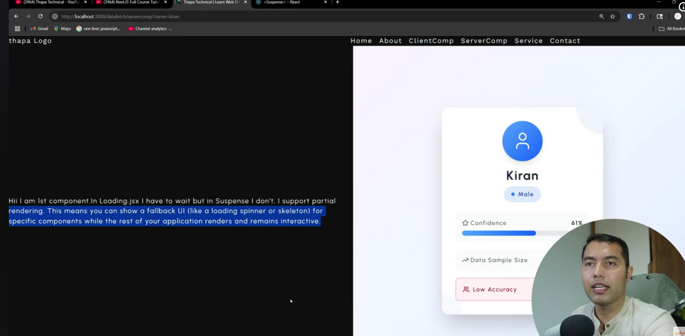