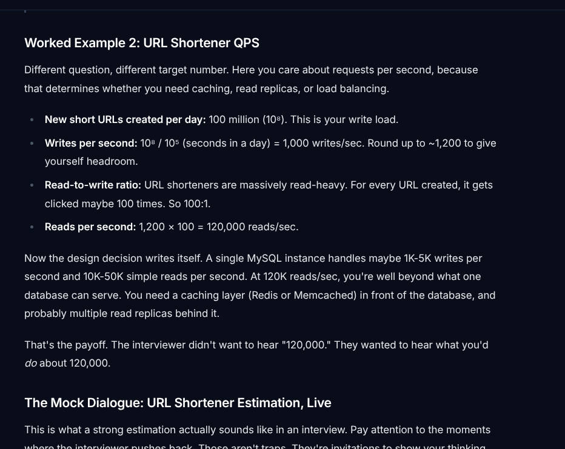

The text clarifies that interviewers don't care about your arithmetic. They are testing your ability to make confident engineering decisions with incomplete information.

## how to assume
```
Good: "Okay, let's assume we have 10 million daily active users. If each user logs in twice a day, that's 20 million login requests. There are about 100,000 seconds in a day, so 20 million divided by 100,000 gives us roughly 200 Requests Per Second."

This is where candidates usually freeze because they want to be perfectly accurate. Do not use real numbers; use "Interview Numbers."

Real World: A day has 86,400 seconds.

Interview World: A day has 100,000 seconds.

Example Assumptions out loud: "Let's assume we have 10 million Daily Active Users (DAU). Let's assume the average user writes 2 posts per day. Let's assume a text post with some metadata is about 1 Kilobyte (KB)."

The Equation: Daily Storage = DAU * Posts Per User * Size Per Post


```


# how to assume
```
Before I start designing the storage layer, let me estimate total storage we'd need over 3 years. That'll tell us whether this fits on a single machine or if we need to think about sharding."

"I want to estimate peak QPS for reads so we can decide if a single database instance is sufficient or if we need caching and replicas.

Not over assume
Aim for 3 to 5 assumptions.
Why? Because your next step is going to be a simple multiplication equation. If you have 3 assumptions, you do a 3-part multiplication (Users * Posts * Size). If you find yourself listing 7 assumptions, you are over-engineering the problem and need to stop.
```

## how to say
```
I'll assume 300 million DAU, which is roughly Twitter-scale. Each user creates about 0.5 tweets per day on average, so that's 150 million new tweets daily. For tweet size, I'll use 300 bytes including metadata but not media, since media would be stored separately in blob storage."


```
## example
```
Worked Example 1: Twitter's Tweet Storage Over One Year#
You're designing a Twitter-like system and need to figure out whether tweets fit on a single machine or require distributed storage. Here's the multiplication chain:

DAU: 300 million (~3 × 10⁸)
Tweets per user per day: not every user tweets. Most are readers. Call it 0.5 tweets per active user per day.
Total tweets per day: 3 × 10⁸ × 0.5 = 1.5 × 10⁸ (~150M tweets/day)
Average tweet size: 140 characters of text is small, but add metadata (user ID, timestamp, geo, indices) and you're at roughly 300 bytes per tweet.
Daily storage: 1.5 × 10⁸ × 300 bytes = 4.5 × 10¹⁰ bytes ≈ 45 GB/day
Annual storage: 45 GB × 365 ≈ 16.4 TB/year. If you want even faster mental math, round 365 up to 400: 45 × 400 = 18 TB. Either way, you're in the 16–18 TB range.
Roughly 16 to 18 terabytes per year. A single high-end server with SSDs can hold that. But you'd never put all your eggs in one machine for a service at Twitter's scale, so this tells you the data volume itself isn't the hard problem. The hard problem is the read throughput and availability requirements, which is a completely different estimation.

Do this: Notice how the estimation ended with an architectural insight, not just a number. "16–18 TB fits on one box, so storage volume isn't the bottleneck" is the sentence that earns you points.

```


## Mock interview
```
The Mock Dialogue: URL Shortener Estimation, Live#
This is what a strong estimation actually sounds like in an interview. Pay attention to the moments where the interviewer pushes back. Those aren't traps. They're invitations to show your thinking.

I
Interviewer: Let's design a URL shortening service. Before we get into architecture, can you give me a sense of the scale we're dealing with?
Y
You: Sure. Let me start by estimating QPS, since that'll drive most of our infrastructure decisions. Can I assume we're building something at the scale of Bitly? Roughly 100 million new short URLs created per day?
I
Interviewer: That's reasonable. Go with that.
Do this: The candidate anchored on a real product to justify the assumption. This is way better than pulling a number from thin air.
Y
You: OK, so 100 million writes per day. To get per-second, I divide by about 10⁵, which is roughly the number of seconds in a day. That gives me about 1,000 writes per second. I'll round up to 1,200 to account for peak traffic being higher than the average.
I
Interviewer: Why 10⁵? A day has 86,400 seconds.
Y
You: Right, 86,400. I round to 10⁵ for easier math. It's within 15%, which is fine for an order-of-magnitude estimate. If anything, it makes my QPS estimate slightly conservative, which I'd rather have than the other way around.
Do this: The interviewer tested whether you knew you were rounding. Don't get defensive. Acknowledge the real number, explain why the approximation is acceptable, and keep moving.
I
Interviewer: OK. What about reads?
Y
You: URL shorteners are extremely read-heavy. Every link gets created once but clicked many times. I'll assume a 100:1 read-to-write ratio, so that's 1,200 times 100, giving us about 120,000 read requests per second.
I
Interviewer: 100:1 feels high. Where does that come from?
Y
You: Fair question. Some links go viral and get millions of clicks, most links get almost none. The 100:1 is an average across the whole system. If you think it's too aggressive, I could drop it to 50:1 and we'd still be at 60K reads per second, which doesn't really change the architectural conclusion. Either way, we're past what a single database can handle.
I
Interviewer: What is that conclusion?
Y
You: A single MySQL instance tops out around 10K to 50K simple reads per second, depending on the query. At 60K to 120K, we need a caching layer. Redis can handle 100K+ ops per second on a single instance, so one or two Redis nodes in front of the database would absorb most of the read traffic. For writes, 1,200 per second is well within MySQL's range, so we probably don't need to shard the write path yet. Though we'd want replication for availability.
Do this: The candidate didn't just survive the pushback on the 100:1 ratio. They showed that even cutting the assumption in half doesn't change the design decision. That's a senior-level move. It tells the interviewer you understand which assumptions are load-bearing and which ones aren't.
I
Interviewer: Great. Let's also think about storage. How much data are we storing over, say, five years?
Y
You: Each shortened URL entry is small. The short code is maybe 7 characters, the original URL averages around 200 bytes, plus metadata like creation timestamp, user ID, expiration. Call it 500 bytes per entry. At 100 million new entries per day, that's 5 × 10¹⁰ bytes per day, or 50 GB per day. Over five years, that's 50 × 365 × 5... roughly 50 × 2,000... about 100 TB.
I
Interviewer: Can one machine hold that?
Y
You: Not comfortably. A large SSD is 1-4 TB, and even with a RAID setup you'd be looking at a machine with dozens of drives. More practically, at 100 TB we'd want to shard across multiple database nodes. We could shard by the hash of the short code, which distributes evenly and makes lookups straightforward since every read request already contains the short code.


```
