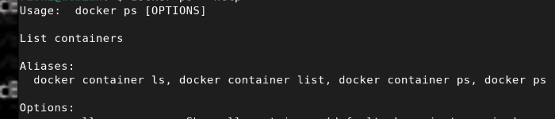

# Operating System

## What does an Operating System do?

- Memory Management  
- I/O Management  
- CPU Scheduling  
- Multitasking / Multiprogramming  

## The only thing running at all times is kernel

## What makes something a system

- There is a connection with each interrelated parts means there is complexity of o(n2)
To overcome this one has to come up with apis to level down this complexity

## Hardware and software

- There are registers on processors which pointing to parts of memory that allows the program to run. In between there may be caches that make system fast 
Then there is page table and TLB that make virtual memory 
The OS abstracts these abstracts the hardware details from the application

## Abstraction
 
- We are creating a abstraction of hardware
 like for processor-threads, memory-address spaces,storage-files, networks-sockets

 that process can run all these abstracted details

 - Above this there is another layer of abstraction called system libs ,security libs which allow you to do ssl on
 

 Each processes are running at a time and each give isolation to each other
 
 here you can see system libraries are linked into our program which is later converted into bits by compiler and then run by processes
 
 # Process
 
 

 # The illusion of multiple processors

 - Here what we do is we try to switch alternate between the two processes so fast we thought we are having two processors. the registers are pointing towards green or brown memory where it is left off
 
