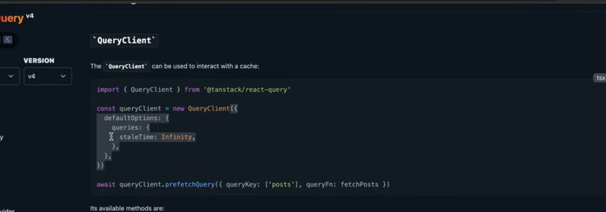

## agar humein data kahin se fetch krna hai toh kya krte hain useEffect se fetch krte hain aur useState mein store krte hain

```
const Products=()=>{
  const [products,setProducts]=useState([])

 useEffect(() => {
  const fetchProducts = async () => {
    const response = await fetch(
      "https://dummyjson.com/products"
    );

    const data = await response.json();

    setProducts(data.products);
  };

  fetchProducts();  
}, []);


  return(
    <div>
    Products
    </div>
  )
}


```

### Important thing to note here How something can cause infinite loop

```
My question was
useEffect(() => {
  const fetchProducts = async () => {
    const response = await fetch(
      "https://dummyjson.com/products"
    );

    const data = await response.json();

    setProducts(data.products);
  };

  fetchProducts();  
}, []); Here i have not passed any dependency array so
will it go like this
first component is mounted so when it is mounted useeffect calls the api and it loads the products data in product state by causing setProducts(data.products) but will it cause again rerender because it is changing the state of Products but this time there will be no api calling since there is no dependency array 
but lets say i want whenever products change it should call the api so how to do it


```

```
Solution- 
Your understanding is almost correct. Let's trace it carefully.

useEffect(() => {
  fetchProducts();
}, []);
Step 1: Initial Render
products = []

React renders the component.

Step 2: useEffect runs

Because the dependency array is [], React runs the effect once after the component is mounted.
API Call
↓
response.json()
↓
setProducts(data.products)
Step 3: State changes
setProducts(data.products);

changes state.

Whenever state changes, React re- renders the component.

Render #2
products = [all products]
Step 4: Does useEffect run again?

No.

React compares dependencies:

[]

Nothing to compare, so React treats it as "run only on mount".

Render #1
↓
Effect runs
↓
setProducts()
↓
Render #2
↓
Effect DOES NOT run


But infinite loop
"Whenever products change, call the API"

You can do:

useEffect(() => {
  fetchProducts();
}, [products]);

But this is usually wrong.

Why?

Effect
↓
API Call
↓
setProducts()
↓
products changed
↓
Effect again
↓
API Call
↓
setProducts()
↓
products changed
↓
Effect again
...

Infinite loop again.


```

```
Real solution

Scenario A: You want a "Refresh" button
If you want the API to be called again when a user clicks a button, you can create a dummy state variable just to trigger the effect.

JavaScript
const [products, setProducts] = useState([]);
const [refreshTrigger, setRefreshTrigger] = useState(0);

useEffect(() => {
  const fetchProducts = async () => {
    const response = await fetch("https://dummyjson.com/products");
    const data = await response.json();
    setProducts(data.products);
  };

  fetchProducts();  
}, [refreshTrigger]); // <- -  Runs whenever refreshTrigger changes

// In your JSX:
<button onClick={() => setRefreshTrigger(prev => prev + 1)}>
  Refresh Products
</button>

int overflow
Is there a better way?
Even though the number counter is 100% safe from crashing, if the idea of an infinitely growing number still bothers your engineering instincts, you can completely avoid it by using an object reference instead.

Since React triggers a re- render whenever an object reference changes in memory, you can do this:

JavaScript
const [refreshTrigger, setRefreshTrigger] = useState({}); // Empty object

// Inside your useEffect dependency array: [refreshTrigger]

// Creates a brand new object in memory, triggering the effect
<button onClick={() => setRefreshTrigger({})}>
  Refresh Products
</button>
Both the number counter (prev + 1) and the new object ({}) methods are widely used, standard patterns in React. You can confidently use either one without fearing a runtime error!

Scenario B: You want to fetch based on a Category or Page Number
If your data changes based on a user selecting a category or moving to page 2, you track that variable in the dependency array, not the products themselves.

JavaScript
const [products, setProducts] = useState([]);
const [category, setCategory] = useState("smartphones");

useEffect(() => {
  const fetchProducts = async () => {
    // The API url now depends on the category state
    const response = await fetch(`https://dummyjson.com/products/category/${category}`);
    const data = await response.json();
    setProducts(data.products);
  };

  fetchProducts();  
}, [category]); // <- -  Safely runs only when the 'category' changes

// In your JSX:
<button onClick={() => setCategory("laptops")}>
  Load Laptops
</button>


```

### Now loading state dikhana hai
```

const Products=()=>{
  const [products,setProducts]=useState([])
  const [isLoading,setIsloading]=useState(false)
    const[isError,setIsError]= useState(null);

 useEffect(() => {
  const fetchProducts = async () => {
 try{
    setIsloading(true)
    setIserror(null);- > ye pehle error ko remove krega
    const response = await fetch(
      "https://dummyjson.com/products"
    );- > isme ye error ni dega agar url galat hai
    
    const data = await response.json();-  ye error dega isliey axios use kro

    setProducts(data.products);
    setIsloading(false)
  };
 }
 catch{
    seterror(err.message);
    setloading(false);
 }
    

  fetchProducts();  
}, []);

    if(isloading)return(<h3>spinner</h3>)
  return(
    <div>
    Products
    </div>
  )
}

agar error aa gya toh hmesha isloading true rhegi 
so error handle ke liye 


```
### Tanstack Query


```

useQuery(Tanstack Query)- > koi chiz fetch krna hai tab use krte hain
useMutation - jab server mein kuch changes krne hain


first import {QueryCLient,QueryClientProvider}from "@tanstack/react- query"
then wrap the app with Queryclient provider


ye products jo key daale hain woh fetching ke liye use hoti hai
const fetchProducts=async()=>{
    const response=await fetch(");
    const data=reson.json();
    return data.products
}

const {isLoading,data:products,error}=useQuery({querKey:["products"],queryfnc:[fetchProducts]})


Welcome to the bright side! Moving from manual useEffect fetching to TanStack Query (formerly React Query) is a massive upgrade. It handles caching, loading states, errors, and re- fetching automatically so you don't have to invent your own refreshTrigger state variables.

Let's break down exactly what is happening in your screenshot, addressing your questions step- by- step.

1. Where is it taking products from?
In the screenshot, you see this line:

JavaScript
data: products,
This is standard JavaScript object destructuring with a rename (aliasing).

Under the hood, TanStack Query's useQuery hook always returns an object with specific, hardcoded properties like isLoading, error, and data. Because the hook doesn't know what kind of data you are fetching, it always names the result data.

By writing data: products, you are telling JavaScript:

"Grab the data property returned by useQuery, but rename it to products inside this component so my code makes more sense."

If your fetchProducts function returns an array of items, products will now hold that array.

2. How does the queryKey work? (And what if it's random?)
Think of the queryKey as a label on a storage box inside TanStack's cache memory.

JavaScript
queryKey: ['products']
When this component loads, TanStack Query looks into its internal memory box labeled ['products'].

If the box is empty: It runs your queryFn (fetchProducts), grabs the data from the internet, puts a copy into the ['products'] box, and gives it to your component.

If the box already has data: It instantly hands that cached data to your component without making you wait for a network request.

What happens if you pass a random key?
It depends on what you mean by "random":

If you use a random word (like queryKey: ['banana']): It will work perfectly fine. TanStack Query doesn't care what the word means; it just uses it as a label. However, you should use meaningful keys so that other components can access or clear that same cache box if they need to.

If you use a truly dynamic random value (like queryKey: [Math.random()]):
This will break your app. Every single time your component renders, Math.random() generates a brand new number. TanStack Query will look at its memory, see a completely new key, assume it has never fetched this data before, and trigger a network request. This defeats the entire purpose of caching and can cause performance issues or infinite loops.


3. How does the whole query work? (The Lifecycle)
Here is the exact lifecycle of how TanStack Query manages this block of code:

Component Mounts: The Products component renders for the first time.

Cache Check: useQuery looks at the cache for the key ['products'].

Loading State: Since it’s the first time, the cache is empty. useQuery instantly sets isLoading to true and error to null.

Execution: It automatically executes your queryFn (fetchProducts).

Success & Storage: Once the API call finishes successfully:

The data is saved into the cache under ['products'].

isLoading switches to false.

The data is assigned to your products variable.

The component re- renders to display your items.

How to trigger a refresh now?
Remember how you had to create a custom counter to trigger a refresh in your useEffect? With TanStack Query, you don't need that. If you want a refresh button, TanStack gives you a built- in function called refetch:

JavaScript
const { data: products, isLoading, refetch } = useQuery({ 
  queryKey: ['products'], 
  queryFn: fetchProducts 
});

// In your JSX:
<button onClick={() => refetch()}>Refresh Products</button>
Calling refetch() tells TanStack Query to ignore the cache, run fetchProducts again, and update the UI automatically.


```
#ERROR
```
3 retries hoti hain generally 
phir error state load hota hai 

```
#Staletime

```
default infinite hota hai
otherwise u can put 10000 milliseconds daal skte ho is milliseconds ke baad cache se ht jayega phir jab maangoge toh phir se fetch krega

ye har query mein daal skte ho ya phir

jab query ka instance bna rhe ho tabhi pass kr skte ho


refetchonMount

. refetchOnMount: true (The Default Behavior)
When this is set to true, every time the component mounts, TanStack Query checks if it already has cached data for that queryKey. If it does, and that data is marked as stale, it will trigger a background refetch.
refetchOnMount: false
When you set this to false, you are telling TanStack Query: "I don't care if the cached data is considered old. When this component mounts, just use what is in the cache and do not hit the network."

The Scenario
Imagine you are fetching a list of Countries or Language Options for a dropdown menu.

The user goes to a settings page. The component mounts and fetches a list of 195 countries from an API.

The user navigates to another page, unmounting the settings.


The user comes back to the settings page, remounting the component.


```

# how to fetch single product

```
querykey mein ['products',params.productId]

```
## use mutation

```
Now that you know how useQuery handles fetching data, this screenshot introduces its sibling: useMutation.

While useQuery is strictly for reading data (GET requests), useMutation is used for creating, updating, or deleting data (POST, PUT, DELETE requests) on your server.

Here is a detailed breakdown of exactly how this code works, from the setup to the user clicking the button.

1. The Setup: Defining the Mutation
JavaScript
const mutation = useMutation({
  mutationFn: (newTodo) => {
    return axios.post('/todos', newTodo)
  },
})
useMutation: This hook tells TanStack Query, "Hey, I want to prepare an action that will change data on the server, track its progress, and let me know if it succeeds or fails."

mutationFn: This is the actual asynchronous function that talks to your backend. In this case, it takes a newTodo object and sends an Axios POST request to the /todos endpoint.

Important: Unlike useQuery, this function does not run automatically when the component mounts. It sits and waits until you explicitly tell it to fire.

2. The Trigger: Making the Call
Down in the JSX, we have the button that sets everything in motion:

JavaScript
<button onClick={() => {
  mutation.mutate({ id: new Date(), title: 'Do Laundry' })
}}>
  Create Todo
</button>
mutation.mutate(...): This is the trigger handle. When the user clicks the button, mutation.mutate is called.

Passing Data: The object inside—{ id: new Date(), title: 'Do Laundry' }—is passed directly into the newTodo parameter of your mutationFn up top.

3. Tracking States: The UI Lifecycle
The object returned by the hook (assigned to the variable mutation) contains built- in state variables that change automatically as the network request progresses. The JSX in the screenshot uses these variables to conditionally render different parts of the UI:

State A: The Loading State (mutation.isLoading)
JavaScript
{mutation.isLoading ? (
  'Adding todo...'
) : ( ... )}
The moment the button is clicked and the network request is mid- flight, mutation.isLoading becomes true. The UI hides the button and shows the text "Adding todo...". This prevents users from clicking the button multiple times and creating duplicate items.

Note: If you are using TanStack Query v5, isLoading has been renamed to isPending, but it behaves exactly the same way.

State B: The Error State (mutation.isError)
JavaScript
{mutation.isError ? (
  <div>An error occurred: {mutation.error.message}</div>
) : null}
If the server crashes, returned a 500 error, or the internet cuts out, mutation.isError becomes true. TanStack Query catches the failure and exposes the error object through mutation.error, allowing you to display a clean error message to the user.

State C: The Success State (mutation.isSuccess)
JavaScript
{mutation.isSuccess ? <div>Todo added!</div> : null}
If the backend successfully saves the data and returns a 200/201 status code, mutation.isSuccess becomes true, and the UI displays "Todo added!".

The Complete Step- by- Step Flow
Idle State: The page loads. Nothing is happening yet. The button "Create Todo" is visible.

The User Clicks: mutation.mutate() fires with the laundry todo data.

The Request Starts: mutation.isLoading instantly turns true. The UI updates to say "Adding todo...".

The Server Processes: Axios sends the payload to /todos.

The Request Finishes:

If successful: isLoading becomes false, isSuccess becomes true. The UI displays "Todo added!".

If failed: isLoading becomes false, isError becomes true. The UI displays the error message.


```

## Paginated Queries
-  skip and limit url mein rkhna betterhot hai
- Pagination in modern web development generally revolves around two core parameters: Limit (how many items you want to fetch) and Skip (how many items you want to jump over before starting to grab that data).

- When you combine this API pattern with TanStack Query (React Query), you have to solve a specific UI problem: Flickering. If a user clicks "Next Page", you don't want the current list to vanish into a blank loading screen before the new data arrives.

- Here is the standard, modern way to handle this in TanStack Query v5 using skip, limit, and a feature called keepPreviousData.

- The Math: Converting Pages to Skip/Limit
Most UI components use "Page Numbers" (Page 1, Page 2), but backend databases usually speak in "Skip/Limit" (or Offset/Limit). You bridge this gap with a simple formula:

- limit: A static number (e.g., 10 items per page).

- skip: (page -  1) * limit

- Page 1: (1 -  1) * 10 = 0 skipped.

- Page 2: (2 -  1) * 10 = 10 skipped.
```
import { useState } from 'react';
import { useQuery, keepPreviousData } from '@tanstack/react- query';

// 1. Your API fetching function
const fetchProducts = async (skip, limit) => {
  const response = await fetch(`https://api.example.com/products?skip=${skip}&limit=${limit}`);
  if (!response.ok) throw new Error('Network response was not ok');
  return response.json(); 
  // Expects backend to return: { data: [...], totalCount: 100 }
};

export default function PaginatedProducts() {
  // 2. Track your UI state
  const [page, setPage] = useState(1);
  const limit = 10;
  
  // 3. Calculate skip for the API
  const skip = (page -  1) * limit;

  // 4. The TanStack Query Hook
  const { 
    data, 
    isLoading, 
    isError, 
    error,
    isPlaceholderData // Lets you know if you are currently looking at "old" data
  } = useQuery({
    // The queryKey MUST include your variables so it caches each page separately
    queryKey: ['products', { skip, limit }], 
    queryFn: () => fetchProducts(skip, limit),
    
    // THE SECRET SAUCE: Keeps the old page on screen while the new one fetches
    placeholderData: keepPreviousData, 
  });

  if (isLoading) return <div>Loading initial data...</div>;
  if (isError) return <div>Error: {error.message}</div>;

  // Calculate if we have more pages based on the total count from the backend
  const hasMore = data?.totalCount > skip + limit;

  return (
    <div>
      <ul>
        {data.data.map(product => (
          <li key={product.id}>{product.name}</li>
        ))}
      </ul>

      <div className="pagination- controls">
        <button 
          onClick={() => setPage(old => Math.max(old -  1, 1))} 
          disabled={page === 1}
        >
          Previous
        </button>

        <span>Page {page}</span>

        <button 
          onClick={() => {
            if (!isPlaceholderData && hasMore) {
              setPage(old => old + 1);
            }
          }} 
          // Disable "Next" if we are waiting for data OR if we hit the end
          disabled={isPlaceholderData || !hasMore}
        >
          Next
        </button>
      </div>
      
      {/* Optional: Show a subtle loading spinner in the corner while transitioning */}
      {isPlaceholderData && <span> Fetching new page...</span>}
    </div>
  );
}

Summary
keepPreviousData makes the transition smooth so the screen doesn't flicker.

isPlaceholderData is your tool to tell the user "Please wait..." and to lock the buttons so they can't break the app while it's fetching.
```


# but above code has a flow if user is on page 5 on refresh it will go back to page 1 so to persist it we keep skip and limit on the url

- You just anticipated the next major production requirement!

- The code provided before will not persist on a browser refresh. Because we used standard useState(1), the moment the user hits refresh, the browser's memory is completely wiped clean, and your app resets back to Page 1.

- If a user is on Page 5, refreshes the page, and suddenly gets kicked back to Page 1, they will likely find it frustrating. Furthermore, they cannot copy the URL and text it to a friend to show them the exact items on Page 5.

- To fix this, the industry standard is to store your page (and filters) directly in the URL query parameters (e.g., ?page=2) instead of React local state.

- The Production Standard: URL- Driven State
Here is how you update the pattern using React Router (the most common routing library in React) via its useSearchParams hook.

- Notice how useState is completely removed for managing the page:
```
import { useQuery, keepPreviousData } from '@tanstack/react- query';
import { useSearchParams } from 'react- router- dom'; // 1. Import from your router

const fetchProducts = async (skip, limit) => {
  const response = await fetch(`https://api.example.com/products?skip=${skip}&limit=${limit}`);
  if (!response.ok) throw new Error('Network response was not ok');
  return response.json();
};

export default function PaginatedProducts() {
  // 2. Read and write directly to the URL bar (looks like ?page=1)
  const [searchParams, setSearchParams] = useSearchParams();
  
  // 3. Extract the page number from the URL string (default to 1 if it doesn't exist)
  const page = parseInt(searchParams.get('page') || '1', 10);
  const limit = 10;
  
  // 4. Calculate skip just like before
  const skip = (page -  1) * limit;

  const { data, isLoading, isPlaceholderData } = useQuery({
    queryKey: ['products', { skip, limit }],
    queryFn: () => fetchProducts(skip, limit),
    placeholderData: keepPreviousData,
  });

  // 5. To change pages, we update the URL instead of local state!
  const handlePageChange = (newPage) => {
    setSearchParams({ page: newPage.toString() });
  };

  if (isLoading) return <div>Loading...</div>;

  const hasMore = data?.totalCount > skip + limit;

  return (
    <div>
      {/* ... Your product list mapping here ... */}

      <div className="pagination- controls">
        <button 
          onClick={() => handlePageChange(Math.max(page -  1, 1))} 
          disabled={page === 1}
        >
          Previous
        </button>

        <span>Page {page}</span>

        <button 
          onClick={() => {
            if (!isPlaceholderData && hasMore) {
              handlePageChange(page + 1);
            }
          }} 
          disabled={isPlaceholderData || !hasMore}
        >
          Next
        </button>
      </div>
    </div>
  );
}

```
# how it got saved
```
Right after wiping everything, the browser downloads your HTML and JavaScript files all over again from scratch.

When your JavaScript bundle loads into this brand- new, empty memory space, your React code runs from top to bottom like it’s the very first time it has ever seen the light of day:
Why the URL Method Survives the Refresh
This is exactly why storing state in the URL (?page=3) is so powerful.

When you hit refresh on mysite.com/products?page=3, the browser still nukes the RAM and destroys the local state. However, it does not destroy the text in the URL bar. When the page reloads from scratch, your code runs from the top again:

```

## how to add search 

- How the Whole System Works Together
- 1. The "Input Buffer" Pattern (Local State vs URL State)
- You might wonder why we have both searchInput (local state) and search (from URL).
- If you hook the <input> directly to the URL parameters, the app will execute a network request on every single keystroke your user types. If they type "laptop", it will trigger 6 separate API calls in half a second.
- Instead, we use searchInput to let them type freely. The URL only updates when they hit Enter or click "Search".

- we can debounce as well from lodash library

- 2)TanStack Query creates separate, isolated cache compartments for every unique combination of your key array.
- Page 1 of all products (['products', {skip: 0, limit: 10, search: ''}]) gets its own cache compartment.
- Page 1 of "phone" (['products', {skip: 0, limit: 10, search: 'phone'}]) gets a completely different cache compartment.
- This ensures that jumping back and forth between search terms and different pages feels instant if the data was fetched previously.

- 3)Why setSearchParams({ search: searchInput, page: '1' }) is Crucial
- Notice inside handleSearchSubmit, we forcefully append page: '1'.
- If a user clicks out to Page 4 of your catalog, their URL is ?page=4. If they type "shoes" into the search bar and press enter, without resetting the page parameter, the URL would update to ?search=shoes&page=4.

- TanStack query would confidently ask the backend for the 4th page of shoe results. If you only have 3 shoes in your store, the API returns an empty array, and your user sees a broken, blank page. Forcing it back to page: '1' resets the grid perfectly for the new query scope.
```
import { useState } from 'react';
import { useQuery, keepPreviousData } from '@tanstack/react- query';
import { useSearchParams } from 'react- router- dom';

// 1. API fetcher now accepts search, skip, and limit
const fetchProducts = async (skip, limit, search) => {
  // Example using dummyjson's search endpoint if search exists, otherwise regular endpoint
  const url = search 
    ? `https://dummyjson.com/products/search?q=${search}&skip=${skip}&limit=${limit}`
    : `https://dummyjson.com/products?skip=${skip}&limit=${limit}`;
    
  const response = await fetch(url);
  if (!response.ok) throw new Error('Failed to fetch');
  return response.json(); // Returns { products: [...], total: 100 }
};

export default function SearchablePaginatedProducts() {
  const [searchParams, setSearchParams] = useSearchParams();
  
  // 2. Read current values directly from the URL bar
  const page = parseInt(searchParams.get('page') || '1', 10);
  const search = searchParams.get('search') || '';
  const limit = 10;
  const skip = (page -  1) * limit;

  // 3. Local state for the input field (Acts as a "buffer")
  const [searchInput, setSearchInput] = useState(search);

  // 4. TanStack Query Hook
  const { data, isLoading, isPlaceholderData } = useQuery({
    // CRITICAL: Include search in the key so searching triggers a new cache bucket
    queryKey: ['products', { skip, limit, search }], 
    queryFn: () => fetchProducts(skip, limit, search),
    placeholderData: keepPreviousData,
  });

  // 5. Triggered when the user submits the search form
  const handleSearchSubmit = (e) => {
    e.preventDefault();
    // FORCE page back to 1 when a new search happens!
    setSearchParams({ search: searchInput, page: '1' });
  };

  const handlePageChange = (newPage) => {
    // Keep the current search term when changing pages
    setSearchParams({ search, page: newPage.toString() });
  };

  if (isLoading) return <div>Loading...</div>;

  const totalProducts = data?.total || 0;
  const hasMore = totalProducts > skip + limit;

  return (
    <div>
      {/* Search Bar Form */}
      <form onSubmit={handleSearchSubmit} style={{ marginBottom: '20px' }}>
        <input 
          type="text" 
          value={searchInput} 
          onChange={(e) => setSearchInput(e.target.value)}
          placeholder="Search products..."
        />
        <button type="submit">Search</button>
      </form>

      {/* Product List */}
      <ul>
        {data?.products?.map(product => (
          <li key={product.id}>{product.title} -  ${product.price}</li>
        ))}
        {data?.products?.length === 0 && <li>No products found.</li>}
      </ul>

      {/* Pagination Controls */}
      <div className="pagination- controls" style={{ marginTop: '20px' }}>
        <button 
          onClick={() => handlePageChange(Math.max(page -  1, 1))} 
          disabled={page === 1 || isPlaceholderData}
        >
          Previous
        </button>

        <span> Page {page} </span>

        <button 
          onClick={() => {
            if (!isPlaceholderData && hasMore) {
              handlePageChange(page + 1);
            }
          }} 
          disabled={isPlaceholderData || !hasMore}
        >
          Next
        </button>
      </div>
    </div>
  );
}


```