# HOW TO DO LEFT JOIN
- Ques
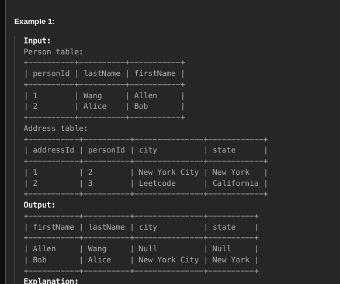
- SOl
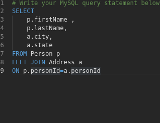
Here if your field name is different then write as a.address as add like this

# HOW TO DO RECURSION
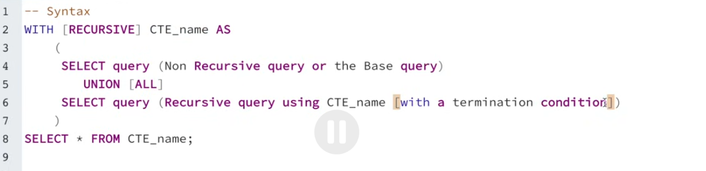
QUESTIONS-
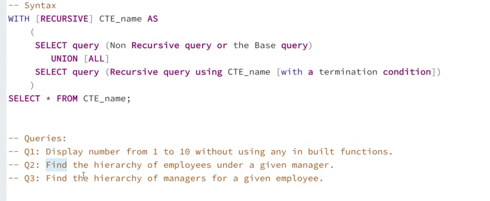
# ANS-
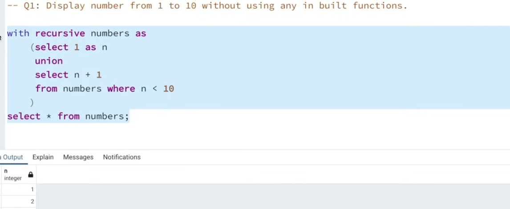
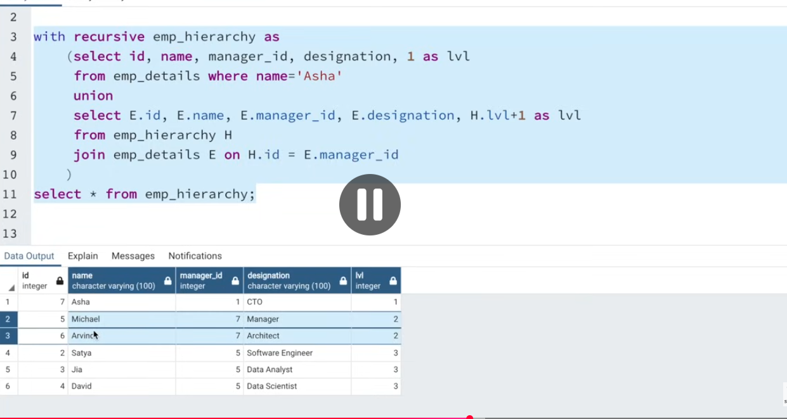

# HOW TO USE WITH CLAUSE
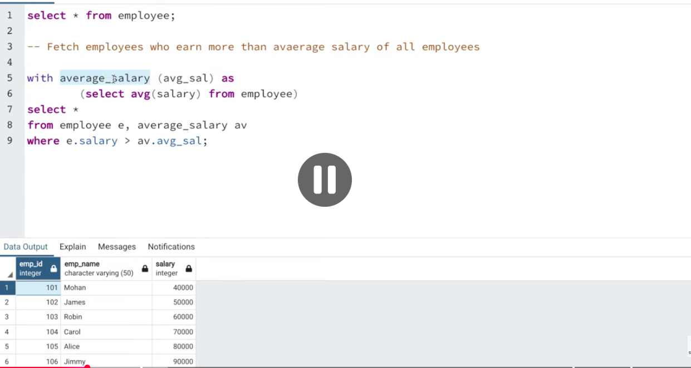
We can use multiple references to cte  with the use of WITH clause
# when you write with average_salary   

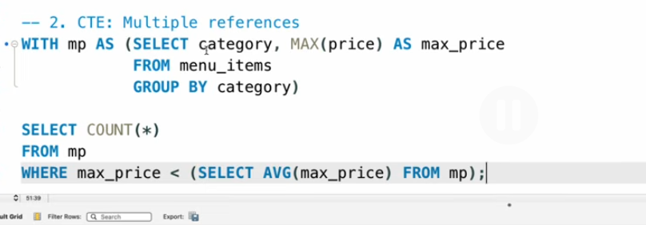

# WINDOW FUNCTION
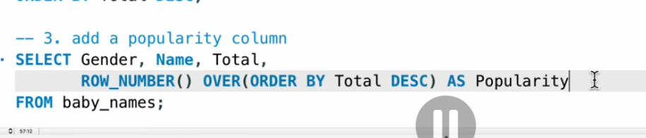
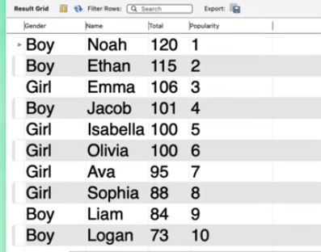
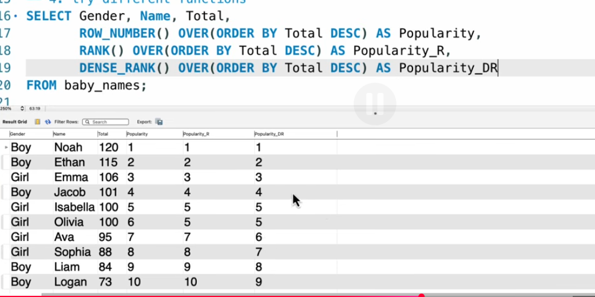

# SUBQUERIES
 1) SCALAR SUBQUERIES
    used for 1 row and 1 column
    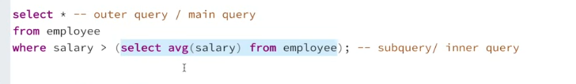 always return 1 column with 1 row
      
 2) MULTIPLE ROW SUBQUEY
  return both multiple rows and multiple column
  or 1 multiple row and one column
  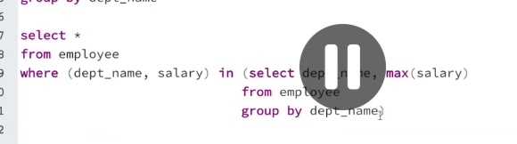

  # when you have to find a department where atleast there is one employee
  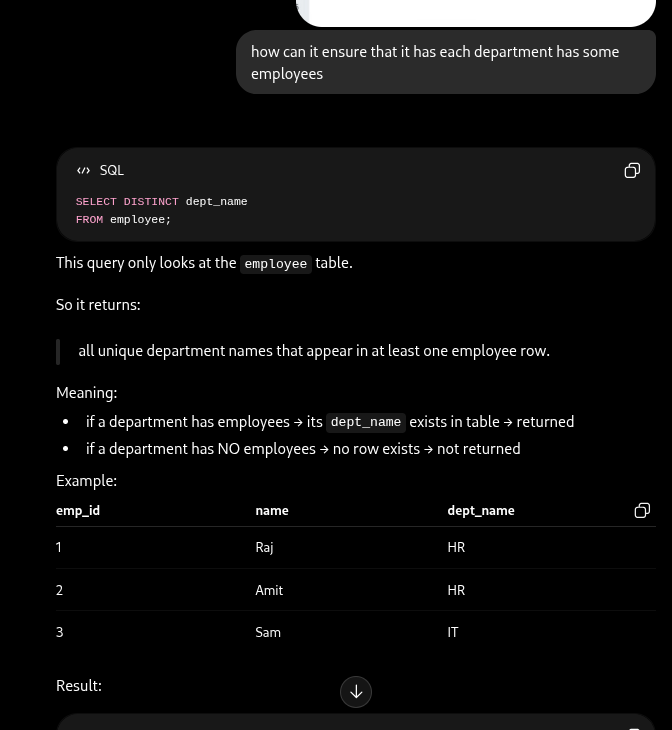

   
 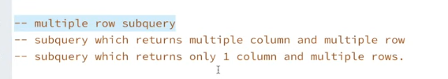
 3) CORRELATED SUBQUERY
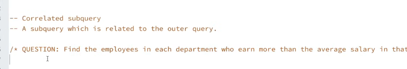
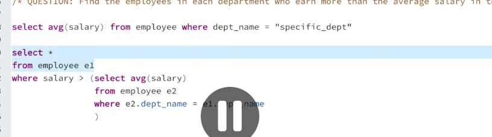

# VIEW
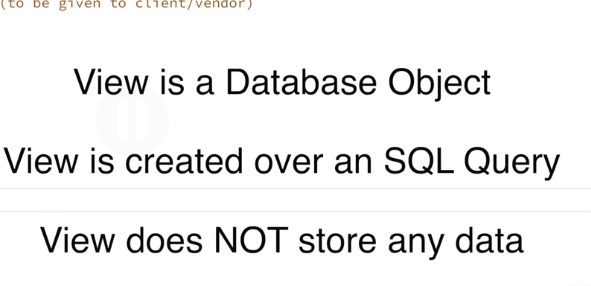
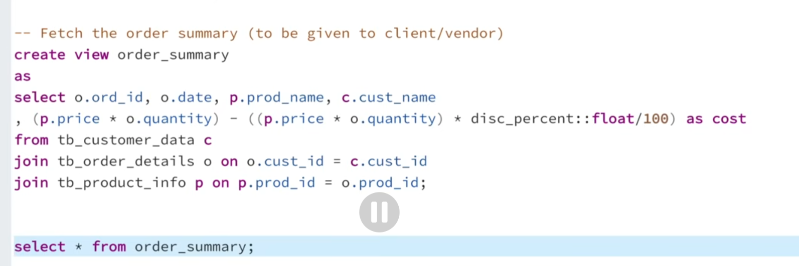